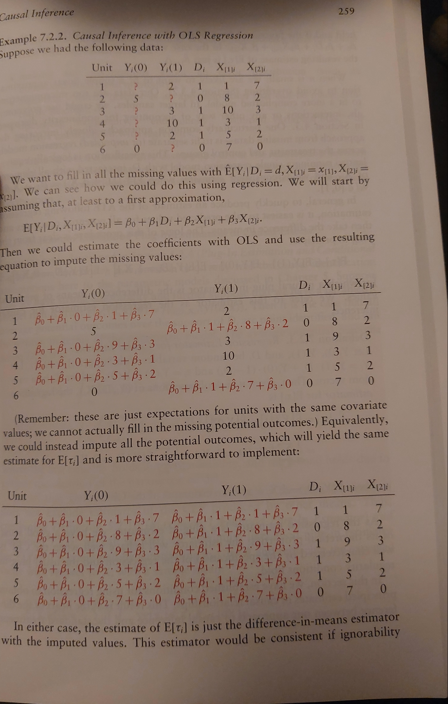

The clearest framework for causal inference has a tight relationship with #missing-data imputation. However, the range of problems addressed seem to require a slew of distinct estimators. It is not always clear in which circumstances we should apply each estimation procedure.

Like most statistical work the practical details should be worked out in code for the clearest demonstration. However, here we'll describe (as best we can) the conceptual underpinning of important estimators. Their usage and motivation.

## Taxonomies of Missing-ness

Causal inference can be seen as a species of missing data problem where the missing data is the counterfactual situation(s) of how the world would have been were the course of the world different from the one we know. What if we used this treatment plan rather than another? What it the actors' behaviour differed from the actions they in fact pursued? 

From an estimation perspective there are different species of missing-ness that matter. We won't here go deep into the distinctions. It is enough to note that they vary in the operative  source of the missing-ness: Missing-completely-at-random (MCAR), missing-at-random (MAR) and missing-not-at-random (MNAR). 

### The Stable Outcomes Assumption 

Mechanically we can't work with null values under any of these assumptions. The stable outcomes model is a first step procedure for imputing the missing values. Whether we choose mean imputation or an arbitrary figure - we initially assume missing values at the individual level in a stable fashion by specifying a constant value for the missing cases. 

Very crudely, estimation procedures work reasonably well under (MCAR) but require extra effort when there is assumptions if we hope to account for the (MAR) and (MNAR) cases. Under MAR we are assuming that the values are missing as a function of the observable covariates and can be imputed under proper conditionalisation. 

Imputation under MAR and MCAR succeeds largely from successive applications of the law of iterated expectations. In this case the stable outcome assumption encodes the missing data as $-99$ and we then average over the joint distribution of the stable outcomes model and the missingness data.

The various estimation procedures for counterfactual results trade on this property of expectation that allow for point identification of the expected value for the outcome variable.

But we also want to consider individual variation due to the observed covariate profiles. When we consider cases of missing data conditional the observed covariate profile, we can derive a propensity score as a one number summary for the conditional probability of missing-ness. This can be used in imputation techniques where we want to carefully attribute values to the missing data that respect the other observed properties of the individual. 

### Propensity Scores

The propensity score has a role in a number of re-weighting schemes for the estimation of missing data. These rely on the property of expectation under (MAR). So accuracy of the propensity score is itself an important question. Because the missing-ness variable $R$ is a binary random variable in $\{ 0, 1 \}$ maximum likelihood methods for logistic regression are often used to estimate these terms.  

$$p_{R}(\mathbf{x}) \sim logit(X_{i} \beta )$$

This score is a summary in some sense of the factors driving missing-ness. In the context of causal inference it is often stated "in reverse" as a probability of being treated. We will keep focus here on the case of missing data, but the generality of the notion shouldn't be lost. The propensity score is a one number summary of the covariate profile for each individual in the data. Under the (MAR) assumption it is often sufficient to conditionalise on the propensity score for each individual for imputation of their missing data values. 

### Regression Estimators

We might want to simply estimate the missing values of our outcome using the conditional expectation function (CEF) property of simple regression. The imputation pattern will work well when the linear properties of the regression model are a good fit for the relationship between the outcome variables and the observed covariates. Hence the estimate for: 

$$E[Y_{i}] = \beta_{0} + \beta_{1}\cdot X_{1i} ... \beta_{n} \cdot X_{ni} $$
where we replace all values to be prediction of our regression model for each individual and then average the predictions. 

### Weighting Estimators 

Another approach to missing data imputation, which relies on the expectation properties of our outcome variable of interest under (MAR) and the stable outcome model,  is the inverse probability weighting approach to imputation.

$$ E[Y_{i}] = E[\dfrac{(YR + (-99) (1-R ))R }{p_{R}(\mathbf{x})}]$$
With this property we can express estimates of missing values as a function of the individuals' observed data. There are variations on this theme but sophisticated imputation schemes all rely on functions of the individual's observed covariate profile. This specificity is important too in the context heterogenous treatment effects in causal inference.

## Causal Inference

The above perspective on missing data has deep analogies with the potential outcomes framework of causal inference. This is well brought out in the beautiful book *Foundations of Agnostic Statistics* by Aronow and Miller.  

### Potential Outcomes and  SUTVA

In the causal context we assume the potential outcomes framework and the notation of $Y(1), Y(0)$ to denote the value of the outcome under the treatment regime $D$. 

$$ Y_{i} =  
\left\{\begin{array}{lr}
        Y_{i}(0), & \text{for } D = 0\\
        Y_{i}(1), & \text{for } D = 1\\
        \end{array}\right\}
$$
where the (S)table (U)nit (T)reatment (V)alue (A)ssumption holds i.e. the observed data under treatment or non-treatment regimes is the potential outcome for that individual. Additionally the counterfactual outcome is assumed to be stable for each individual. It is crucially this assumption that allows for statistical identification of key metrics in causal inference under randomisation. 

### Average Treatment Effects

Similarly, here we rely on the properties of expectation over the observed data to isolate quantities of causal effect. In particular we tend to be interested in the average treatment effects, which we can get by using the following decomposition under random assignment.

$$ E[\tau] = E[Y_{i}(1) - Y_{i}(0)] = E[Y_{i}(1)] - E[Y_{i}(0)] $$
This decomposition is crucial since it allows us to move between the expectations derived from the observed data under each regime towards an estimate of the population treatment effects. 

|subject|$Y_{i}(1)$|$Y_{i}(0)$|$\tau$|
|---|---|---|---|
|Joe|?|115|?|
|Bob|120|?|?|
|James|100|?|?|
|Mary|115|?|?|
|Sally|120|?|?|
|Laila|?|105|?|
|$E[Y_{i}(D)]$|113.75|110|3.75|

The missing values in this table depict the *fundamental problem of causal inference* as a missing data issue. So #causal-inference as a strategy is broadly related to finding ways to solve this missing data problem under different regimes of missing-ness. For instance, the reason A/B testing works to isolate the treatment effects is that under randomisation of treatment regime we are implicitly assuming that the reason missing-data is effectively a case of MCAR missing-ness. As such the expectations of the individual columns in the above table are valid estimates which can then be combined using the above decomposition to derived the treatment effect $\tau$. 

In this case the pattern of reasoning is akin to performing mean-imputation and then taking the difference of the averages. The imputation step is redundant in A/B testing, but it is highlighted by Aronow and Miller as a useful lens on more complex causal inference tasks on observed data. We are always (under the hood) trying to impute the missing values to gain a better view of the treatment effect distribution. 
### Regression Estimators

Again we rely on the idea of regression as an approximation to the CEF of the data generating process. The flexibility of regression modelling for automating a host of statistical test should be reasonably familiar. The point here is not to rehash the theory but just to note the similarity with the procedures used above for regression-based imputation. Regression modelling of the treatment effect proceeds on the **strong ignorability** assumption that - conditional on the observed covariates knowing whether or not an individual received the treatment adds no new information i.e. it is the insistence that assignment might as well be *random*
after accounting for the background characteristics. These assumptions mirror the conditions required for imputation under the MAR regime. 

So we can derive estimates for the ATE from the data generating model 

$$ Y \sim \beta_0 + \beta_1 D + ... \beta_{n} \cdot X_{n} $$
such that out quantity of interest $\tau$  is cleanly identified in expectation by the quantity: 
$$ E[\tau] = \beta_{1}$$
But this result can also be derived by predicting the outcomes under the different treatment regimes, using a fitted regression model, and taking the differences of the averaged predictions over the cases. The equivalence between these perspectives is the insight we want to record here. We drew out this connection in the discussion of [poststratification estimators](https://nathanielf.github.io/oss/bambi/mr_p.html)

This is a neat and beautiful connection between causal-inference and missing data analysis. Simultaneously a reminder of the versatility of regression analysis. 

### Propensity Functions and Reweighting Estimators.

We will skip the detailed elaboration of propensity score matching, a technique for creating pseudo treatment and control groups, only noting that there is a rich and detailed literature on the topic for causal inference. 

We do want to draw out how propensity-scores can be used in the class of reweighting estimators. Where under the **strong ignorability** assumption we can estimate the treatment effect as a simple expectation: 

$$E[\tau] = E [\dfrac{YD}{p_D(X)} - \dfrac{Y(1-D)}{(1 - p_D (X))}] $$

Using this formula we can scale each observation by the relative probabilities for the individual falling into each treatment regime. Then the expectation of the scaled differences is an estimate of our ATE. The logic of this inverse probability weighting (IPW) estimator stems from the idea that low propensity individuals are likely underrepresented in the treatment group and over represented in the control. So this estimator down weights and unweights each option accordingly to "balance" the groups before comparison. 

This balancing operation can work but is dependent on empirical properties of the sample data. Even if the data generating process ensures that *strong ignorability* holds, if our sample under represents the variety of possible individual in each group then reweighting the remaining individuals is no guarantee for sound inference. This is a small sample problem recurring. 

## Conclusion

The sequence of complexity in missing data imputation is as follows: 

$$ MCAR \Rightarrow MAR \Rightarrow MNAR $$

which mirrors the complexity of cases in causal inference. Here we have:

$$ Ignorability \Rightarrow \text{Strong Ignorability} \Rightarrow \text{Non Ignorability} $$
As we consider circumstances moving up the hierarchy, we require an increase in assumptions or structural commitments to offset the risk of non-identifiability bringing us back down the hierarchy. The emphasis in the book stresses how properties of good experimental design can help recover sound inference by enforcing MAR conditions in MNAR circumstances. But the crucial role of modelling in defending the **strong ignorability** condition is underplayed. 

Yes, we need to justify our estimator but also our model! Are we including the right covariates? Have we an appropriate covariance structure? What is the functional form and why is it reasonable? Are we accounting for heterogeneity of outcome? All such questions centre the importance of domain knowledge for causal inference. This is not a criticism of boon focused on Agnostic statistics. Their focus is appropriately on the design aspects that enable inference. However it should be abundantly clear that you cannot get away with agnostic approaches in the real world. There is no way to justify stepping back down the hierarchy without substantial commitments about the world-model fit. Even if your aesthetic preferences drive you toward design based methods, this only serves to obscure the commitments. Statistics in the real world require real world commitments.

