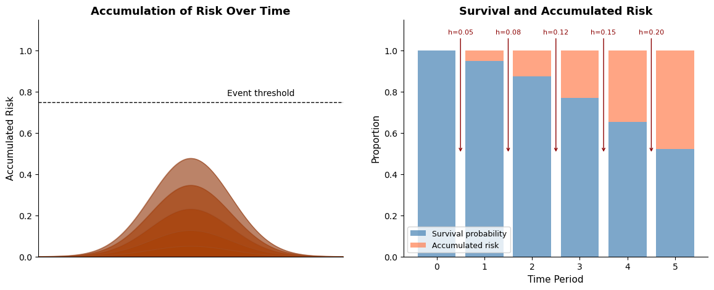

# Accumulation of Risk and the Sorites Paradox

In this project I contributed documentation for survival analysis modelling with the [Bambi](https://bambinos.github.io/bambi/) package. The work covers both discrete and continuous time approaches to survival analysis, demonstrating how regression techniques can be applied to model the accumulation of risk over time. The philosophical puzzle of the Sorites Paradox provides a natural frame for thinking about the gradual accumulation of risk and the threshold effects that survival models seek to capture.

The project culminated in two publications to the official Bambi documentation: discrete time survival analysis can be found online [here](https://bambinos.github.io/bambi/notebooks/survival_discrete_time_notebook.html) or downloaded as notebook [here](survival_discrete_time_notebook.html), and continuous time survival analysis can be found online [here](https://bambinos.github.io/bambi/notebooks/survival_continuous_time_notebook.html) or downloaded as notebook [here](survival_continuous_time_notebook.html).

