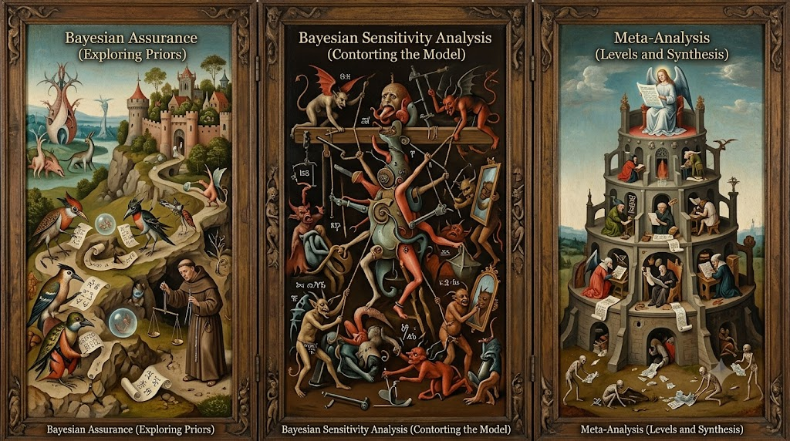

# Experiment Design Workflow in PyMC

This project added three new demonstrations to the PyMC Examples site, staged above as a Boschian triptych of the experimentation lifecycle. The learning loop, plan, interpret, synthesize, then plan again with what you learned, is central to the Bayesian experimentation workflow.

- → Assurance Planning via Simulation
- → Sensitivity Analysis for Unmeasured Confounding
- → Multiple Experiments & Bayesian Meta-analysis
- ...
- → Assurance Planning via Simulation

Each notebook jumps off a theme in the FDA's guidance on how to plan, probe and consolidate information derived from an experimentation programme.

- Bayesian Assurance: [here](https://www.pymc.io/projects/examples/en/latest/causal_inference/assurance_planning_simulation.html)

- Bayesian Sensitivity Analysis: [here](https://www.pymc.io/projects/examples/en/latest/causal_inference/sensitivity_unmeasured_confounding.html#sensitivity-confounding)

- Bayesian Meta-analysis: [here](https://www.pymc.io/projects/examples/en/latest/causal_inference/multiple_experiments_meta_analysis.html#meta-analysis-experiments)

They will ideally be read as a learning loop. 

