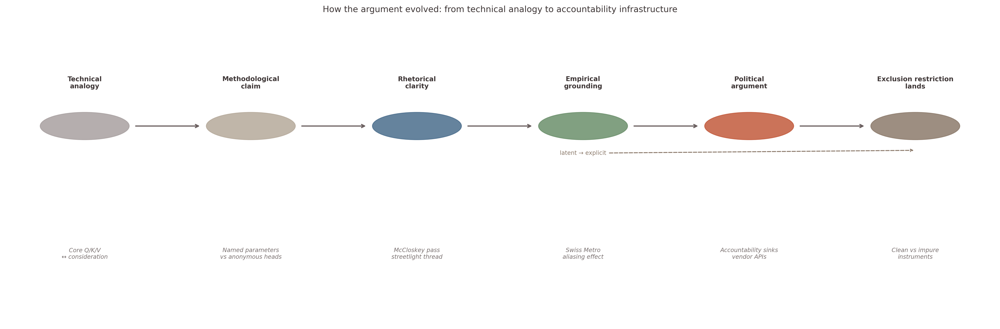
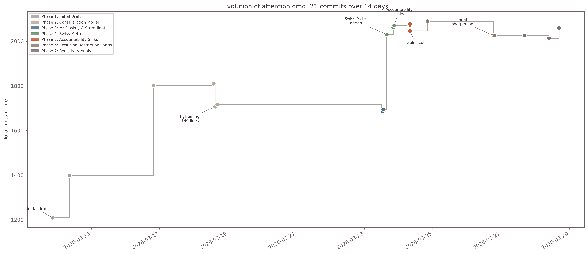
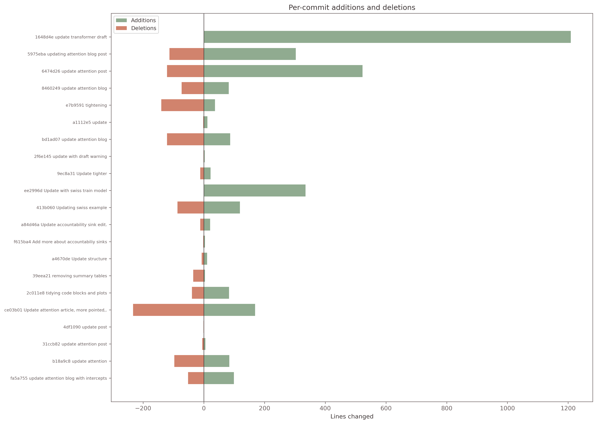

## Introduction

At my most cynical, I think the hype around AI-assisted work is largely driven by the revelatory power of simply writing things down. I've kept a personal blog and a suite of Obsidian notes for years. Writing has always been the most important step in developing quality work. To test whether AI changes that, I leaned into the workflow for a recent post: tracking every commit, every prompt, every response, and every revision. The question I wanted to answer was not whether the AI helps, but under what conditions, and at what tasks.

The companion post, [*The Architecture of Focus*](/posts/post-with-code/Consideration_Sets_Attention/attention.qmd), took 15 days and 21 commits. It started as a technical comparison between transformer attention and econometric consideration sets, with bias detection as the motivating question. It ended as an argument about accountability infrastructure: how multi-head attention functions as what Dan Davies calls an *accountability sink*, and how consideration set models provide a counter-architecture with named parameters, posteriors, and an exclusion restriction you can actually argue about.

The core analogy was there from the first draft. What unfolded over the next two weeks was the rhetorical structure, the real-data empirical grounding, and the political framing. This emerged through iterative refinement with Claude. I have an instinct to call it dialogue, but it was less than that. More mechanical, less enriching, but an occasional spur to thought. This essay maps that evolution: a record of how an argument changes shape when you refine it with a system that can diagnose technical failures, recognise structural patterns, and execute editorial passes at speed.

Both writing and modelling are iterative processes of corrective refinement. The same dynamic played out in both domains across this project: a first attempt that was competent and inert, a corrective prompt that named what was wrong, and a second attempt that was actually useful. This pattern repeats. The tools make that repetition fast.

{width=100%}

---

## How the Argument Developed

### The Initial Draft: Machinery Without Argument

My initial prompt:

> You are an expert statistician and machine learning engineer. I want your help to craft a blog post which delves into the analogies between the transformer self-attention mechanism in large language models, and the idea of attention or consideration sets in discrete choice modelling. The idea is to demonstrate the idea attention is integral to efficient processing in the two statistical paradigms, and then stress how far each implementation serves as an analogy for the other. I will want your help to implement the consideration sets discrete choice model in pymc, while I'll implement a simple transformer model with pytorch. I've attached the pymc-marketing code for a mixed logit implementation. The considerations set model should be implemented on top of this model. Let's build a qmd file with a skeleton draft of a compelling blog post on this topic.

The skeleton took shape quickly. Claude produced a clean pytorch model about lexical ambiguity on the word "bank": river vs money. Technically correct, argumentatively inert. The first corrective prompt arrived immediately:

> Good, but let's restructure the transformer data example to give it a bit more bite about attention. Let's replace the lexical ambiguity example with a vocabulary inspired by Tversky and Kahneman's Linda the bank teller example. Instead of river and finance classification let's classify the context as "feminist banker" or "bank teller."

The initial prompting did two things: it introduced a motivating example with genuine bite, and it oriented the modelling toward bias rather than lexical disambiguation. The first commit landed on March 13 with ~1,200 lines: the Q/K/V to consideration set structural map, the Linda conjunction fallacy as motivating example, and four working transformer demos. We had technical content, and a human interest hook. 

What was missing was not content but *argument*. I had working code and a clean analogy table but no rhetorical thread. No metaphor to carry the reader through. No real-world data to ground the synthetic validation. No political framing to connect the technical observation to anything a regulator would care about. This is practically often more important than the technical content. The code is the machinery; the argument is the purpose. It's why anyone should listen to you, why the details matter. 

Over the next five days I built out the econometric side. Starting from my earlier work on mixed logit models using PyMC Marketing, the dialogue extended it to handle the consideration set decomposition. We refined the data generating process for a hiring case study, defined a PyMC consideration set model, interpreted parameter estimates and derived the implications. The first tightening pass removed 140 lines. By March 18 the post had both halves of the analogy working and a concrete bias-detection result. It still read like a technical report.

{width=100%}

### Finding the Through-Line: Rhetoric and the Streetlight

On March 23, I asked for an assessment of writing style and redundancy through the lens of Deirdre McCloskey, the economist whose *Economical Writing* argues that academics write badly because they hedge, pad, and refuse to commit to a claim.

The prose tightening was mechanical and fast: splitting run-on sentences, cutting throat-clearing, replacing passive constructions. The more interesting contribution was structural, and it came from a corrective prompt about a disconnected image.

The post contained a streetlight photograph that illustrated the interpretability problem but didn't argue anything. I had gesured at the idea without making it land. The corrective prompt was simple: make this image do argumentative work. The response threaded it into a through-line:

> *The old joke about searching under the streetlight applies here. Interpretability tools examine attention weights because they are visible, not because they are where the bias lives. Single-head attention is the lamppost: you can see the weights clearly, so you look there. Multi-head attention scatters the keys into the dark. Consideration set models do something different. They ask not where does the mechanism put the bias? but does the system's behaviour exhibit bias, and on which variables? They bring their own light.*

But this was still a claim without a demonstration. What made the streetlight image fully earn its place was the multi-head attention demo built earlier in the post. The demo trains a classifier to identify the Linda context, then shows the bias localised clearly in a single attention head. Add a second head: the same bias persists but is now split across both. Add more heads: the bias is distributed across anonymous subspaces and no single head is "the biased one." You literally cannot find it by looking at any individual head. That progression *is* the streetlight effect made technical: the architecture does not hide the bias through malice but through aggregation. The metaphor and the demo were made for each other. Once the prompt surfaced the framing, the demo became the proof.

The streetlight was then threaded through three touch-points: the introduction (lamppost = single-head attention, where the bias is visible), the multi-head interpretability callout (the keys are in the dark), and the conclusion (consideration set models bring their own light). A disconnected image became a structural metaphor carried across the whole post.

::: {.callout-note icon=false}
## Before and after

**Before**: "These systems encode bias. The real problem is detection: can we *locate and quantify* what they encode? Consideration set models separate 'who gets noticed' from 'who gets chosen.' They provide the audit infrastructure that transformer attention lacks."

**After**: "These systems encode bias — they learn it from data that biased humans generated. The real problem is detection. Can we *locate and quantify* what they encode? Consideration set models separate 'who gets noticed' from 'who gets chosen.' They provide the audit infrastructure that transformer attention lacks."

The colon becomes a full stop. "The real problem is detection" becomes a declaration, not a prelude. The question that follows lands as a challenge. McCloskey's point: if you believe it, say it. Let the reader decide whether to agree.
:::

The sharpening of the prose and the threading of the metaphor were accompanied by technical model refinements too. 

### The Aliasing Discovery: Modelling as Iterative Correction

Applying the consideration model to real data was the next priority. The Swiss Metro dataset was added on March 23. The post needed real-world grounding: nobody hands you the true $\gamma_z$ in the real world. The Swiss Metro survey provides three transport modes (Train, Swiss Metro, Car), mode-level attributes (time, cost), and person-level characteristics (GA pass, business trip, income, age). The question: which characteristics gate *consideration* of a mode, as distinct from the attributes that drive utility conditional on consideration?

The first model produced a flipped sign on the GA pass: a rail pass showed *negative* $\gamma_z$ on rail modes. This looked dramatic but was not deep. The instruments were not mean-centred and the model had no consideration intercepts, so the slopes picked up a residual with a flipped sign. Fix the specification, fix the sign. A bad implementation, not a paradox.

What *was* worth writing about was why the bad implementation failed. The surrogate likelihood adds $\log \pi_{nj}$ and $V_{nj}$ inside the same softmax. If both components include intercept-like terms, a baseline consideration $\gamma_0$ and a utility constant $\alpha_j$, those terms compete during sampling. The sampler can shift probability mass between the two without changing the likelihood, because what matters is only their sum. This is the aliasing problem: multiple intercepts across the consideration and utility phases create competing degrees of freedom that are weakly identified.

::: {.callout-tip icon=false}
## The surrogate likelihood

The structural consideration set model says each alternative is independently in or out of the consideration set, generating $2^J$ possible subsets. For three modes that is manageable. For ten it is not. The log-consideration-adjusted utility approximation collapses the combinatorial sum into a tractable single softmax: $\log \pi_{nj}$ and $V_{nj}$ simply add inside it. This preserves the two-stage interpretive structure while avoiding the combinatorial explosion. It also makes the transformer analogy precise: $\log \pi_{nj}$ plays the role of the query-key dot product, and both enter a normalising function alongside a payload.
:::

What followed was a discrete sensitivity analysis, not planned as such but recognisable in retrospect. Each modelling decision was a perturbation; the dialogue tracked what changed:

1. **Drop consideration intercepts**, let $\alpha_j$ absorb both baselines. The slopes become identified from cross-person variation, but $\alpha_j$ does double duty and is hard to interpret cleanly.
2. **Add per-individual random effects** on travel-time sensitivity. This absorbs person-level heterogeneity in the utility stage where it belongs, rather than letting it bleed into the consideration slopes. My first attempt put random effects per *observation*, not per *individual*: a subtle error that inflated the parameter count without modelling the right structure. The fix was an index lookup mapping each observation to its respondent, so the model learns one time sensitivity per person across their multiple choice scenarios.
3. **Restore consideration intercepts** alongside the random effects. The intercepts absorb baseline consideration for each mode, freeing $\alpha_j$ to capture only utility preference and the slopes to capture only marginal instrument effects. The aliasing between $\gamma_0$ and $\alpha_j$ is not eliminated; it is *managed* by priors and the sigmoid nonlinearity. But the decomposition becomes interpretable.

Each step changed the posteriors. The GA effect on Car was robust across all specifications: always catastrophically negative, always with an HDI excluding zero by a wide margin. The GA effect on Train was fragile; its sign and magnitude shifted with the intercept specification. That asymmetry *is* the finding: the pass acts as a negative gate on alternatives, not a positive promoter of rail. Only the sensitivity analysis made this visible. This is exactly parallel to the writing process: the first draft is competent and inert, the corrective pass reveals what the argument actually is.

#### Identifying Restrictions: Comparing the Hiring and Transport Cases

The hiring case, by contrast, has *clean* instruments. Protected characteristics like race and age gate whether a résumé is read but should not determine job performance conditional on reading. The model recovers *which firm* screens on *which variable* and how strongly. The aliasing problem barely arises because the exclusion restriction holds by construction and, in practice, by law.

This contrast, clean instruments in hiring against impure instruments in transport, became the heart of the argument. Its status as the *central modelling choice* only emerged through iterative refinement. The most important idea in the post was latent for several drafts before the right framing surfaced it:

> *The "should not" is not a pious hope; it is the content of anti-discrimination law. When the exclusion restriction and the legal standard say the same thing, the modelling assumption is as defensible as it gets.*

### The Political Turn: Naming What Was Already There

The post had argued from the start that multi-head attention distributes bias across anonymous subspaces where it resists audit. That is already a claim about accountability; it just hadn't been named as one. Dan Davies's concept of an *accountability sink* gave the observation its proper name: an institutional structure that absorbs blame without assigning it. Calling multi-head attention an accountability sink is not adding a political frame from outside. It is following the technical observation to its logical conclusion.

The dialogue extended the logic. I pushed further:

> *Not only is the architecture at risk of obscuring information and responsibility. Eager adoption of these architectures via API calls to vendor LLMs is a pattern of off-loading responsibility to SOTA models rather than human actors or firms...*

The response articulated the three-level nesting:

> *When a firm replaces its screening committee with an API call to a vendor LLM, it outsources the decision and the accountability. The vendor says: "we provide a tool, not a decision." The firm says: "we used the best available technology." The candidate has no one to appeal to. The architecture distributes blame internally across anonymous heads. The procurement structure distributes it externally across organisations.*

The architecture (no single head), the procurement (no single firm), the history (no single decision-maker). Each layer is an accountability sink nested inside the next. The framing was new. The logic was already latent in the post's technical claims. The dialogue surfaced it.

What the accountability sink prevents is not just blame assignment. It prevents the feedback that makes diagnosis possible. If no one is responsible for a discriminatory outcome, no one is obliged to investigate it, correct the model, or change the intake filter. The sink is not just a political problem; it is an epistemological one. It structurally blocks the corrective iteration that would improve the system. Consideration set models are the counter-architecture not only because they name the variables that gate access, but because they make the decomposition *arguable*: a named parameter can be challenged, a posterior can be updated, a specification error can be diagnosed and fixed. The accountability sink forecloses that loop. Consideration set models reopen it.

---

## What It Tells You About AI Collaboration

So: is the AI adding something, or is it just the act of writing things down? Both, but unevenly. The prose tightening is mechanical: fast, somewhat reliable, and not interesting. What is interesting is what happened when the mechanical parts were done and there was something specific to push against.

The streetlight metaphor needed a corrective prompt and guided threading through the post's structure. The political framing needed a corrective prompt and rhetorical positioning. The Swiss Metro model needed three corrective prompts before it said something true: drop the intercepts, fix the random effects to individuals, restore the intercepts. In each case the AI's first response was competent and inert. The work was in knowing what was wrong with it.

That is the honest description of the tool. It is not a collaborator in the sense of bringing independent insight. It is a respondent that scales with the quality of your prompts. Corrective prompting requires the domain knowledge the AI is simulating: knowing that a flipped sign is a specification error rather than a finding, knowing that random effects per observation and per individual are different models rather than different parameterisations of the same model, knowing that a disconnected image can be made argumentative rather than merely illustrative. Rhetorical positioning requires a point of view the AI will mirror back if you give it one. Model sensitivity analysis requires knowing what to perturb and what counts as a robust result. None of that can be delegated. What can be delegated is execution: drafting the paragraph once you know what it should say, running the model variant once you know what to change, threading the metaphor once you know where it should land.

Convergence on *what matters* took longer than convergence on *how to say it*. The prose was tight by Phase 3. The argument only landed in Phase 6. That gap, between writing that reads well and writing that argues, is where the human work lives. A sharper initial prompt would have collapsed six phases into two. But writing that prompt requires knowing what you are arguing, and knowing what you are arguing is partly what the six phases produced.

{width=100%}

The core unit of progress here was not generation but diagnosis. Every useful step began with a diagnosis of what was wrong with the previous version: the Linda example replacing bank/river, the streetlight threaded across three sections, the GA pass identified as a negative gate rather than a rail promoter. The AI accelerated the subsequent execution. It did not originate the diagnosis or identify the need.

Branko Milanovic's [*Capitalism, Alone*](https://www.hup.harvard.edu/catalog.php?isbn=9780674983506) argues that fear of the robot is misplaced:

> "Fear of robotics and technology arise, I think, from two human frailties. One is cognitive: we simply do not know what future technological change will be and thus cannot tell what jobs will be created, __what our future needs will be__, or how raw materials will be used. The second is psychological: we get a thrill from the feat of the unknown..."

The cognitive frailty is the point. We do not know what our future needs will be because discovering what they are is an iterative process of diagnosis and correction. The essay began as a blog post exploring an analogy. The modelling work — extending my earlier PyMC Marketing mixed logit implementation to handle the consideration set decomposition — turned out to be more than illustration. Working through the aliasing problem, the exclusion restriction, and the surrogate likelihood in prose clarified what the code needed to do. The essay culminated in a [pull request to pymc-marketing](https://github.com/pymc-labs/pymc-marketing/pull/2442) combining consideration set modelling with mixed logit models. Writing the post was not a detour from the software work. It was the process by which the software design became clear. The AI made each cycle faster. It did not determine what the cycles were for. That remains the hard part — not because the mechanics of iteration resist automation, but because the goal itself is what the iteration discovers. You cannot prompt your way to a destination you have not yet found.
