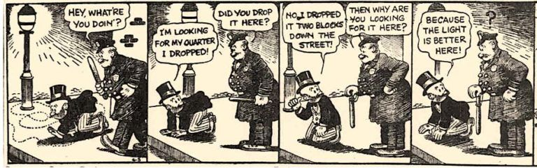

```{python}
#| label: setup
#| echo: false
#| message: false
import warnings
import pandas as pd
import matplotlib.pyplot as plt
import pymc as pm
import pytensor.tensor as pt
warnings.filterwarnings("ignore")
```

!!!!!THIS IS A DRAFT!!!!!!

## Introduction: Attention is Bias

Every act of attention is an act of exclusion. To focus on one thing is to ignore another. When the mechanism operates invisibly in systems that make consequential decisions about people, it becomes unaccountable bias.

Large language models now serve as first-pass filters in hiring. They screen résumés and shortlist applicants before a human sees them. Given candidates and a job description, they decide which features deserve processing resources. That is *selective relevance weighting*. Econometricians have studied the same structure for decades under a different name: consideration set formation.

These systems encode bias. They learn it from data generated by biased human decisions. The real problem is detection. Can we *locate and quantify* what they encode? Consideration set models separate "who gets noticed" from "who gets chosen." They provide the audit infrastructure that transformer attention lacks.

::: {.callout-tip icon=false}
## Road map

This post makes one argument in three movements. **Part I** builds a toy transformer that replicates the conjunction fallacy. A single attention head learns to over-weight vivid but non-diagnostic words. We can see the bias in the attention map. Then we add heads: the same bias persists, but now it is distributed across anonymous subspaces. No single head is "the biased one." The architecture has become what Dan Davies calls an *accountability sink*: a structure that absorbs blame without assigning it.

**Part II** introduces the econometric alternative. Consideration set models separate screening from evaluation, with named parameters, posteriors, and an exclusion restriction that forces instrument validity into the open. We fit the model to synthetic hiring data (where the ground truth is known) and then to the Swiss Metro transport dataset (where it is not). The GA pass result shows what happens when instruments are impure and the model has to earn its decomposition.

**Part III** draws the structural comparison and asks what each framework buys you. The streetlight effect and the accountability sink are two sides of the same problem. We search where the light is; the architecture ensures there is no light where the bias lives. Consideration set models bring their own lamp.
:::



The old joke about searching under the streetlight applies here. Interpretability tools examine attention weights because they are visible, not because they are where the bias lives. Single-head attention is the lamppost: you can see the weights clearly, so you look there. Multi-head attention scatters the keys into the dark. Consideration set models do something different. They ask not *where does the mechanism put the bias?* but *does the system's behaviour exhibit bias, and on which variables?* They bring their own light.

### The Linda Problem: Where Attention Bias Begins

*Linda is 31 years old, single, outspoken, and very bright. She majored in philosophy. As a student, she was deeply concerned with issues of discrimination and social justice, and also participated in anti-nuclear demonstrations.*

Kahneman and Tversky's famous vignette asks which is more probable: that Linda is (a) a bank teller, or (b) a bank teller *and* active in the feminist movement. Most people choose (b), the conjunction, violating basic probability. The error is instructive. The words *outspoken*, *philosophy*, *discrimination*, *social justice* create an attentional field that makes "feminist" overwhelmingly salient. The base rate drowns. Context selectively weights descriptors by relevance to each hypothesis.

This *selective relevance weighting* is the same mathematical mechanism at work in two paradigms:

1. **Transformer attention** (we use a simplified cross-attention variant for clarity), and
2. **Consideration sets** (from econometric discrete choice modelling).

Both score, normalise, and weight. The difference that matters for fairness: one framework names its biases, the other distributes them across anonymous subspaces where they resist audit.

---

## The Core Analogy

### Transformer Attention

For a sequence of tokens, attention computes:

$$
\text{Attention}(Q, K, V) = \text{softmax}\!\left(\frac{QK^\top}{\sqrt{d_k}}\right) V
$$

where:

- $Q \in \mathbb{R}^{1 \times d}$ is the **Query** — the target word's projection of "what am I looking for?"
- $K \in \mathbb{R}^{n \times d}$ is the **Key** — each context word's projection of "what do I signal?"
- $V \in \mathbb{R}^{n \times d}$ is the **Value** — each context word's "information payload"
- $\text{softmax}(QK^\top / \sqrt{d_k})$ gives attention weights $w_j \in [0,1]$ with $\sum_j w_j = 1$

The output is a weighted sum of value payloads, with weights set by query-key similarity. The crucial point: **$K$ and $V$ are separate projections**. What determines *what to attend to* is decoupled from *what gets retrieved*.

::: {.callout-note}
## A note on terminology: cross-attention vs self-attention

In **self-attention**, $Q$, $K$, and $V$ are all projections of the *same* sequence. In **cross-attention**, $Q$ comes from one source and $K$/$V$ from another. Our implementation is closer to cross-attention: the query is "Linda" and the keys/values are the context words. This isolates the scoring mechanism without the complexity of full self-attention. Demo 4 adds multi-head structure to show how interpretability degrades with scale.
:::

::: {.callout-warning}
## What cross-attention cannot represent

Our cross-attention architecture computes each context word's relevance to "Linda" independently. Words do not attend to *each other*, so the model cannot learn that "organized" + "concern" together signal activist more than either alone. The conjunction effect lives entirely in the training labels. The model absorbs word-label correlations from biased data. It does not discover conjunction structure through architectural composition.

Full self-attention would let context words interact before classification. Production transformers handle conjunction-like reasoning this way, through multi-layer self-attention across the sequence.

This limitation is conservative. Our conjunction fallacy results are a **lower bound** on the interpretability problem. Pure single-word correlations from biased training data suffice to reproduce the bias. Self-attention with word-word interactions would make the bias *harder* to locate: more interaction terms, more compositional subspaces, more places for discrimination to hide.
:::

### Consideration Sets in Discrete Choice

A consumer does not evaluate every available alternative. She first forms a **consideration set** $\mathcal{C}_n \subseteq \mathcal{J}$, then chooses from within it.

The probability of choosing alternative $j$ is:

$$
P(j \text{ chosen}) = \sum_{\mathcal{C}: j \in \mathcal{C}} P(j \mid \mathcal{C}) \cdot P(\mathcal{C})
$$

where:

- $\pi_{nj} = \sigma\!\left(\gamma_{0j} + \mathbf{z}_n^\top \boldsymbol{\gamma}_j\right)$ is the **consideration probability** for alternative $j$, i.e. the propensity to attend, modelled with a **sigmoid** (independent per alternative, not softmax)
- $P(\mathcal{C}) = \prod_k \pi_{nk}^{\mathbf{1}[k \in \mathcal{C}]} (1-\pi_{nk})^{\mathbf{1}[k \notin \mathcal{C}]}$ is the probability of a particular set forming
- $P(j \mid \mathcal{C}) = \text{softmax}(V_{n\mathcal{C}})_j$ is the standard logit choice *within* the consideration set

Marginalising over all $2^J$ possible consideration sets is combinatorially expensive. The **log-consideration-adjusted utility** approximation (Swait & Ben-Akiva, 1987; Cascetta & Papola, 2001) collapses both stages into a single softmax:

$$
P(j \text{ chosen}) \approx \text{softmax}_j\!\bigl(\log \pi_{nj} + V_{nj}\bigr)
$$

This is a surrogate likelihood, not the structural model. The hard-gating story motivates the decomposition: each alternative is in or out. The log-adjusted form makes it estimable. We use it throughout because it is tractable, identified under the exclusion restriction, and sufficient for the audit question: *which variables gate consideration, and how strongly?*

### The Structural Map

::: {.callout-note icon=false}
## The Attention–Consideration Analogy

| Transformer Component | Discrete Choice Analogue |
|---|---|
| Query $Q$ | Consumer's current **need state** (context $z_n$) |
| Key $K_j$ | Alternative $j$'s **signalled attributes** |
| $Q \cdot K_j^\top / \sqrt{d}$ | Alternative $j$'s **relevance score** $\gamma_{0j} + z_n'\gamma_j$ |
| $\text{softmax}(QK^\top / \sqrt{d})$ | Consideration probability $\pi_{nj} = \sigma(\cdot)$; note: sigmoid (independent), not softmax (coupled) |
| Value $V_j$ | Alternative $j$'s **utility payload** $V_{nj}$ |
| $\sum_j w_j V_j$ (weighted value aggregate) | $\text{softmax}(\log \pi_j + V_j)$ (consideration-weighted choice) |

**How scores and values combine differs.** Transformers aggregate values by weights: $\sum_j w_j V_j$. Consideration models add scores and values inside a single softmax: $\text{softmax}_j(\log \pi_j + V_j)$. The parallel is structural, not algebraic. Both separate a relevance signal from a payload.

**The other critical difference is the gate type.** Transformers use soft continuous weighting: every token always contributes. Consideration sets use hard stochastic gating: alternatives are in the set or not. The transformer is a *differentiable relaxation* of the consideration set mechanism. Sending the softmax temperature $\tau \to 0$ recovers hard one-hot gating from the soft distribution, i.e. the same limit used in Gumbel-Softmax reparameterisation.
:::

---

## Part I: The Transformer Side

We build a toy transformer that classifies "Linda" by attending to context. A single head learns to over-weight vivid but non-diagnostic words. The signal then fragments across multiple heads until it becomes unlocatable. The interpretability problem in miniature.

### Demo 1 — Static Soft Attention

Before training anything, we can see the $Q, K, V$ mechanism at work. The word `"Linda"` computes a scaled dot-product against context word keys. The $Q \cdot K^\top$ score determines *what to attend to*, but $V$ determines *what information is retrieved*.

```{python}
#| label: static-attention
#| message: false
#| fig-cap: "Static attention: a feminist-sense query for 'Linda' attends selectively to activism context. The V matrix decouples the signal (K) from the payload (V)."

import torch
import torch.nn.functional as F
import matplotlib.pyplot as plt
import numpy as np


def static_qkv_attention(Q, K, V):
    """
    Full QKV scaled dot-product attention.

    Q : (1, d)  — query  (the target word: "what am I looking for?")
    K : (n, d)  — keys   (context words: "what do I signal?")
    V : (n, d)  — values (context words: "what information do I deliver?")

    Returns
    -------
    context : (1, d)  — relevance-weighted information payload
    weights : (1, n)  — attention distribution
    """
    d_k = Q.shape[-1]
    scores  = torch.matmul(Q, K.T) / (d_k ** 0.5)
    weights = F.softmax(scores, dim=-1)
    context = torch.matmul(weights, V)   # weighted sum of VALUE payloads
    return context, weights


torch.manual_seed(1)
d = 8

# Hand-crafted key embeddings — activism words project similarly to the feminist query
outspoken_K  = torch.tensor([1.2, 0.1, 2.1, 0.5, 0.2, 0.0, 1.1, 0.8])
justice_K    = torch.tensor([1.1, 0.0, 2.3, 0.4, 0.1, 0.1, 1.0, 0.9])
deposit_K    = torch.tensor([0.1, 2.5, 0.2, 1.1, 1.5, 2.0, 0.1, 0.2])  # very different

# Feminist-sense query for "Linda"
linda_Q = torch.tensor([1.0, 0.2, 2.0, 0.5, 0.3, 0.1, 1.0, 0.8]).unsqueeze(0)

# Value payloads are separate from keys — they carry semantic content
V_static = torch.randn(3, d) * 0.5  # arbitrary payloads for illustration

K_static = torch.stack([outspoken_K, justice_K, deposit_K])
_, attn_w = static_qkv_attention(linda_Q, K_static, V_static)

words = ["outspoken", "justice", "deposit"]
w = attn_w[0].detach().numpy()

fig, ax = plt.subplots(figsize=(6, 3.5))
colors = ["#4C72B0", "#4C72B0", "#DD8452"]
bars = ax.bar(words, w, color=colors, alpha=0.85, edgecolor="white", linewidth=1.5)
ax.set_ylabel("Attention weight $w_j$")
ax.set_title("Static QKV attention: feminist-sense 'Linda' query")
ax.set_ylim(0, 1.05)
for bar, weight in zip(bars, w):
    ax.text(bar.get_x() + bar.get_width() / 2, bar.get_height() + 0.02,
            f"{weight:.3f}", ha="center", va="bottom", fontsize=11)
plt.tight_layout()
plt.show()
```

The feminist-sense query attends heavily to `outspoken` and `justice`, and nearly ignores `deposit`. The output is the weighted sum of the *value* payloads of those relevant words, not just the knowledge that they were relevant.

---

### Demo 2 — Learning to Attend: The Linda Classification Task

Now the $Q$, $K$, $V$ matrices are *learned* from data, not hand-crafted. We construct a toy corpus centred on `"Linda"`, inspired by the conjunction fallacy experiment.

#### Data-Generating Process

Each training example places `"Linda"` in a context corresponding to either (0) a *feminist activist* reading or (1) a *bank teller* reading. Three features of the original T&K experiment are built directly into the DGP:

1. **Base rate imbalance.** In the real world, bank tellers vastly outnumber feminist activists. We set P(teller sense) = 0.70, P(activist sense) = 0.30. A calibrated model should respect this prior for ambiguous inputs.

2. **Vignette injection.** Every participant in the original experiment reads the same activist-flavoured description of Linda before judging. We mirror this by injecting one word from a vignette pool (*"outspoken"*, *"philosophy"*, *"justice"*, *"discrimination"*) into *every* context, regardless of the true generating sense. This creates systematic activist-flavoured noise that the transformer must either discount or be biased by.

3. **Conjunction boosts.** Words like *"independent"* and *"organized"* are genuinely ambiguous. Individually they signal neither sense clearly. But when a vignette word co-occurs with an ambiguous word, the combination shifts the label toward activist on a log-odds scale. Vivid descriptors plus ambiguous traits create a stronger activist impression than either alone.

Each word $w$ is assigned signal weights $(a_w, t_w)$ representing how likely it is to appear when "Linda" carries its activist versus teller sense. Context words are sampled proportional to these weights. The label is determined stochastically: base sense provides a strong prior, but conjunction effects can override it.

```{python}
#| label: dgp-vocabulary
#| message: false

import random
import pandas as pd

random.seed(42)
np.random.seed(42)

# =============================================================================
# Vocabulary with graded signal strengths (Linda task).
#
# Format: word -> (activist_weight, teller_weight)
#
# activist_weight = proportional probability of appearing when Linda=feminist
# teller_weight   = proportional probability of appearing when Linda=bank teller
#
# Ambiguous words carry moderate weight in BOTH senses.
# Noise words carry low weight in either direction.
# =============================================================================

VOCAB_SIGNALS: dict[str, tuple[float, float]] = {
    # --- Strong ACTIVIST signals ---
    "protest":       (0.90, 0.05),
    "outspoken":     (0.85, 0.08),
    "justice":       (0.88, 0.06),
    "philosophy":    (0.82, 0.07),
    "discrimination":(0.80, 0.05),
    "rally":         (0.78, 0.06),
    "petition":      (0.75, 0.08),
    "equality":      (0.72, 0.05),
    # --- Genuinely AMBIGUOUS words ---
    "independent":   (0.50, 0.42),   # "independent thinker" vs "independent contractor"
    "organized":     (0.38, 0.48),   # "organized protests"  vs "organized ledgers"
    "concern":       (0.45, 0.35),   # "social concern"      vs "financial concern"
    # --- Strong TELLER signals ---
    "deposit":       (0.06, 0.92),
    "vault":         (0.04, 0.95),   # "vault of knowledge" leaks a mild activist signal
    "ledger":        (0.05, 0.90),
    "account":       (0.08, 0.88),   # "account of injustice" leaks activist
    "teller":        (0.03, 0.94),
    "transaction":   (0.06, 0.85),
    "cashier":       (0.05, 0.90),
    "receipt":       (0.07, 0.82),
    # --- Low-signal NOISE words ---
    "Tuesday":       (0.08, 0.07),
    "nearby":        (0.09, 0.10),
    "usually":       (0.07, 0.06),
    "recently":      (0.06, 0.08),
    "often":         (0.07, 0.07),
    "sometimes":     (0.06, 0.06),
    "rather":        (0.05, 0.05),
    "quite":         (0.08, 0.09),
}

VOCAB  = list(VOCAB_SIGNALS.keys())
TARGET = "Linda"

# --- Vignette injection (the T&K design) --------------------------------------
# In the original experiment every participant reads the same activist-flavoured
# description of Linda before judging.  We mirror this by injecting one word
# from this pool into EVERY context, regardless of the true generating sense.
# This creates a systematic activist signal in every training example —
# analogous to the "volume of text" that biases the transformer's mapping.
VIGNETTE_POOL = ["outspoken", "philosophy", "justice", "discrimination"]

# --- Conjunction effects (the Linda insight) -----------------------------------
# Certain word PAIRS boost P(activist) when they co-occur.  Values are additive
# shifts on the log-odds scale of P(label = activist).
#
# Vignette × ambiguous pairs fire often (a vignette word is always present);
# ambiguous × ambiguous pairs fire rarely but carry stronger boosts.
CONJUNCTION_BOOST: dict[frozenset, float] = {
    # Vignette × ambiguous (moderate boost, fires often)
    frozenset({"philosophy", "organized"}):   1.5,   # philosophical organiser → activist
    frozenset({"justice", "concern"}):        1.5,   # justice + concern → activist
    frozenset({"outspoken", "independent"}):  1.5,   # outspoken independent → activist
    frozenset({"discrimination", "concern"}): 1.2,   # concern about discrimination → activist
    # Ambiguous × ambiguous (strong boost, fires rarely)
    frozenset({"organized", "concern"}):      3.0,   # organized concern → social activism
    frozenset({"independent", "organized"}):  2.5,   # two ambiguous traits → activist profile
    frozenset({"independent", "concern"}):    2.0,   # principled concern → activist mindset
}


def generate_context(sense: int, ctx_size: int = 4) -> list[str]:
    """
    Sample a context window for 'Linda' given its true sense.

    Every context contains one VIGNETTE word (always activist-flavoured,
    drawn uniformly from VIGNETTE_POOL) plus (ctx_size - 1) words sampled
    by signal strength.  This mirrors the T&K design: every participant
    reads the same vivid activist description, regardless of Linda's
    actual occupation.
    """
    vignette = random.choice(VIGNETTE_POOL)
    remaining_vocab = [w for w in VOCAB if w != vignette]
    weights = np.array([VOCAB_SIGNALS[w][sense] for w in remaining_vocab])
    weights = weights / weights.sum()
    others = list(np.random.choice(
        remaining_vocab, size=ctx_size - 1, replace=False, p=weights
    ))
    return [vignette] + others


def build_corpus(n: int = 2500, ctx_size: int = 4) -> list[tuple]:
    """
    Generate a corpus of (context, target, label) triples.

    Base rate: P(teller sense) = 0.70, P(activist sense) = 0.30 — mirroring
    the real-world prior that bank tellers vastly outnumber feminist
    activists.  The vignette injection and conjunction boosts then shift
    labels toward activist, creating a training distribution that over-
    represents activist labels relative to the base rate — the conjunction
    fallacy baked into the data.
    """
    corpus = []
    for _ in range(n):
        base_sense = 0 if random.random() < 0.30 else 1   # 30 % activist

        ctx = generate_context(base_sense, ctx_size)

        # Log-odds of activist label (base ≈ 90 % match with generating sense)
        base_logodds = 2.2 if base_sense == 0 else -2.2

        # Pair interaction: co-occurring words boost activist odds
        ctx_set = set(ctx)
        boost = sum(
            delta for pair, delta in CONJUNCTION_BOOST.items()
            if pair.issubset(ctx_set)
        )
        p_activist = 1 / (1 + np.exp(-(base_logodds + boost)))
        label = 0 if random.random() < p_activist else 1

        corpus.append((ctx, TARGET, label))
    return corpus


corpus = build_corpus(n=2500)
df     = pd.DataFrame(corpus, columns=["context", "target", "label"])

# --- Label distribution: does the conjunction fallacy inflate activist labels? ---
n_act = (df["label"] == 0).sum()
n_tel = (df["label"] == 1).sum()
print(f"Label distribution:  activist={n_act} ({n_act/len(df):.1%})  "
      f"teller={n_tel} ({n_tel/len(df):.1%})")
print(f"  (base-rate prior was 30 % activist / 70 % teller)\n")

# Vignette frequency check
for v in VIGNETTE_POOL:
    frac = df["context"].apply(lambda c: v in c).mean()
    print(f"  Vignette '{v}' appears in {frac:.0%} of contexts")

# Sanity checks: do signal words appear in the right contexts?
print("\nWord co-occurrence by label (0=activist, 1=teller):\n")
for word in ["vault", "protest", "independent", "Tuesday"]:
    df[f"has_{word}"] = df["context"].apply(lambda x: word in x)
    ct = pd.crosstab(df[f"has_{word}"], df["label"], normalize="columns")
    ct.index = [f"{word}=False", f"{word}=True"]
    print(ct.round(3)); print()

# Show conjunction effect: how do pair co-occurrences shift the label?
print("--- Conjunction effects on P(activist label) ---\n")
for pair, boost_val in sorted(CONJUNCTION_BOOST.items(), key=lambda x: -x[1]):
    w1, w2 = sorted(pair)
    has_pair = df["context"].apply(lambda ctx: pair.issubset(set(ctx)))
    n_pair = has_pair.sum()
    if n_pair > 0:
        p_act = (df.loc[has_pair, "label"] == 0).mean()
        print(f"  {w1:>14s} + {w2:<14s}  (boost={boost_val:+.1f})  "
              f"n={n_pair:3d}   P(activist)={p_act:.2f}")
    else:
        print(f"  {w1:>14s} + {w2:<14s}  (boost={boost_val:+.1f})  "
              f"n=  0   [pair never sampled]")
```

Although only 30% of examples were generated from the activist-sense distribution, the effective P(activist label) is higher. Conjunction boosts systematically flip teller-sense examples toward activist when vignette words co-occur with ambiguous descriptors. Every context contains at least one vignette word, so the model trains on text that is always partially activist-flavoured.

```{python}
#| label: vocab-log-odds
#| fig-cap: "Log-odds of each word's activist vs teller signal strength. Words near zero are genuine ambiguity carriers; words at the extremes are strong sense-specific signals."

log_odds = {
    w: np.log((VOCAB_SIGNALS[w][0] + 1e-3) / (VOCAB_SIGNALS[w][1] + 1e-3))
    for w in VOCAB
}

sorted_items = sorted(log_odds.items(), key=lambda x: x[1])
words_sorted = [x[0] for x in sorted_items]
lo_sorted    = [x[1] for x in sorted_items]

fig, ax = plt.subplots(figsize=(8, 6))
colors  = ["#4C72B0" if lo > 0 else "#DD8452" for lo in lo_sorted]
ax.barh(words_sorted, lo_sorted, color=colors, alpha=0.85, edgecolor="white")
ax.axvline(0, color="black", linewidth=0.9, linestyle="--")
ax.set_xlabel(r"Log-odds  $\log(a_w / t_w)$")
ax.set_title("Vocabulary signal structure: activist (blue) vs teller (orange)")
plt.tight_layout()
plt.show()
```

The log-odds chart shows each word's marginal diagnostic value. Words at the extremes are unambiguous signals; words near zero carry little or conflicting information. The four vignette words (`outspoken`, `philosophy`, `justice`, `discrimination`) all sit at the activist extreme, but because they appear in *every* context regardless of sense, their marginal diagnostic value is actually lower than this chart suggests. The model must learn to discount them or it will systematically over-predict activist.

---

#### Full QKV Attention Head

```{python}
#| label: attention-model

import torch.nn as nn
import torch.optim as optim


class AttentionHead(nn.Module):
    """
    Single attention head (cross-attention style: Q from target, K/V from context).

    The analogy with discrete choice:

        Q  <->  Consumer's current need state (what am I looking for?)
        K  <->  What each word SIGNALS / advertises
        V  <->  The information PAYLOAD each word delivers

    The attended context = softmax(QK^T / sqrt(d)) . V is a
    relevance-weighted extraction from the value space — not the
    raw embedding space. Without V, the model conflates "what I
    attend to" with "what I get", exactly as a consideration model
    that treats consideration probability and utility as the same
    quantity would.
    """

    def __init__(self, vocab_size: int, d_model: int = 32):
        super().__init__()
        self.d_model = d_model
        self.embed   = nn.Embedding(vocab_size, d_model)
        self.q_proj  = nn.Linear(d_model, d_model, bias=False)
        self.k_proj  = nn.Linear(d_model, d_model, bias=False)
        self.v_proj  = nn.Linear(d_model, d_model, bias=False)  # the crucial addition
        self.clf     = nn.Linear(d_model, 2)

    def _attention_weights(
        self, ctx_idxs: torch.Tensor, tgt_idx: torch.Tensor
    ) -> tuple[torch.Tensor, torch.Tensor]:
        """Compute soft attention weights and context embeddings."""
        c = self.embed(ctx_idxs)           # (ctx, d)
        t = self.embed(tgt_idx).unsqueeze(0)  # (1, d)
        Q = self.q_proj(t)                 # (1, d)  — need-state query
        K = self.k_proj(c)                 # (ctx, d) — signal projection
        scores  = torch.matmul(Q, K.T) / (self.d_model ** 0.5)
        weights = F.softmax(scores, dim=-1)
        return weights, c

    def forward(
        self, ctx_idxs: torch.Tensor, tgt_idx: torch.Tensor
    ) -> tuple[torch.Tensor, torch.Tensor]:
        weights, c_embs = self._attention_weights(ctx_idxs, tgt_idx)
        V           = self.v_proj(c_embs)          # (ctx, d) — value/payload projection
        context_vec = torch.matmul(weights, V)     # (1, d)   — aggregate information
        logits      = self.clf(context_vec)        # (1, 2)
        return logits, weights
```

#### Hard-Gated Attention (the Consideration Set Variant)

#### Training

We train with cross-entropy loss only, no entropy penalty. The task has three sources of structure: individual word signals, pair co-occurrences, and a base rate prior (70% teller). Every context contains an activist-flavoured vignette word. Whether the model learns to discount this omnipresent signal or is captured by it is the empirical question.

```{python}
#| label: training
#| message: false

torch.manual_seed(42)

# Build vocabulary (sorted for reproducibility)
all_words = sorted(set(w for ctx, _, _ in corpus for w in ctx) | {TARGET})
w2i = {w: i for i, w in enumerate(all_words)}
i2w = {i: w for w, i in w2i.items()}

train_corpus = corpus[:2000]
test_corpus  = corpus[2000:]

model     = AttentionHead(len(w2i), d_model=32)
optimizer = optim.Adam(model.parameters(), lr=1e-3)
criterion = nn.CrossEntropyLoss()

losses = []
for epoch in range(100):
    model.train()
    epoch_loss = 0.0
    for ctx, tgt, lbl in train_corpus:
        optimizer.zero_grad()
        c_idx  = torch.tensor([w2i[w] for w in ctx])
        t_idx  = torch.tensor(w2i[tgt])
        logits, _ = model(c_idx, t_idx)
        loss = criterion(logits, torch.tensor([lbl]))
        loss.backward()
        optimizer.step()
        epoch_loss += loss.item()
    losses.append(epoch_loss / len(train_corpus))

# Evaluate
model.eval()
with torch.no_grad():
    correct = sum(
        torch.argmax(
            model(
                torch.tensor([w2i[w] for w in ctx]),
                torch.tensor(w2i[tgt])
            )[0]
        ).item() == lbl
        for ctx, tgt, lbl in test_corpus
    )
print(f"Test accuracy : {correct / len(test_corpus):.3f}")
print(f"Final loss    : {losses[-1]:.4f}")
```

#### What Has the Model Learned to Attend To?

Do the learned attention weights track the *true* signal strengths, or are they biased by the vignette injection? Vignette words appear in every context, so their marginal diagnostic value is zero. Yet their strong activist associations might cause the model to over-attend to them.

```{python}
#| label: attention-by-sense
#| fig-cap: "Average attention weight per word, by label. Vignette words (outspoken, philosophy, justice, discrimination) appear in every context — does the model learn to discount them?"

attention_records = {0: {}, 1: {}}

model.eval()
with torch.no_grad():
    for ctx, tgt, lbl in corpus:
        c_idx = torch.tensor([w2i[w] for w in ctx])
        t_idx = torch.tensor(w2i[tgt])
        _, weights = model(c_idx, t_idx)
        for w, a in zip(ctx, weights[0].numpy()):
            attention_records[lbl].setdefault(w, []).append(float(a))

# Words appearing in both label groups — exclude vignette words from the
# Spearman analysis because their appearance is forced (not governed by
# VOCAB_SIGNALS), so their "true signal weight" is not a meaningful
# comparison point.
common_words  = [
    w for w in VOCAB
    if w not in VIGNETTE_POOL
    and attention_records[0].get(w) and attention_records[1].get(w)
]
vignette_words_in_data = [
    w for w in VIGNETTE_POOL
    if attention_records[0].get(w) and attention_records[1].get(w)
]
activist_attn    = [np.mean(attention_records[0][w]) for w in common_words]
teller_attn  = [np.mean(attention_records[1][w]) for w in common_words]

fig, axes = plt.subplots(1, 2, figsize=(13, 6))

for ax, (attn, sense_name, color) in zip(
    axes,
    [(activist_attn, "Activist sense (0)", "#4C72B0"),
     (teller_attn, "Teller sense (1)", "#DD8452")],
):
    order = np.argsort(attn)[::-1]
    ax.barh(
        [common_words[i] for i in order],
        [attn[i] for i in order],
        color=color, alpha=0.85,
    )
    baseline = 1 / len(common_words)
    ax.axvline(
        baseline, color="k", linestyle="--", alpha=0.5,
        label=f"Uniform baseline ({baseline:.2f})"
    )
    ax.set_xlabel("Average attention weight")
    ax.set_title(f"Learned attention: {sense_name}")
    ax.legend(fontsize=8)

plt.suptitle(
    "Learned attention by label — do vignette words get discounted or over-attended?",
    y=1.02, fontsize=12
)
plt.tight_layout()
plt.show()
```

```{python}
#| label: signal-recovery
#| fig-cap: "Scatter of true DGP signal strength vs learned average attention weight, by label. Circles: non-vignette words (Spearman computed over these). Red triangles: vignette words (always present, excluded from correlation — their forced presence means VOCAB_SIGNALS does not govern their frequency)."

from scipy.stats import spearmanr

fig, axes = plt.subplots(1, 2, figsize=(12, 5))

for ax, (sense_idx, sense_label, attn_list, color) in zip(
    axes,
    [(0, "Activist", activist_attn,   "#4C72B0"),
     (1, "Teller",   teller_attn, "#DD8452")],
):
    true_s = [VOCAB_SIGNALS[w][sense_idx] for w in common_words]
    rho, p = spearmanr(true_s, attn_list)

    # Non-vignette words (governed by VOCAB_SIGNALS)
    ax.scatter(true_s, attn_list, color=color, alpha=0.8, s=55)
    for w, ts, la in zip(common_words, true_s, attn_list):
        ax.annotate(w, (ts, la), fontsize=7, alpha=0.75,
                    xytext=(3, 2), textcoords="offset points")

    # Vignette words (always present — annotated separately as red triangles)
    for vw in vignette_words_in_data:
        vts = VOCAB_SIGNALS[vw][sense_idx]
        vla = np.mean(attention_records[sense_idx][vw])
        ax.scatter([vts], [vla], color="red", marker="^", s=80,
                   zorder=5, alpha=0.9)
        ax.annotate(vw, (vts, vla), fontsize=7, alpha=0.9, color="red",
                    xytext=(3, 2), textcoords="offset points")

    # Regression line
    m, b = np.polyfit(true_s, attn_list, 1)
    xs = np.linspace(min(true_s), max(true_s), 100)
    ax.plot(xs, m * xs + b, color=color, linestyle="--", alpha=0.6)

    ax.set_xlabel(f"True DGP signal weight ({sense_label.lower()} sense)")
    ax.set_ylabel("Learned attention weight")
    ax.set_title(f"{sense_label} sense  (Spearman ρ = {rho:.2f},  p = {p:.3f})")

plt.suptitle(
    "Does transformer attention recover the DGP signal weights?",
    y=1.02, fontsize=12
)
plt.tight_layout()
plt.show()
```

**How to read these plots.** Each point is a word. The x-axis is the true DGP signal weight; the y-axis is the learned attention weight. Perfect recovery would place points on an increasing line. Red triangles are vignette words, excluded from the correlation because their appearance is forced.

Two features stand out. First, **asymmetry between senses**: the teller panel shows significant positive $\rho$. The majority class (70%) gives the model enough data to learn which words are teller-diagnostic. The activist panel shows weak or negative $\rho$, with fewer examples and vignette contamination.

Second, **vignette words** have the highest designed signal weights but zero diagnostic value. Elevated attention to them is the conjunction fallacy in learned weights. The model has been captured by the volume of activist-flavoured text, exactly as human respondents are captured by the vivid Linda description.

A weak $\rho$ for non-vignette words teaches a further lesson. The V-projection and classifier can absorb classification signal without attention weights faithfully mirroring word importance. As Jain & Wallace (2019) and Wiegreffe & Pinter (2019) argued, attention provides a *mechanism* but not necessarily an *explanation*.

---

### Demo 3 — The Conjunction Fallacy in Attention

Human respondents systematically judge P(feminist bank teller) > P(bank teller). Vivid descriptions overwhelm the base rate. Does our transformer exhibit the same bias? Seven diagnostic contexts separate three effects: the base rate prior, the conjunction boost, and the vignette injection.

```{python}
#| label: conjunction-fallacy-probe
#| fig-cap: "Conjunction fallacy probe: P(model predicts activist) for seven diagnostic contexts. The dashed line marks the 30% base rate. Moving left to right isolates the additive effects of conjunction pairs and vignette words."

probes = {
    "Pure Teller":             ["deposit", "vault", "ledger", "account"],
    "Teller + Vignette":       ["outspoken", "deposit", "vault", "ledger"],
    "Ambiguous (no pairs)":    ["independent", "Tuesday", "nearby", "usually"],
    "Ambiguous (with pairs)":  ["independent", "organized", "concern", "Tuesday"],
    "Vignette + Amb pairs":    ["philosophy", "independent", "organized", "concern"],
    "Vignette + Amb + Teller": ["justice", "organized", "deposit", "usually"],
    "Pure Activist":           ["protest", "rally", "petition", "equality"],
}

probe_results = {}
model.eval()
with torch.no_grad():
    for name, ctx in probes.items():
        c_idx = torch.tensor([w2i[w] for w in ctx])
        t_idx = torch.tensor(w2i[TARGET])
        logits, attn_w = model(c_idx, t_idx)
        probs = F.softmax(logits, dim=-1)[0].numpy()
        pred  = "activist" if probs[0] > probs[1] else "teller"
        probe_results[name] = {
            "P(activist)": probs[0],
            "prediction":  pred,
            "attention":   dict(zip(ctx, attn_w[0].numpy())),
        }

# --- Table ---
print(f"{'Probe':<26s}  P(activist)  Prediction")
print("-" * 58)
for name, res in probe_results.items():
    marker = " ***" if name == "Vignette + Amb pairs" else ""
    print(f"{name:<26s}  {res['P(activist)']:>9.3f}    {res['prediction']}{marker}")
print(f"\n  Base rate prior = 0.30")

# --- Bar chart ---
fig, ax = plt.subplots(figsize=(11, 5))
names = list(probe_results.keys())
p_act = [probe_results[n]["P(activist)"] for n in names]
colors = ["#c44e52" if p > 0.5 else "#4C72B0" for p in p_act]

bars = ax.bar(range(len(names)), p_act, color=colors, alpha=0.85, edgecolor="white")
ax.axhline(0.30, color="black", linestyle="--", alpha=0.6,
           label="Base rate (30 % activist)")
ax.axhline(0.50, color="grey", linestyle=":", alpha=0.4,
           label="Decision boundary")
ax.set_xticks(range(len(names)))
ax.set_xticklabels(names, rotation=30, ha="right", fontsize=9)
ax.set_ylabel("P(model predicts activist)")
ax.set_ylim(0, 1.05)
ax.legend(fontsize=8)
ax.set_title("The conjunction fallacy in attention: "
             "isolating base rate, conjunction pairs, and vignette effects")
plt.tight_layout()
plt.show()
```

The probes isolate three cumulative effects:

1. **Base rate**: Pure Teller and Pure Activist establish the endpoints.

2. **Conjunction pairs**: Compare **Ambiguous (no pairs)** to **Ambiguous (with pairs)**. The first should classify near the 30% base rate. The second packs three ambiguous words whose pairwise boosts total +7.5 on the log-odds scale. The jump measures the *conjunction effect* alone.

3. **Vignette injection**: Compare **Ambiguous (with pairs)** to **Vignette + Amb pairs**. Same conjunction words, but a noise word is swapped for `philosophy`. Any additional increase in P(activist) is the marginal vignette effect.

The transformer classifies by pattern similarity, not by Bayesian updating. The volume of activist-flavoured text shapes the learned mapping, exactly as the vivid Linda description biases human respondents away from the base rate.

---

### Demo 4 — Multi-Head Attention: Where Does the Bias Live?

The single-head model gives us one attention map and a direct link between what the model attends to and what it predicts. Real transformers use **multiple heads**, each operating in a low-dimensional subspace, recombined through nonlinear projections. Two questions. First, when bias is distributed across heads, does it become harder to detect? Second, does recombination amplify or attenuate the conjunction fallacy?

::: {.callout-note}
## Why multi-head attention matters for interpretability

Four heads compute Q, K, V projections in 8-dimensional subspaces ($d_{\text{head}} = 32 / 4 = 8$). Head outputs are concatenated and passed through a **two-layer MLP with GELU activation** before classification. The nonlinear recombination destroys decomposability. You cannot express the final logit as a sum of per-head contributions.

We use a single-layer, four-head architecture. Production transformers stack many such layers. The distribution effect is already stark at one layer. The interpretability challenge is architectural, not a matter of scale.
:::

#### The Multi-Head Architecture

```{python}
#| label: multihead-model


class MultiHeadAttention(nn.Module):
    """
    Multi-head attention with nonlinear recombination.

    Four heads, each in a d_head-dimensional subspace, recombined
    through a two-layer MLP (GELU activation) before classification.
    The nonlinear recombination is the key: it makes the mapping from
    per-head attention to output non-decomposable — you cannot attribute
    the final prediction to any single head's attention pattern.
    """

    def __init__(self, vocab_size: int, d_model: int = 32, n_heads: int = 4):
        super().__init__()
        assert d_model % n_heads == 0, "d_model must be divisible by n_heads"
        self.d_model = d_model
        self.n_heads = n_heads
        self.d_head  = d_model // n_heads

        self.embed = nn.Embedding(vocab_size, d_model)

        # Per-head Q, K, V projections (d_model -> d_head each)
        self.q_projs = nn.ModuleList([
            nn.Linear(d_model, self.d_head, bias=False) for _ in range(n_heads)
        ])
        self.k_projs = nn.ModuleList([
            nn.Linear(d_model, self.d_head, bias=False) for _ in range(n_heads)
        ])
        self.v_projs = nn.ModuleList([
            nn.Linear(d_model, self.d_head, bias=False) for _ in range(n_heads)
        ])

        # Nonlinear output MLP: concat -> GELU -> projection -> classifier
        self.out_mlp = nn.Sequential(
            nn.Linear(d_model, d_model),
            nn.GELU(),
            nn.Linear(d_model, d_model),
        )
        self.clf = nn.Linear(d_model, 2)

    def _head_attention(self, head_idx, c_embs, t_emb):
        """Compute attention weights and output for a single head."""
        Q = self.q_projs[head_idx](t_emb.unsqueeze(0))   # (1, d_head)
        K = self.k_projs[head_idx](c_embs)                # (ctx, d_head)
        V = self.v_projs[head_idx](c_embs)                # (ctx, d_head)

        scores  = torch.matmul(Q, K.T) / (self.d_head ** 0.5)
        weights = F.softmax(scores, dim=-1)                # (1, ctx)
        out     = torch.matmul(weights, V)                 # (1, d_head)
        return weights, out

    def forward(self, ctx_idxs, tgt_idx):
        c_embs = self.embed(ctx_idxs)          # (ctx, d_model)
        t_emb  = self.embed(tgt_idx)           # (d_model,)

        all_weights  = []
        head_outputs = []
        for h in range(self.n_heads):
            w_h, out_h = self._head_attention(h, c_embs, t_emb)
            all_weights.append(w_h)
            head_outputs.append(out_h)

        # Nonlinear recombination: concat -> MLP -> classifier
        concat    = torch.cat(head_outputs, dim=-1)   # (1, d_model)
        projected = self.out_mlp(concat)               # (1, d_model)
        logits    = self.clf(projected)                # (1, 2)

        return logits, all_weights  # all_weights: list of n_heads tensors
```

Same embedding, same Q/K/V pattern, same classifier. Two additions: four heads in 8-dimensional subspaces instead of one head in 32, and a GELU MLP that recombines head outputs nonlinearly before classification. A linear output projection would preserve additive decomposability. The GELU layer destroys it.

#### Training

Same hyperparameters and data as the single-head model. The only difference is the architecture.

```{python}
#| label: multihead-training

torch.manual_seed(42)

n_heads  = 4
mh_model = MultiHeadAttention(len(w2i), d_model=32, n_heads=n_heads)
mh_opt   = optim.Adam(mh_model.parameters(), lr=1e-3)

mh_losses = []
for epoch in range(100):
    mh_model.train()
    epoch_loss = 0.0
    for ctx, tgt, lbl in train_corpus:
        mh_opt.zero_grad()
        c_idx  = torch.tensor([w2i[w] for w in ctx])
        t_idx  = torch.tensor(w2i[tgt])
        logits, _ = mh_model(c_idx, t_idx)
        loss = criterion(logits, torch.tensor([lbl]))
        loss.backward()
        mh_opt.step()
        epoch_loss += loss.item()
    mh_losses.append(epoch_loss / len(train_corpus))

# Evaluate
mh_model.eval()
with torch.no_grad():
    mh_correct = sum(
        torch.argmax(
            mh_model(
                torch.tensor([w2i[w] for w in ctx]),
                torch.tensor(w2i[tgt])
            )[0]
        ).item() == lbl
        for ctx, tgt, lbl in test_corpus
    )

print(f"Single-head test accuracy : {correct / len(test_corpus):.3f}")
print(f"Multi-head  test accuracy : {mh_correct / len(test_corpus):.3f}")
print(f"Single-head final loss    : {losses[-1]:.4f}")
print(f"Multi-head  final loss    : {mh_losses[-1]:.4f}")
```

More parameters, lower training loss, no better generalisation. Four heads and a nonlinear MLP give the bias more places to hide.

#### Head Specialisation: Who Attends to What?

Do the four heads specialise, each attending to a distinct word class? Or do they learn diffuse, overlapping patterns? Specialisation would preserve some interpretability; diffusion would mean the bias is truly distributed.

```{python}
#| label: head-category-heatmap
#| fig-cap: "Mean attention by head and word category, averaged over the full corpus. If heads specialise cleanly, each row should have a distinct column peak. If bias is distributed, the pattern will be diffuse — and no single head will cleanly capture the vignette effect."

WORD_CATEGORIES = {
    "activist":  [w for w, (a, t) in VOCAB_SIGNALS.items()
                  if a > 0.70 and w not in VIGNETTE_POOL],
    "vignette":  VIGNETTE_POOL,
    "teller":    [w for w, (a, t) in VOCAB_SIGNALS.items() if t > 0.80],
    "ambiguous":  ["independent", "organized", "concern"],
    "noise":     [w for w, (a, t) in VOCAB_SIGNALS.items()
                  if a < 0.10 and t < 0.15],
}

# Collect per-head attention by word category
head_cat_attn = {
    h: {cat: [] for cat in WORD_CATEGORIES}
    for h in range(n_heads)
}

# Also collect per-word for later use
head_word_attn = {h: {} for h in range(n_heads)}

mh_model.eval()
with torch.no_grad():
    for ctx, tgt, lbl in corpus:
        c_idx = torch.tensor([w2i[w] for w in ctx])
        t_idx = torch.tensor(w2i[tgt])
        _, all_weights = mh_model(c_idx, t_idx)
        for h in range(n_heads):
            for w, a in zip(ctx, all_weights[h][0].numpy()):
                # Per-category
                for cat, words in WORD_CATEGORIES.items():
                    if w in words:
                        head_cat_attn[h][cat].append(float(a))
                        break
                # Per-word
                head_word_attn[h].setdefault(w, []).append(float(a))

# Build heatmap
categories = list(WORD_CATEGORIES.keys())
heatmap_data = np.array([
    [np.mean(head_cat_attn[h][cat]) if head_cat_attn[h][cat] else 0.0
     for cat in categories]
    for h in range(n_heads)
])

fig, ax = plt.subplots(figsize=(8, 3))
im = ax.imshow(heatmap_data, cmap="YlOrRd", aspect="auto")
ax.set_xticks(range(len(categories)))
ax.set_xticklabels(categories, fontsize=10)
ax.set_yticks(range(n_heads))
ax.set_yticklabels([f"Head {h}" for h in range(n_heads)], fontsize=10)
for i in range(n_heads):
    for j in range(len(categories)):
        ax.text(j, i, f"{heatmap_data[i, j]:.3f}",
                ha="center", va="center", fontsize=9,
                color="white" if heatmap_data[i, j] > heatmap_data.max() * 0.6
                else "black")
plt.colorbar(im, ax=ax, label="Mean attention weight")
ax.set_title("Head specialisation: which heads attend to which word types?")
plt.tight_layout()
plt.show()
```

Partial specialisation, but not along the axis that matters. Head 0 tracks strong diagnostic signals and suppresses vignette. Head 1 picks up ambiguous and teller words. Head 2 is diffuse. Head 3 concentrates on vignette and activist words but conflates the two. No single head gives you "the vignette effect" in isolation. The bias has no address.

#### Vignette Bias: Concentrated or Distributed?

Vignette words appear in every context with zero diagnostic value. Does multi-head attention concentrate the over-attention in one head, or spread it across all four?

```{python}
#| label: vignette-attention-comparison
#| fig-cap: "Vignette word attention: single-head vs multi-head decomposition. The single-head bar shows total learned attention to each vignette word. The multi-head bars show per-head contributions. The dashed line marks uniform attention (1/4 for context size 4)."

vignette_words = VIGNETTE_POOL

# Collect single-head attention for vignette words
sh_vignette_attn = {}
for lbl in [0, 1]:
    for w in vignette_words:
        vals = attention_records[lbl].get(w, [])
        sh_vignette_attn.setdefault(w, []).extend(vals)

n_groups  = len(vignette_words)
bar_width = 0.25
x = np.arange(n_groups)

fig, ax = plt.subplots(figsize=(10, 5))

# Single-head bars
sh_means = [np.mean(sh_vignette_attn.get(w, [0.0])) for w in vignette_words]
ax.bar(x - bar_width, sh_means, bar_width, label="Single head",
       color="#4C72B0", alpha=0.85)

# Multi-head per-head bars
colors_mh = ["#DD8452", "#55A868", "#C44E52", "#8172B3"]
for h in range(n_heads):
    mh_means = [np.mean(head_word_attn[h].get(w, [0.0]))
                for w in vignette_words]
    ax.bar(x + h * bar_width, mh_means, bar_width,
           label=f"Head {h}", color=colors_mh[h], alpha=0.85)

ax.axhline(1.0 / 4, color="black", linestyle="--", alpha=0.5,
           label="Uniform baseline (1/ctx_size)")
ax.set_xticks(x + bar_width * (n_heads - 1) / 2)
ax.set_xticklabels(vignette_words, fontsize=10)
ax.set_ylabel("Mean attention weight")
ax.set_title("Vignette word attention: single head vs per-head decomposition")
ax.legend(fontsize=9)
plt.tight_layout()
plt.show()
```

**No single head's attention map tells the full story.** Even if three heads suppress vignette attention, the fourth head's value representation may carry the signal through the GELU MLP to the output. The bias is not in any one set of weights. It is in the interaction.

#### Does Multi-Head Attention Amplify the Conjunction Fallacy?

We run the same seven diagnostic probes from Demo 3 through the multi-head model and compare P(activist) side by side, with calibration curves on the test set.

```{python}
#| label: calibration-comparison
#| fig-cap: "Left: Conjunction fallacy probe comparison — single-head vs multi-head P(activist) for seven diagnostic contexts. Right: Calibration curves on the test set — does multi-head attention produce better-calibrated probabilities, or does it simply learn a more confident version of the same bias?"

# --- Multi-head probes ---
mh_probe_results = {}
mh_model.eval()
with torch.no_grad():
    for name, ctx in probes.items():
        c_idx = torch.tensor([w2i[w] for w in ctx])
        t_idx = torch.tensor(w2i[TARGET])
        logits, all_weights = mh_model(c_idx, t_idx)
        probs = F.softmax(logits, dim=-1)[0].numpy()
        mh_probe_results[name] = {
            "P(activist)": probs[0],
            "head_weights": {
                h: dict(zip(ctx, all_weights[h][0].numpy()))
                for h in range(n_heads)
            },
        }

# --- Calibration helper ---
def calibration_curve(mdl, test_data, n_bins=6):
    mdl.eval()
    preds, labels = [], []
    with torch.no_grad():
        for ctx, tgt, lbl in test_data:
            c_idx = torch.tensor([w2i[w] for w in ctx])
            t_idx = torch.tensor(w2i[tgt])
            logits, _ = mdl(c_idx, t_idx)
            p = F.softmax(logits, dim=-1)[0][0].item()  # P(activist)
            preds.append(p)
            labels.append(1 if lbl == 0 else 0)  # 1 = activist
    preds, labels = np.array(preds), np.array(labels)
    bin_edges = np.linspace(0, 1, n_bins + 1)
    mean_pred, mean_obs = [], []
    for lo, hi in zip(bin_edges[:-1], bin_edges[1:]):
        mask = (preds >= lo) & (preds < hi)
        if mask.sum() >= 5:  # require minimum bin size
            mean_pred.append(preds[mask].mean())
            mean_obs.append(labels[mask].mean())
    return mean_pred, mean_obs

# --- Two-panel figure ---
fig, (ax1, ax2) = plt.subplots(1, 2, figsize=(14, 5))

# Left: probe comparison
probe_names = list(probes.keys())
sh_pact = [probe_results[n]["P(activist)"] for n in probe_names]
mh_pact = [mh_probe_results[n]["P(activist)"] for n in probe_names]

x = np.arange(len(probe_names))
bw = 0.35
ax1.bar(x - bw / 2, sh_pact, bw, label="Single head", color="#4C72B0", alpha=0.85)
ax1.bar(x + bw / 2, mh_pact, bw, label="Multi-head",  color="#DD8452", alpha=0.85)
ax1.axhline(0.30, color="black", linestyle="--", alpha=0.5, label="Base rate (30%)")
ax1.axhline(0.50, color="grey",  linestyle=":",  alpha=0.4, label="Decision boundary")
ax1.set_xticks(x)
ax1.set_xticklabels(probe_names, rotation=35, ha="right", fontsize=8)
ax1.set_ylabel("P(activist)")
ax1.set_title("Conjunction fallacy probes: single vs multi-head")
ax1.legend(fontsize=8)
ax1.set_ylim(0, 1.05)

# Right: calibration
sh_pred, sh_obs = calibration_curve(model, test_corpus)
mh_pred, mh_obs = calibration_curve(mh_model, test_corpus)

ax2.plot([0, 1], [0, 1], "k--", alpha=0.5, label="Perfect calibration")
ax2.plot(sh_pred, sh_obs, "o-", color="#4C72B0", label="Single head", alpha=0.85)
ax2.plot(mh_pred, mh_obs, "s-", color="#DD8452", label="Multi-head",  alpha=0.85)
ax2.set_xlabel("Mean predicted P(activist)")
ax2.set_ylabel("Observed fraction activist")
ax2.set_title("Calibration: do extra heads improve probability estimates?")
ax2.legend(fontsize=8)
ax2.set_xlim(0, 1)
ax2.set_ylim(0, 1)

plt.tight_layout()
plt.show()
```

The conjunction fallacy persists. Multi-head attention does not eliminate the bias. Calibration does not improve.

The finding is not about amplification. It is about **locatability**. In Demo 3 we traced the bias to specific weights on specific words. Here the same discriminatory outcome resists inspection.

::: {.callout-important}
## The interpretability cost of distribution

Single head: inspect one attention map, ask "is the model over-attending to vignette words?", get a legible answer. This is the streetlight. The weights are visible, so we look there.

Four heads + GELU MLP: no clean answer. The bias lives in the interaction of concatenated value vectors, nonlinear recombination, and classifier. It cannot be decomposed into additive per-head contributions. Even *linear* probing of individual heads misses the interaction terms that drive the output. The keys are in the dark.

Dan Davies would recognise the structure. An *accountability sink* is an institutional arrangement that absorbs blame without assigning it: the call centre that cannot escalate, the committee where no individual voted for the outcome. Multi-head attention is an accountability sink for bias. The discrimination is real. No single head is responsible.
:::

---

## Part II: From Cognitive Bias to Institutional Bias

The Linda task is a thought experiment. The real world is worse. In hiring, the priming signals are protected characteristics: race, age, gender. The conjunction fallacy shows that attention can be captured by irrelevant salience. Hiring bias shows that attention can be captured by *systematically* irrelevant salience, i.e. features that predict screening decisions but should not predict job performance. And when the screening system is a multi-head transformer, the accountability sink swallows the evidence.

The consideration set model is the counter-architecture. Every screening variable gets a name, a coefficient, and a posterior. *Who gets considered?* is separate from *who gets hired?* The variables driving each stage are structurally distinct.

### The Two-Stage Model

The consideration set model separates choice into two stages:

**Stage 1 — Consideration:**
$$\pi_{nj} = \sigma\!\left(\gamma_{0j} + \mathbf{z}_n^\top \boldsymbol{\gamma}_j\right), \qquad j = 1, \ldots, J$$

Each alternative is independently included in the consideration set. The **sigmoid** (not softmax) is critical: consideration of one alternative does not crowd out another.

**Stage 2 — Choice within consideration:**
$$P(j \mid \mathcal{C}_n) = \frac{\exp(V_{nj})}{\sum_{k \in \mathcal{C}_n} \exp(V_{nk})}, \qquad V_{nj} = \alpha_j + \mathbf{x}_{nj}^\top \boldsymbol{\beta}$$

As before, the **log-consideration-adjusted utility** collapses both stages into a surrogate softmax:
$$P(j \text{ chosen}) \approx \text{softmax}_j\!\bigl(\underbrace{\log \pi_{nj}}_{\text{Key score}} + \underbrace{V_{nj}}_{\text{Value}}\bigr)$$

Why "surrogate"? The structural story is hard gating: each alternative is in the set or not, generating $2^J$ possible subsets. The log-adjusted form marginalises over those subsets analytically, yielding a single softmax. We estimate this reduced form, not the latent binary gates. The decomposition is identified provided the exclusion restriction holds: the screening instruments $z$ create cross-person variation in $\log \pi_{nj}$ that is absent from $V_{nj}$.

In the transformer analogy, $\log \pi_{nj}$ plays the role of the query-key dot product. $V_{nj}$ is, literally, the value.

::: {.callout-important icon=false}
## Identification requires K ≠ V: two aliasing problems

The log-consideration-adjusted utility is:

$$U_{\text{avail},nj} = \log\sigma\!\bigl(\underbrace{\gamma_{0j}}_{\text{consideration intercept}} + \gamma_{zj}\, z_{nj}\bigr) + \underbrace{\alpha_j}_{\text{utility intercept}} + \beta' x_{nj}$$

This contains **two identification problems**:

**Problem 1 — Level aliasing.** If both $\gamma_{0j}$ and $\alpha_j$ are free, they are aliased. Both shift the level of $U_{\text{avail},nj}$ in the same direction, so the data cannot separate "often considered" from "high intrinsic utility." Fix: drop $\gamma_{0j}$, letting $\alpha_j$ absorb both. (In the Swiss Metro demo below we relax this, adding $\gamma_{0j}$ back and letting the data adjudicate.)

**Problem 2 — Misspecified heterogeneity.** If the DGP generates individual heterogeneity in utility that the model does not capture, the unexplained variance bleeds into the consideration mechanism, attenuating the utility coefficients. Fix: match the model complexity to the DGP.

With both problems resolved, the model structure becomes:

$$\log \pi_{nj} = \gamma_{zj} \cdot \tilde{z}_{nj}, \quad \tilde{z}_{nj} = z_{nj} - \bar{z}_j$$

where $\tilde{z}_{nj}$ is mean-centred so that the default consideration ($z_{nj} = \bar{z}_j$) maps onto $\pi_{nj} = 0.5$, absorbed into $\alpha_j$. Only the **within-alternative, cross-person variation** in $z$ identifies $\gamma_{zj}$.

This is the discrete choice analogue of K ≠ V in transformers: the signal that determines what to consider ($\tilde{z}$, the Key) must be structurally separate from what determines utility ($x$, the Value), and both must be different projections of the available information.
:::

---

### Data-Generating Process: Hiring Decisions

The consideration stage uses **screening instruments**: variables that shift whether a firm considers a candidate but do not determine job utility. Finding good instruments is the central modelling challenge. In hiring, the candidates are obvious:

- `is_college_grad`: a legitimate screening criterion
- `is_white`: an illegitimate but empirically documented screening criterion
- `is_under_40`: an age-based screening criterion

These are the **Keys**: they determine which candidates pass the initial filter. Age and experience are the **Values**: they determine how attractive a candidate is once considered.

`is_white` and `is_under_40` are protected characteristics. The point is not to endorse such screening but to show that consideration set models can *detect and quantify* gatekeeping biases that a standard logit would absorb into unexplained constants.

```{python}
#| label: choice-dgp
#| message: false

np.random.seed(42)
N = 800

# --- Utility parameters ---
TRUE_ALPHA  = np.array([0.6,  1.1,  0.0])  # ASCs (Firm C = reference)
TRUE_B_AGE  = -0.9                          # age sensitivity — FIXED across firms
TRUE_B_EXP  =  0.4                          # experience sensitivity — fixed (positive: more exp → higher utility)
# NOTE: No random coefficient (TRUE_SIGMA = 0).
# Unmodelled individual heterogeneity in utility attenuates beta estimates
# because the unexplained variance bleeds into the consideration stage.
# Matching the DGP to the model is the prerequisite for clean identification.

# --- Consideration parameters (no intercept) ---
# pi_nj = sigmoid(gamma_zj * z_tilde_nj),  z_tilde = z - E[z]
# Mean-centring z means: at average screening, pi_nj = sigmoid(0) = 0.5.
# Only the individual DEVIATION from population mean screening drives consideration.
# This is the exclusion restriction: z_tilde != x.
TRUE_GAMMA_Z = np.array([2.5, 3.5, 3.0])    # Firm A, Firm B, Firm C

# Population means of z (used to centre in both DGP and model)
Z_GRAD_MEAN  = 2 / (2 + 3)   # E[Beta(2, 3)] = 0.40 — fraction with degrees
Z_WHITE_MEAN = 0.65           # P(is_white = 1)
Z_YOUNG_MEAN = 0.55           # P(is_under_40 = 1)
Z_MEANS      = np.array([Z_GRAD_MEAN, Z_WHITE_MEAN, Z_YOUNG_MEAN])

rows = []
for n in range(N):
    # ---- Utility covariates (enter V, not pi) ----
    age_A = np.random.uniform(22, 60);  age_B = np.random.uniform(22, 60);  age_C = np.random.uniform(22, 60)
    exp_A = np.random.uniform(0,  30);  exp_B = np.random.uniform(0,  30);  exp_C = np.random.uniform(0,  30)

    # ---- Consideration instruments (enter pi, not V) ----
    is_college_grad = np.random.beta(2, 3)               # continuous proxy: degree strength
    is_white        = float(np.random.binomial(1, 0.65))
    is_under_40     = float(np.random.binomial(1, 0.55))
    z_raw = np.array([is_college_grad, is_white, is_under_40])

    # Mean-centre z before computing consideration probabilities
    z_tilde = z_raw - Z_MEANS
    log_odds_c = TRUE_GAMMA_Z * z_tilde          # no intercept
    pi_n = 1.0 / (1.0 + np.exp(-log_odds_c))

    # Systematic utility (FIXED coefficients — no random coefficient)
    V = np.array([
        TRUE_ALPHA[0] + TRUE_B_AGE * age_A + TRUE_B_EXP * exp_A,
        TRUE_ALPHA[1] + TRUE_B_AGE * age_B + TRUE_B_EXP * exp_B,
        TRUE_ALPHA[2] + TRUE_B_AGE * age_C + TRUE_B_EXP * exp_C,
    ])

    # Log-consideration-adjusted utility — model-consistent DGP
    #
    # Conceptually, consideration is a hard binary gate: C_nj ~ Bernoulli(pi_nj),
    # and the firm hires from whichever candidates they considered.
    # Marginalising over all possible consideration sets {C_nj} gives a
    # closed-form likelihood — the log-consideration adjusted softmax:
    #
    #   P(j | n)  ≈  softmax_j( log(pi_nj) + V_nj )
    #
    # Using this form as the DGP guarantees the model likelihood is correctly
    # specified, enabling clean Monte Carlo validation of parameter recovery.
    U_adj = np.log(pi_n + 1e-8) + V   # (J,) — consideration score + value
    U_adj = U_adj - U_adj.max()        # numerical stability
    exp_u = np.exp(U_adj)
    p     = exp_u / exp_u.sum()
    choice = np.random.choice(["Firm A", "Firm B", "Firm C"], p=p)

    rows.append({
        "choice":         choice,
        "age_A": age_A,  "age_B": age_B,  "age_C": age_C,
        "exp_A": exp_A,  "exp_B": exp_B,  "exp_C": exp_C,
        "is_college_grad": is_college_grad,
        "is_white":        is_white,
        "is_under_40":     is_under_40,
    })

choice_df = pd.DataFrame(rows)
alts      = ["Firm A", "Firm B", "Firm C"]

# Show how strongly Z instruments move consideration
print("Consideration probability at extreme Z values:\n")
for j, (alt, gz, z_lo, z_hi, label_lo, label_hi) in enumerate(zip(
    alts,
    TRUE_GAMMA_Z,
    [0.05,  0.0, 0.0],       # low z_raw
    [0.90,  1.0, 1.0],       # high z_raw
    ["college=0.05",  "is_white=0", "under_40=0"],
    ["college=0.90",  "is_white=1", "under_40=1"],
)):
    pi_lo = 1 / (1 + np.exp(-gz * (z_lo - Z_MEANS[j])))
    pi_hi = 1 / (1 + np.exp(-gz * (z_hi - Z_MEANS[j])))
    print(f"  {alt:8s}:  {label_lo:16s} → π={pi_lo:.2f}   "
          f"{label_hi:16s} → π={pi_hi:.2f}")

print(f"\nObserved hiring frequencies:")
print(choice_df["choice"].value_counts(normalize=True).round(3).to_string())
```

Firm A hires less frequently partly because of lower baseline utility and partly because candidates without college degrees have low consideration probability there. A standard multinomial logit collapses both effects into a single ASC; the consideration set model separates them because the Z instruments create **individual-level variation** in $\pi_{nj}$. The posterior will reveal *how strongly* each instrument gates consideration.

::: {.callout-note}
**DGP and model likelihood are aligned.** The simulation generates choices directly from the log-consideration-adjusted softmax, i.e. the same reduced-form surrogate we estimate. This is deliberate: it ensures clean parameter recovery. The hard binary gate $C_{nj} \sim \text{Bernoulli}(\pi_{nj})$ motivates the decomposition, but neither the DGP nor the estimator instantiates it. Both work with the marginalised form. The structural claim is not "firms literally flip coins." It is "the system's screening behaviour is *as if* gated, and we can estimate the gate parameters."
:::

---

### PyMC Implementation

```{python}
#| label: pymc-setup

import pymc as pm
import pytensor.tensor as pt
import arviz as az

alt_enc = {"Firm A": 0, "Firm B": 1, "Firm C": 2}
choice_df["y"] = choice_df["choice"].map(alt_enc)

# X : (N, J, K_x) — utility covariates (age, experience per firm)
X = np.stack([
    np.column_stack([choice_df["age_A"], choice_df["exp_A"]]),
    np.column_stack([choice_df["age_B"], choice_df["exp_B"]]),
    np.column_stack([choice_df["age_C"], choice_df["exp_C"]]),
], axis=1)   # (N, 3, 2)

# Z_tilde : (N, J) — mean-centred consideration instruments
# Mean-centring is critical: it ensures the "default" consideration
# (at average screening) maps to pi = sigmoid(0) = 0.5, absorbed into alpha_j.
# Only the DEVIATION from population-mean screening is identified separately.
Z_raw = np.column_stack([
    choice_df["is_college_grad"],
    choice_df["is_white"],
    choice_df["is_under_40"],
])
Z_tilde = Z_raw - Z_MEANS   # shape: (N, 3), column means ≈ 0

y = choice_df["y"].values
```

```{python}
#| label: consideration-set-model
#| eval: true


def build_consideration_model(
    X: np.ndarray, Z_tilde: np.ndarray, y: np.ndarray
) -> pm.Model:
    """
    Consideration Set Logit in PyMC — identified with mean-centred instruments.

    The model makes the transformer analogy structurally explicit:

        log(π_nj)  +  V_nj   ↔   Q K_j^T / sqrt(d)  …  V_j

    Note: the combination differs — transformers weight-average V by
    softmax(score), while the consideration model *adds* log(π) to V
    inside a single softmax.  The parallel is structural (score/value
    separation), not algebraic identity.

    Identification design:
      - NO consideration intercept gamma_0.  A per-alternative consideration
        intercept is perfectly aliased with the utility ASC alpha_j.  Dropping
        it means alpha_j now absorbs both the firm's baseline attractiveness
        AND the average (baseline) consideration tendency for each firm.
        Only the *deviation* from average consideration — driven by the
        instrument z_tilde — is separately identified.

      - Z_tilde is mean-centred: at average screening (z_tilde = 0),
        pi_nj = sigmoid(0) = 0.5.  The baseline consideration is absorbed
        into alpha_j; gamma_zj captures *how strongly* above/below-average
        screening characteristics change pi.

      - No random coefficient in the DGP or model.  Unmodelled
        individual heterogeneity in utility attenuates beta estimates via the
        same mechanism as omitted-variable bias.

    The structural map:

        gamma_zj * z_tilde_nj   ↔   Q K_j^T / sqrt(d)   (Key score)
        V_nj = alpha_j + x_nj' beta               ↔   V_j           (Value)
        softmax( log(pi_nj) + V_nj )               ↔   softmax(score) · V
    """
    n_obs, n_alts, n_covs = X.shape

    with pm.Model(
        coords={
            "obs":  range(n_obs),
            "alts": alts,
            "covs": ["age", "experience"],
        }
    ) as model:

        # ----------------------------------------------------------------
        # STAGE 1: Consideration — the KEY mechanism
        #
        # pi_nj = sigmoid(gamma_zj * z_tilde_nj)
        #
        # No intercept: the level of consideration is absorbed into alpha_j.
        # Only the slope gamma_zj is identified, from the within-alternative
        # cross-person variation in z_tilde.
        # ----------------------------------------------------------------
        gamma_z   = pm.Normal("gamma_z", mu=0, sigma=2, dims="alts")
        Z_data    = pm.Data("Z", Z_tilde, dims=("obs", "alts"))
        log_odds  = gamma_z[None, :] * Z_data               # (N, J)
        pi        = pm.Deterministic("pi", pm.math.sigmoid(log_odds),
                                     dims=("obs", "alts"))

        # ----------------------------------------------------------------
        # STAGE 2: Utility — the VALUE mechanism
        #
        # V_nj = alpha_j + beta_age * age_nj + beta_exp * exp_nj
        #
        # alpha_j absorbs both intrinsic firm attractiveness AND baseline
        # consideration for firm j.
        # ----------------------------------------------------------------
        alpha_raw = pm.Normal("alpha_raw", mu=0, sigma=2, shape=n_alts - 1)
        alpha     = pt.concatenate([alpha_raw, pt.zeros(1)])   # Firm C = 0

        beta_age = pm.Normal("beta_age", mu=0, sigma=2)
        beta_exp = pm.Normal("beta_exp", mu=0, sigma=2)
        beta     = pt.stack([beta_age, beta_exp])

        X_data = pm.Data("X", X, dims=("obs", "alts", "covs"))
        V = alpha[None, :] + pt.sum(X_data * beta[None, None, :], axis=2)

        # ----------------------------------------------------------------
        # Log-consideration-adjusted utility — the bridge
        #
        # softmax( log(pi_nj) + V_nj )
        #
        # = softmax( gamma_z * z_tilde  +  alpha + beta * x )
        #            ^^^^^^^^^^^^^^^^^^^    ^^^^^^^^^^^^^^^^^
        #            Key score (from z)     Value  (from x)
        # ----------------------------------------------------------------
        log_pi  = pm.math.log(pi + 1e-8)       # (N, J) individual-level
        U_avail = V + log_pi

        U_c = U_avail - U_avail.max(axis=1, keepdims=True)
        p   = pm.Deterministic("p", pm.math.softmax(U_c, axis=1),
                               dims=("obs", "alts"))

        y_obs = pm.Data("y_obs", y, dims="obs")
        _     = pm.Categorical("likelihood", p=p, observed=y_obs)

    return model


consideration_model = build_consideration_model(X, Z_tilde, y)
print(consideration_model)
```

### Prior Predictive Check

```{python}
#| label: prior-predictive
#| eval: true
#| fig-cap: "Prior predictive marginal hiring frequencies. The weakly informative prior puts roughly equal weight on all three firms before data is seen."

with consideration_model:
    prior_pred = pm.sample_prior_predictive(500, random_seed=42)

ppc = prior_pred["prior_predictive"]["likelihood"].values   # (1, 500, N)
prior_freq = np.array([np.mean(ppc == k) for k in range(3)])

fig, ax = plt.subplots(figsize=(6, 3.5))
ax.bar(alts, prior_freq, color=["#4C72B0", "#55A868", "#DD8452"], alpha=0.85)
ax.axhline(1 / 3, color="k", linestyle="--", alpha=0.5, label="Uniform baseline (1/3)")
ax.set_ylabel("Marginal hiring probability (prior predictive)")
ax.set_title("Prior predictive check: consideration set model with screening instruments")
ax.set_ylim(0, 0.5)
ax.legend()
plt.tight_layout()
plt.show()
```

### Fitting (MCMC)

```{python}
#| label: fit-model
#| eval: true
#| echo: true

# NOTE: Run with eval: true to sample. Requires PyMC + NumPyro (for NUTS).
with consideration_model:
    idata = pm.sample(
        draws=1000, tune=1000,
        target_accept=0.9,
        random_seed=42,
        progressbar=True,
    )
```

### Results

The key diagnostic: `gamma_z` posteriors should be strongly positive, and utility parameters close to their true values. `gamma_z[Firm B]` captures the effect of `is_white` on consideration. A large positive posterior means the model has surfaced racial bias in screening.

```{python}
#| label: results-consideration
#| eval: true
#| echo: true

# --- Consideration stage parameters ---
# Only gamma_z is identified — no intercept (see identification callout above).
# gamma_z recovers the MARGINAL effect of the instrument on consideration
# after mean-centering Z (so the level is absorbed into alpha_j).
az.plot_posterior(
    idata,
    var_names=["gamma_z"],
    ref_val=TRUE_GAMMA_Z.tolist(),
    figsize=(10, 3),
)
plt.suptitle(
    "Consideration stage: screening instrument slopes γ_z  (mean-centred Z → no intercept)\n"
    "True values marked — positive = higher Z → higher consideration probability",
    y=1.02,
)
plt.tight_layout()
plt.show()

# Expected recovery:
#   gamma_z[Firm A] ≈  2.5  (is_college_grad above mean → more likely to be considered)
#   gamma_z[Firm B] ≈  3.5  (is_white above mean → strongly predicts consideration — bias!)
#   gamma_z[Firm C] ≈  3.0  (is_under_40 above mean → predicts consideration — age bias)

# --- Utility parameters ---
az.plot_posterior(
    idata,
    var_names=["beta_age", "beta_exp", "alpha_raw"],
    ref_val=[TRUE_B_AGE, TRUE_B_EXP, *TRUE_ALPHA[:2]],
    figsize=(12, 3),
)
plt.suptitle(
    "Utility stage: age/experience sensitivities and firm constants\n"
    "With aliasing resolved: beta_age ≈ -0.9,  beta_exp ≈ 0.4",
    y=1.02,
)
plt.tight_layout()
plt.show()

# --- Stratified consideration probabilities: the key identification check ---
# At mean Z (Z_tilde=0) every firm has pi=sigmoid(0)=0.5 by construction.
# The interesting story is the cross-candidate variation driven by the instruments.
pi_post        = idata.posterior["pi"].mean(("chain", "draw"))   # (N, J) xarray
white_mask     = choice_df["is_white"].values.astype(bool)
grad_mask      = choice_df["is_college_grad"].values > Z_MEANS[0]
young_mask     = choice_df["is_under_40"].values.astype(bool)

pi_grad_hi     = pi_post.values[grad_mask,    0].mean()
pi_grad_lo     = pi_post.values[~grad_mask,   0].mean()
pi_white_yes   = pi_post.values[white_mask,   1].mean()
pi_white_no    = pi_post.values[~white_mask,  1].mean()
pi_young_yes   = pi_post.values[young_mask,   2].mean()
pi_young_no    = pi_post.values[~young_mask,  2].mean()

labels = [
    "Firm A\n(no degree)", "Firm A\n(degree)",
    "Firm B\n(non-white)",  "Firm B\n(white)",
    "Firm C\n(over 40)",    "Firm C\n(under 40)",
]
vals   = [pi_grad_lo, pi_grad_hi, pi_white_no, pi_white_yes, pi_young_no, pi_young_yes]
colors = ["#4C72B0", "#4C72B0", "#55A868", "#55A868", "#DD8452", "#DD8452"]

fig, ax = plt.subplots(figsize=(9, 3.8))
bars = ax.bar(labels, vals, color=colors, alpha=0.85)
for i, (bar, v) in enumerate(zip(bars, vals)):
    bar.set_alpha(0.45 if i % 2 == 0 else 0.9)
    ax.text(
        bar.get_x() + bar.get_width() / 2, v + 0.01,
        f"{v:.2f}", ha="center", fontsize=10,
    )
ax.set_ylabel("Posterior mean consideration probability π")
ax.set_title(
    "Consideration varies across candidates: screening-instrument-driven heterogeneity\n"
    "Dark bar = protected characteristic present;  light = absent"
)
ax.set_ylim(0, 1.1)
plt.tight_layout()
plt.show()
```

::: {.callout-warning}
**The model surfaces structural discrimination.** `is_white` and `is_under_40` shift consideration probabilities as strongly as `is_college_grad`. A standard multinomial logit would absorb these effects into firm-level constants. The consideration set model separates *who gets screened in* from *who is attractive once screened*. The screening stage is where protected characteristics exert their gatekeeping force.
:::

```{python}
#| label: comparison-visualisation
#| eval: true
#| echo: true

# Side-by-side: transformer attention weights vs posterior consideration probs.
# The key payoff visualisation — both tell the same story in their language.
#
# Left:  Transformer — soft attention weights across context words
#        (activist sense: high on protest/justice, low on vault/deposit)
# Right: Consideration model — marginal pi per firm, by is_white subgroup
#        (structural K≠V separation: z instruments drive pi, age/experience drive V)

fig, axes = plt.subplots(1, 2, figsize=(13, 4.5))

# ---- LEFT: transformer attention (activist sense, top words) ----
ax = axes[0]
attn_activist_means = [
    np.mean(attention_records[0].get(w, [0])) for w in common_words
]
order = np.argsort(attn_activist_means)[::-1][:12]
colors_left = [
    "#4C72B0" if VOCAB_SIGNALS[common_words[i]][0] > 0.5   # activist signal
    else "#DD8452" if VOCAB_SIGNALS[common_words[i]][1] > 0.5  # teller signal
    else "#8c8c8c"
    for i in order
]
ax.barh(
    [common_words[i] for i in order],
    [attn_activist_means[i] for i in order],
    color=colors_left, alpha=0.85,
)
ax.axvline(1 / len(common_words), color="k", linestyle="--", alpha=0.4)
ax.set_xlabel("Average attention weight (activist sense)")
ax.set_title("Transformer: learned attention\nBlue=activist signal, orange=teller signal")

# ---- RIGHT: consideration probabilities stratified by is_white ----
ax = axes[1]
pi_posterior = idata.posterior["pi"].mean(("chain", "draw"))   # (N, J) via xr

# Stratify by is_white: the key (biased) consideration instrument for Firm B
white_mask      = choice_df["is_white"].values.astype(bool)
pi_B_white    = pi_posterior.values[white_mask,  1].mean()
pi_B_nonwhite = pi_posterior.values[~white_mask, 1].mean()
pi_A_mean     = pi_posterior.values[:, 0].mean()
pi_C_mean     = pi_posterior.values[:, 2].mean()

labels = ["Firm A\n(all)", "Firm B\n(non-white)", "Firm B\n(white)", "Firm C\n(all)"]
vals   = [pi_A_mean, pi_B_nonwhite, pi_B_white, pi_C_mean]
colors_right = ["#4C72B0", "#55A868", "#55A868", "#DD8452"]

bars = ax.bar(labels, vals, color=colors_right, alpha=0.85)
for bar, v in zip(bars, vals):
    ax.text(bar.get_x() + bar.get_width() / 2, v + 0.01, f"{v:.2f}",
            ha="center", fontsize=10)
ax.set_ylabel("Posterior mean consideration probability π")
ax.set_title("Consideration model: π varies across candidates\n(is_white strongly predicts Firm B consideration — bias)")
ax.set_ylim(0, 1.1)

plt.suptitle(
    "Two paradigms, one mechanism: selective relevance weighting\n"
    "Left = soft attention (transformer); Right = hard-gate consideration (hiring model)",
    y=1.03, fontsize=11,
)
plt.tight_layout()
plt.show()
```

---

### Swiss Metro: Consideration Sets on Real Data

The hiring demo used synthetic data with known ground truth. That validates parameter recovery but sidesteps the central difficulty: nobody hands you the true $\gamma_z$. The Swiss Metro dataset lets us confront the instrument question with real data.

The data comes from a 1998 stated preference survey in Switzerland. Respondents chose between three transport modes: **Train**, **Swiss Metro** (a hypothetical high-speed maglev), and **Car**, across scenarios that varied travel time, cost, and headway. Each respondent also reported person-level characteristics: age, income, whether the trip was for business, and whether they held a **General Abonnement (GA)**, i.e. an annual rail pass that covers most Swiss public transport.

The question: which person-level characteristics gate *consideration* of a mode, as distinct from the mode-level attributes that drive utility conditional on consideration?

::: {.callout-note}
**Instrument choice is arguable here, not obvious.** In hiring, protected characteristics satisfy the exclusion restriction almost by definition. In transport the case is weaker. Does holding a GA pass shift whether you *consider* the train, or does it shift how attractive the train *is* conditional on consideration? Plausibly both. We proceed with the assumption that person-level characteristics primarily gate consideration while mode-level attributes (time, cost) drive utility. The framework does not hide this assumption. It names it as $Z \neq X$ and invites scrutiny.
:::

```{python}
#| label: swiss-metro-data
#| message: false

import pandas as pd

# ---- Load Swiss Metro data (local copy) ----
sm_df = pd.read_csv("swissmetro.dat", sep='\t')

# Standard filters (Bierlaire 2003): SP survey, known choice, exclude group=2 with purpose != 1,3
sm_df = sm_df[sm_df["SP"] != 0]
sm_df = sm_df[sm_df["CHOICE"] != 0]

# Availability: keep only rows where at least 2 modes are available
sm_df = sm_df[
    (sm_df["TRAIN_AV"] + sm_df["SM_AV"] + sm_df["CAR_AV"]) >= 2
]

# Recode CHOICE to 0-indexed: 1=Train, 2=SM, 3=Car → 0, 1, 2
sm_df["y"] = sm_df["CHOICE"] - 1

print(f"Observations: {len(sm_df)}")
print(f"\nChoice frequencies:")
choice_labels = {0: "Train", 1: "Swiss Metro", 2: "Car"}
for k, v in sm_df["y"].value_counts().sort_index().items():
    print(f"  {choice_labels[k]:12s}: {v:5d}  ({v/len(sm_df):.1%})")

print(f"\nPerson-level variables (consideration instruments):")
print(f"  GA (annual pass):   {sm_df['GA'].mean():.2%} hold one")
print(f"  PURPOSE (business):  coded 1={sm_df[sm_df['PURPOSE']==1].shape[0]} obs")
print(f"  AGE distribution:    {sm_df['AGE'].value_counts().sort_index().to_dict()}")
print(f"  INCOME distribution: {sm_df['INCOME'].value_counts().sort_index().to_dict()}")
```

```{python}
#| label: swiss-metro-prep
#| message: false

# ---- Prepare arrays for the consideration set model ----
#
# Z (consideration instruments): person-level characteristics
#   - GA: annual rail pass (binary) — gates rail/SM consideration
#   - PURPOSE==1: business trip (binary) — business travellers may ignore car
#   - INCOME > 2: higher income (binary) — may screen out slow/cheap modes
#   - AGE > 3: older traveller (binary) — may screen out novel modes like SM
#
# X (utility covariates): mode-level attributes
#   - Travel time (TT) per mode, scaled to hours
#   - Cost (CO) per mode, scaled to CHF/100

sm_alts = ["Train", "Swiss Metro", "Car"]
n_sm = len(sm_df)

# ---- Person-level consideration instruments ----
ga       = sm_df["GA"].values.astype(float)
business = (sm_df["PURPOSE"] == 1).values.astype(float)
high_inc = (sm_df["INCOME"] > 2).values.astype(float)
older    = (sm_df["AGE"] > 3).values.astype(float)

# Composite Z: same instruments for each mode, but gamma varies by mode
# This lets e.g. GA shift train consideration differently from car consideration
Z_person = np.column_stack([ga, business, high_inc, older])  # (N, 4)
Z_means_sm = Z_person.mean(axis=0)
Z_tilde_sm = Z_person - Z_means_sm  # mean-centred

# Stack to (N, J, K_z) — same person-level Z for all modes, gamma_z differs per mode
Z_sm = np.stack([Z_tilde_sm, Z_tilde_sm, Z_tilde_sm], axis=1)  # (N, 3, 4)

# ---- Mode-level utility covariates ----
# Travel time in hours, cost in CHF/100
X_sm = np.stack([
    np.column_stack([sm_df["TRAIN_TT"].values / 60, sm_df["TRAIN_CO"].values / 100]),
    np.column_stack([sm_df["SM_TT"].values / 60,    sm_df["SM_CO"].values / 100]),
    np.column_stack([sm_df["CAR_TT"].values / 60,   sm_df["CAR_CO"].values / 100]),
], axis=1)  # (N, 3, 2)

# Availability mask: set unavailable modes' utility to -inf
avail = np.column_stack([
    sm_df["TRAIN_AV"].values,
    sm_df["SM_AV"].values,
    sm_df["CAR_AV"].values
])  # (N, 3)

y_sm = sm_df["y"].values

print(f"Z_sm shape: {Z_sm.shape}  (N, J, K_z)")
print(f"X_sm shape: {X_sm.shape}  (N, J, K_x)")
print(f"Availability: {avail.mean(axis=0).round(2)} (Train, SM, Car)")
print(f"\nZ instrument means (pre-centring):")
for name, m in zip(["GA", "Business", "High income", "Older"], Z_means_sm):
    print(f"  {name:12s}: {m:.3f}")
```

```{python}
#| label: swiss-metro-model
#| eval: true

import pymc as pm
import pytensor.tensor as pt

def build_swissmetro_consideration(
    X: np.ndarray, Z: np.ndarray, avail: np.ndarray, y: np.ndarray
) -> pm.Model:
    """
    Consideration set model for Swiss Metro with:
      - Person-level Z instruments (GA, business, income, age) driving consideration
      - Mode-level X covariates (travel time, cost) driving utility
      - Availability constraints (unavailable modes get -inf utility)
      - Consideration intercept gamma_0 per mode

    Each mode gets its own gamma_z vector: a GA pass may strongly increase
    train consideration but have no effect on car consideration.

    Unlike the hiring model, we include a consideration intercept here.
    In principle gamma_0j and alpha_j are aliased (both shift the level of
    U_avail_nj). In practice, with strong instruments and real data, letting
    each stage have its own intercept allows the model to separate baseline
    consideration from baseline utility — at the cost of weaker identification
    of the intercept decomposition. The slopes (gamma_z, beta) remain identified
    from cross-person variation.
    """
    n_obs, n_alts, n_z = Z.shape
    _, _, n_x = X.shape

    z_names = ["GA", "Business", "High_income", "Older"]
    x_names = ["travel_time", "cost"]
    alt_names_ref = sm_alts[:n_alts - 1]  # reference-coded alternatives

    with pm.Model(
        coords={
            "obs": range(n_obs),
            "alts": sm_alts,
            "alts_ref": alt_names_ref,
            "z_instruments": z_names,
            "x_covs": x_names,
        }
    ) as model:

        # ---- STAGE 1: Consideration ----
        # gamma_0: per-mode consideration intercept
        # gamma_z: (J, K_z) — each mode has its own sensitivity to each instrument
        gamma_0 = pm.Normal("gamma_0", mu=0, sigma=2, dims="alts")
        gamma_z = pm.Normal("gamma_z", mu=0, sigma=2,
                           dims=("alts", "z_instruments"))

        Z_data = pm.Data("Z", Z, dims=("obs", "alts", "z_instruments"))

        # log_odds_consideration: (N, J) = gamma_0[j] + sum_k gamma_z[j,k] * Z[n,j,k]
        log_odds_c = gamma_0[None, :] + pt.sum(gamma_z[None, :, :] * Z_data, axis=2)
        pi = pm.Deterministic("pi", pm.math.sigmoid(log_odds_c),
                             dims=("obs", "alts"))

        # ---- STAGE 2: Utility ----
        # Named dims so the summary table shows mode names, not indices
        alpha_raw = pm.Normal("alpha_raw", mu=0, sigma=2, dims="alts_ref")
        alpha = pt.concatenate([alpha_raw, pt.zeros(1)])  # Car = reference

        beta_tt   = pm.Normal("beta_tt", mu=0, sigma=2)    # travel time
        beta_cost = pm.Normal("beta_cost", mu=0, sigma=2)  # cost
        beta = pt.stack([beta_tt, beta_cost])

        X_data = pm.Data("X", X, dims=("obs", "alts", "x_covs"))
        V = alpha[None, :] + pt.sum(X_data * beta[None, None, :], axis=2)

        # ---- Availability + log-consideration-adjusted utility ----
        avail_data = pm.Data("avail", avail.astype(float), dims=("obs", "alts"))
        log_pi = pm.math.log(pi + 1e-8)

        # Unavailable modes: set to large negative number
        U_avail = log_pi + V + pt.log(avail_data + 1e-8)

        U_c = U_avail - U_avail.max(axis=1, keepdims=True)
        p = pm.Deterministic("p", pm.math.softmax(U_c, axis=1),
                            dims=("obs", "alts"))

        y_obs = pm.Data("y_obs", y, dims="obs")
        _ = pm.Categorical("likelihood", p=p, observed=y_obs)

    return model

sm_model = build_swissmetro_consideration(X_sm, Z_sm, avail, y_sm)
print(sm_model)
```

```{python}
#| label: swiss-metro-fit
#| eval: true
#| echo: true

with sm_model:
    sm_idata = pm.sample(
        draws=1000, tune=1000,
        target_accept=0.9,
        random_seed=42,
        progressbar=True,
    )
```

```{python}
#| label: swiss-metro-results
#| eval: true
#| echo: true

# ---- Consideration parameters: gamma_z by mode ----
# Each row is a mode, each column is a person-level instrument.
# A positive gamma means that characteristic INCREASES consideration of that mode.

fig, axes = plt.subplots(1, 3, figsize=(14, 4), sharey=True)
z_names = ["GA", "Business", "High_income", "Older"]

for j, (ax, mode) in enumerate(zip(axes, sm_alts)):
    gamma_post = sm_idata.posterior["gamma_z"].sel(alts=mode)
    for k, z_name in enumerate(z_names):
        samples = gamma_post.sel(z_instruments=z_name).values.flatten()
        ax.hist(samples, bins=40, alpha=0.6, label=z_name, density=True)
    ax.axvline(0, color="k", linestyle="--", alpha=0.5)
    ax.set_title(f"{mode}")
    ax.set_xlabel("γ_z")
    if j == 0:
        ax.set_ylabel("Posterior density")
    ax.legend(fontsize=7)

plt.suptitle(
    "Swiss Metro: person-level screening parameters γ_z by mode\n"
    "Positive = characteristic increases consideration; zero line = no effect",
    y=1.03
)
plt.tight_layout()
plt.show()

# ---- Consideration intercepts: baseline consideration per mode ----
az.plot_posterior(
    sm_idata,
    var_names=["gamma_0"],
    figsize=(12, 3),
)
plt.suptitle(
    "Consideration intercepts γ₀ by mode\n"
    "Positive = higher baseline consideration; these are aliased with α_j",
    y=1.02,
)
plt.tight_layout()
plt.show()

# ---- Utility parameters ----
az.plot_posterior(
    sm_idata,
    var_names=["beta_tt", "beta_cost", "alpha_raw"],
    figsize=(12, 3),
)
plt.suptitle(
    "Utility stage: travel time and cost sensitivities, mode constants\n"
    "Expected: negative β_tt (prefer faster), negative β_cost (prefer cheaper)",
    y=1.02,
)
plt.tight_layout()
plt.show()
```

```{python}
#| label: swiss-metro-consideration-plot
#| eval: true
#| echo: true

# ---- Stratified consideration: GA holders vs non-holders ----
# The GA pass is the most interesting instrument: it should strongly shift
# consideration of rail modes (Train, SM) but have little effect on Car.

pi_post_sm = sm_idata.posterior["pi"].mean(("chain", "draw"))  # (N, J)
ga_mask = sm_df["GA"].values.astype(bool)

fig, ax = plt.subplots(figsize=(9, 4))

labels_sm = []
vals_sm = []
colors_sm = []
alphas_sm = []
mode_colors = {"Train": "#4C72B0", "Swiss Metro": "#55A868", "Car": "#DD8452"}

for j, mode in enumerate(sm_alts):
    pi_no_ga  = pi_post_sm.values[~ga_mask, j].mean()
    pi_yes_ga = pi_post_sm.values[ga_mask,  j].mean()
    labels_sm.extend([f"{mode}\n(no GA)", f"{mode}\n(GA)"])
    vals_sm.extend([pi_no_ga, pi_yes_ga])
    colors_sm.extend([mode_colors[mode], mode_colors[mode]])
    alphas_sm.extend([0.45, 0.9])

bars = ax.bar(labels_sm, vals_sm, color=colors_sm)
for bar, v, a in zip(bars, vals_sm, alphas_sm):
    bar.set_alpha(a)
    ax.text(bar.get_x() + bar.get_width() / 2, v + 0.01,
            f"{v:.2f}", ha="center", fontsize=10)

ax.set_ylabel("Posterior mean consideration probability π")
ax.set_title(
    "Consideration probability by GA status\n"
    "Dark = GA holder; light = no GA"
)
ax.set_ylim(0, 1.1)
plt.tight_layout()
plt.show()
```

Before interpreting any posterior, check convergence. A Bayesian model that has not converged is a random number generator with delusions of structure. The trace plots show marginal posterior densities (left) and raw MCMC chains (right). We want smooth, unimodal densities and chains that look like hairy caterpillars: rapidly mixing, stationary, overlapping. Chains that drift, stick, or separate indicate the sampler has not explored the posterior.

```{python}
#| label: swiss-metro-diagnostics
#| eval: true
#| echo: true
#| fig-cap: "Trace plots: left column shows posterior densities, right column shows MCMC chains. Well-mixed chains and smooth densities indicate convergence."

az.plot_trace(
    sm_idata,
    var_names=["beta_tt", "beta_cost", "alpha_raw", "gamma_0", "gamma_z"],
    figsize=(9, 12),
)
plt.tight_layout()
plt.show()
```

The chains mix well. The posteriors are unimodal. The summary table provides the numerical diagnostics. $\hat{R}$ measures between-chain versus within-chain variance: values at or near 1.00 confirm convergence. Effective sample size (ESS) tells us how many independent draws the chains are worth after accounting for autocorrelation. Values in the hundreds or thousands mean the posteriors are well-estimated. $\hat{R}$ above 1.01 or ESS below 100 would warrant longer chains or a reparameterisation.

```{python}
#| label: swiss-metro-summary
#| eval: true
#| echo: true

az.summary(
    sm_idata,
    var_names=["beta_tt", "beta_cost", "alpha_raw", "gamma_0", "gamma_z"],
    round_to=3,
)
```

#### Reading the results

**Consideration intercepts.** Swiss Metro has the highest baseline consideration ($\gamma_0 \approx 4.3$), Train is moderate ($\gamma_0 \approx 1.2$), Car is near zero ($\gamma_0 \approx -0.1$). These intercepts are aliased with $\alpha_j$ in principle — both shift the level of $U_{\text{avail},nj}$ — but the model separates them here. $\gamma_0$ absorbs baseline popularity at the consideration stage. $\alpha_j$ captures utility-stage preferences. Both are well-identified and tell different stories. The two-stage decomposition is earning its keep.

**Consideration slopes.** With the intercept absorbing baseline consideration, the $\gamma_z$ slopes capture the *marginal* effect of each instrument.

- **GA pass** is sharply asymmetric. GA holders consider Train more ($\gamma_z \approx 0.64$), screen out Swiss Metro ($\gamma_z \approx -2.7$; they already have a rail commitment and do not need a hypothetical alternative), and massively screen out Car ($\gamma_z \approx -7.7$). The pass does not make driving worse. It makes driving *unconsidered*.
- **Older** travellers prefer Train ($\gamma_z \approx 2.7$) and avoid Swiss Metro ($\gamma_z \approx -2.8$). Familiarity with existing rail, scepticism toward a hypothetical maglev.
- **Business** travellers consider Swiss Metro strongly ($\gamma_z \approx 4.2$) but screen out Train ($-1.3$) and Car ($-1.6$). They want speed.
- **High income** favours Swiss Metro ($\gamma_z \approx 2.7$) and is indifferent to Car ($0.08$).

**Utility stage.** Conditional on consideration, mode attributes drive choice in the expected directions.

- $\beta_{tt} \approx -0.72$: strongly negative. People prefer faster modes.
- $\beta_{cost} \approx -0.094$: negative but smaller. Cost matters less than time in this sample, consistent with a relatively affluent Swiss commuter population.
- $\alpha_{raw}[\text{Train}] \approx -1.15$: lower baseline utility than Car (reference), net of time and cost. People *consider* Train readily ($\gamma_0 \approx 1.2$) but find it less attractive conditional on consideration.
- $\alpha_{raw}[\text{Swiss Metro}] \approx -0.50$: moderate baseline utility, but its high consideration intercept ($\gamma_0 \approx 4.3$) drives its overall choice share.

**The GA consideration plot** confirms the story. GA holders consider Train at 0.76 (vs 0.68), Swiss Metro at 0.75 (vs 0.94), and Car at 0.00 (vs 0.70). Someone who has committed to rail screens out driving entirely, gives the familiar mode a slight boost, and loses some interest in a hypothetical alternative.

This is the core advantage over transformer attention. When a multi-head model distributes mode preferences across anonymous subspaces, there is nothing to argue about. No named assumption to accept or reject. The consideration set model makes instrument validity the central modelling choice and forces it into the open.

---

## Part III: Where the Analogy Holds and Breaks

::: {.callout-tip icon=false}
## Where the Analogy Holds

| Dimension | Transformer Attention | Consideration Set |
|---|---|---|
| **Scoring** | $QK^\top / \sqrt{d_k}$ | $\tilde{z}_{nj}\gamma_j$ |
| **Normalisation** | Softmax: $w_j = e^{s_j} / \sum_k e^{s_k}$ | Log-adjusted softmax: $e^{\log\pi_{nj} + V_{nj}} / \sum_k (\cdots)$ |
| **Signal/value separation** | $K$ and $V$ are *different* projections of the same embeddings | $z_{nj}$ (consideration) and $x_{nj}$ (utility) are *different* variables |
| **Identification requirement** | $K \neq V$: degenerate if the same projection is used for both | $Z \neq X$: non-identified if the same covariates enter both stages |
| **Context-sensitivity** | $Q$ changes per query | $\pi_{nj}$ changes per person via $z_{nj}$ |
| **Bottleneck** | Sequence → fixed-size context vector | Full alternative space → consideration set → choice |
:::

::: {.callout-warning icon=false}
## Where the Analogy Breaks

| Dimension | Transformer | Consideration Set |
|---|---|---|
| **Gate type** | **Soft**: every token always contributes | **Hard**: alternatives are in or out |
| **Independence** | Softmax couples all tokens: $\sum_j w_j = 1$ | Sigmoid decouples: $\pi_j$ is independent |
| **Uncertainty** | Deterministic at inference | Stochastic: a latent discrete variable |
| **Learning** | Backpropagation from task loss | MCMC / VI from a likelihood |
| **Output** | A transformed representation | A discrete choice |
| **Interpretability** | Bias distributed across anonymous heads | Each $\gamma_{zj}$ is named with a posterior |
:::

The most productive difference is the hard/soft divide. Transformer attention is a **differentiable relaxation** of discrete consideration. Consideration sets provide a **Bayesian interpretation** of what attention weights represent: the posterior probability that an alternative is decision-relevant.

Cross-pollination runs both ways:

- **From discrete choice to transformers**: Attention weights are better read as "how likely is this token to be decision-relevant" than "how much does this token contribute." This motivates sparsity-inducing variants (Sparsemax, $\alpha$-entmax) as continuous relaxations of hard consideration.

- **From transformers to discrete choice**: The $Q/K/V$ factorisation suggests consideration models could separate the *signal* that determines consideration from the *utility* that drives choice, rather than conflating them through shared covariates. Our Swiss Metro model takes a step in this direction.

---

## Behavioural Audit, Not Mechanistic Explanation

Mechanistic interpretability (probing classifiers, causal tracing, activation patching) asks: *where inside the model does the bias live?* This is the streetlight question. It searches where the representations are visible. The consideration set approach asks something different: *does the system's observable screening behaviour exhibit bias, and on which variables?* It does not need to find the keys under the lamppost. It applies to any screener, whether human, logistic regression, or transformer, without access to weights or architecture.

A clarification on what the audit recovers. Fitting a consideration set model to a screener's decisions does not estimate the screener's internal mechanism. It estimates a **behavioural model**. If the system's input-output mapping were generated by a two-stage process (gating then evaluation), what would the gating parameters look like? The $\gamma_z$ posteriors say the system's decisions are *consistent with* a process where a given variable gates consideration with a given magnitude and uncertainty. This is a functional claim, not a mechanistic one. It has the same epistemic status as Bertrand & Mullainathan's résumé audit studies, which surface discrimination without opening the hiring pipeline. The consideration model adds structure beyond a simple disparity test. It decomposes screening from conditional-on-screening evaluation. The exclusion restriction makes the decomposition identified.

### Finding Instruments is the Hard Part

Everything rests on the **exclusion restriction** $Z \neq X$. You need variation that shifts who gets considered without shifting who is attractive conditional on consideration. Without it, screening and evaluation are aliased and the model is unidentified.

The two demos illustrate the range. Hiring is the exemplary domain. Protected characteristics satisfy the exclusion restriction almost by definition. They gate whether a résumé is read but should not determine job performance conditional on reading. The "should not" is not a pious hope; it is the content of anti-discrimination law. When the exclusion restriction and the legal standard say the same thing, the modelling assumption is as defensible as it gets. Swiss Metro is harder. A GA pass plausibly shifts both consideration and utility. The model names this tension and invites scrutiny rather than burying it.

Other domains are harder still. In content recommendation, what feature shifts whether an item is *considered* without shifting its quality? In credit scoring? In triage? The framework does not pretend instrument discovery is easy. It makes the difficulty *visible* as a modelling assumption that must be defended. The same identification problem applies inside the transformer. Is a given attention head encoding screening bias, or a legitimate feature correlation, or both? Without exogenous variation that isolates the bias channel, internal attribution is underdetermined, for the same reason that a consideration model without valid instruments is unidentified.

## Conclusion

Two metaphors, one problem. The streetlight effect says we search where the light is, not where the keys fell. The accountability sink says the architecture ensures there is no one to blame when the keys go missing. Multi-head attention is both at once: the bias is real, but distributed across anonymous subspaces where it resists inspection, and no single head is responsible for the discriminatory outcome.

Consideration set models are the counter-architecture. They name the variables that gate access. They estimate how strongly each one operates. They report their uncertainty. $\gamma_z[\text{Car, GA}] \approx -7.7$ is not a diffuse activation pattern. It is a claim, with a sign, a magnitude, and a credible interval. You can show it to a regulator. You can argue about whether the instrument is valid. You can be *wrong* — and that is the point. A framework that can be wrong can also be held accountable.

Naming what you model is not a stylistic preference. It is audit infrastructure.

---

