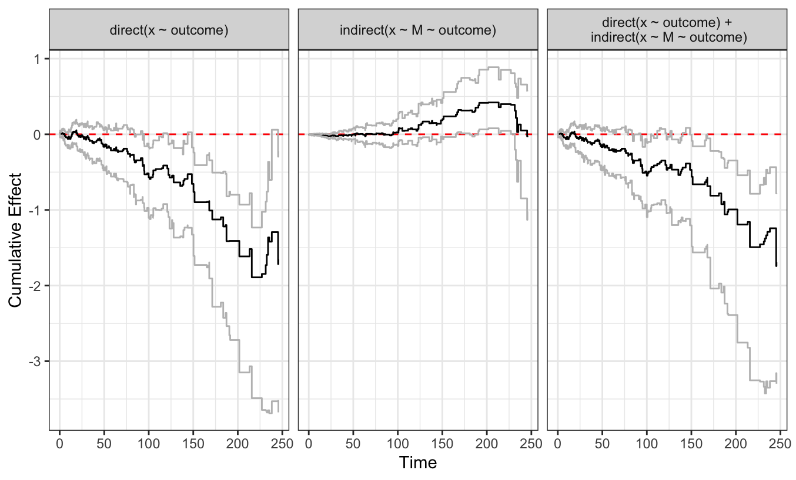
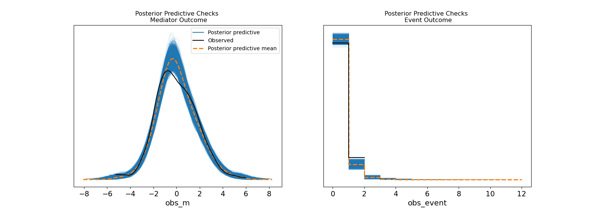

## Preliminaries

:::{.callout-warning}
## Who am I?
- I'm a __data scientist__ at __[Personio]{.blue}__
    - Bayesian statistician,
    - Reformed philosopher and logician.
- Website: [https://nathanielf.github.io/](https://nathanielf.github.io/)
:::

{fig-align="center" width="150px"}

::: {.callout-tip}
## Code or it didn't Happen
The full worked example can be found on my [blog](https://nathanielf.github.io/posts/post-with-code/AalenDynamicPaths/aalen_dynamic_paths.html)
:::


## {background-color="black" background-image="images/evolving_dag.png" background-size="cover" background-opacity="0.2"}

::: {style="color: white; font-size: 1.6em; font-weight: bold; text-align: center; margin-top: 100px;"}
"Most causal inference treats time as a container.

What if time is the medium?"
:::


## The Pitch

Survival analysis answers **when**.

Causal inference answers **whether**.

. . .

Dynamic path analysis answers **how the answer changes**.

. . .

A single endpoint is a snapshot. The process is the model.


## Agenda

::: {.fragment .fade-in}
- What your endpoint analysis cannot see
:::
::: {.fragment .fade-in}
- The Bayesian DPA model: three technical moves
:::
::: {.fragment .fade-in}
- From process to estimand: g-computation and the symmetry argument
:::


# Act I: What You're Missing {background-color="#2a3439"}


## A Concrete Problem

A patient starts an exercise programme.

. . .

It reduces cardiovascular risk directly. Good.

. . .

But it also causes joint inflammation. The inflammation increases risk over time.

. . .

At the six-month endpoint, the treatment looks modestly protective.

**You have no idea it's being undermined.**

::: {.notes}
This is the motivating example. The treatment works through two opposing channels with different temporal signatures. A standard endpoint analysis sees only the net. Dynamic path analysis sees the components.
:::


## What the Decomposition Reveals

{fig-align="center" width="90%"}

Three panels. Three stories your endpoint missed.

::: {.notes}
Left: the direct effect is protective throughout. Centre: the indirect effect is inert for 100 days, then spikes. Right: the total effect is attenuated. Without the decomposition, you'd conclude "modest benefit" and move on. With it, you know where to intervene next.
:::


## The Structure: A Sequence of DAGs

{fig-align="center" width="90%"}

The arrows don't just exist. They **strengthen and weaken** over time.

::: {.notes}
This is Aalen's insight. The DAG is not static. The causal structure evolves. Treatment X influences mediator M, and both influence the hazard. But the weights on every arrow are functions of time.
:::


# Act II: How to See It {background-color="#2a3439"}


## Three Technical Moves

::: {.fragment .fade-in}
**1. Discretise time** into bins. Piecewise constant hazards.
:::

::: {.fragment .fade-in}
**2. Smooth with B-splines.** Coefficient paths evolve without jumping.
:::

::: {.fragment .fade-in}
**3. The Poisson bridge.** A full generative likelihood, not a partial one.
:::

::: {.notes}
Each of these solves a specific problem. Discretisation gives us a time index. Splines impose narrative coherence — adjacent time bins are probably similar. The Poisson bridge turns the baseline hazard from a nuisance into an explicit parameter.
:::


## Move 1: Discretise Time

The data is long-format: one row per subject per interval.

```{.python code-line-numbers="|1-3|5-6"}
# Each row: who was at risk, for how long, what happened
df["dt"] = df["stop"] - df["start"]
bin_idx = df["bin_idx"].values  # discrete time index

# The hazard is now piecewise constant within bins
# but free to vary across bins
```

. . .

Time is no longer continuous background noise. It's a covariate.


## Move 2: Smooth with Splines

```{.python code-line-numbers="|1-3|5-7"}
# Random walk prior on spline coefficients
beta_raw = pm.Normal("beta_raw", 0, 1, dims=('splines', 'tv'))
coef_alpha = pt.cumsum(beta_raw * sigma_smooth, axis=0)

# Construct smooth time-varying functions
alpha_0_t = pt.dot(basis, coef_alpha[:, 0])  # baseline
alpha_1_t = pt.dot(basis, coef_alpha[:, 1])  # direct effect
alpha_2_t = pt.dot(basis, coef_alpha[:, 2])  # mediator effect
```

. . .

The cumulative sum is a random walk. Adjacent coefficients are probably similar. The data decides how much they differ.

::: {.notes}
This is the Bayesian version of a smoothing penalty. The sigma_smooth parameter controls wiggliness. Too smooth and you miss real changes. Too wiggly and you fit noise. We test this with LOO cross-validation across different knot counts.
:::


## Move 3: The Poisson Bridge

$$d_{it} \sim \text{Poisson}(\lambda(t)), \quad \lambda(t) = Y_{it} \cdot \Delta t \cdot f(\text{linear predictor})$$

. . .

Binary events are counts capped at 1.

. . .

The baseline hazard becomes an **explicit parameter**, not a nuisance to be conditioned away.

::: {.notes}
This is the key statistical move. Partial likelihoods care about ordering — who failed before whom. The Poisson likelihood cares about intensities — how fast is risk accumulating in each bin. This gives us a full generative model we can simulate from.
:::


## The Joint Model

:::: {.columns}
::: {.column width="50%"}

**Mediator equation:**

$$M_t = \beta(t) \cdot X + \rho \cdot M_{t-1} + \epsilon$$

The mediator has inertia. Its dynamics are modelled, not assumed away.

:::
::: {.column width="50%"}

**Hazard equation:**

$$\lambda(t) = f\big(\alpha_0(t) + \alpha_1(t) X + \alpha_2(t) M_{t-1}\big)$$

Direct and indirect paths, both time-varying.

:::
::::

. . .

These are estimated **simultaneously**. One likelihood, one posterior.

::: {.notes}
The joint estimation is important. Information flows between the mediator model and the hazard model. If the mediator equation fits well, the hazard model gets a cleaner signal about M's causal contribution. You're fitting a system, not two regressions.
:::


## The Softplus Link

$$f(x) = \ln(1 + \exp(x))$$

. . .

Ensures the hazard is always positive. Smooth. Differentiable. MCMC-friendly.

. . .

This is **not** Aalen's identity link. The path decomposition is approximate on the hazard scale.

. . .

That's fine. The decomposition is diagnostic. The estimand lives elsewhere.

::: {.notes}
This is where a common objection arises. "But the decomposition doesn't hold exactly under a nonlinear link!" Correct. And it doesn't matter, because the coefficients are not the final causal estimand. They show you the mechanism. The causal quantity comes from g-computation, where the link function has already been applied.
:::


## Diagnostics: Does the Model Fit?

{fig-align="center" width="85%"}

Left: mediator model fits. Right: event model fits. The generative model is internally coherent.

::: {.notes}
There are also LOO comparisons across spline counts and forest plots showing stability of the direct effect across model specifications. These are in the blog post. The PPC is the one diagnostic that matters for the talk: the model can reproduce the data it was trained on, for both equations simultaneously.
:::


# Act III: What It Tells You {background-color="#2a3439"}


## The Path Decomposition

:::: {.columns}
::: {.column width="50%"}

These time-varying coefficients show **which channel dominates when**:

- Direct effect: protective throughout
- Indirect effect: inert, then harmful after day 100
- Total effect: attenuated

:::
::: {.column width="50%"}

This is the model's **internal mechanics**.

The structure of mediation, not the magnitude.

:::
::::

. . .

But mechanism is not yet an estimand.

::: {.notes}
The decomposition tells you something real: the treatment is being undermined by a delayed mediator effect. But these quantities live on the linear predictor scale, before the softplus transformation. To get a causal number you can act on, you need g-computation.
:::


## G-Computation: The Bridge

```{.python code-line-numbers="|1-4|6-9"}
# World 1: everyone treated
pm.set_data({'trt': np.ones(n)})
idata_trt1 = pm.sample_posterior_predictive(
    idata, var_names=['Lambda', 'obs_m', 'obs_event'])

# World 0: nobody treated
pm.set_data({'trt': np.zeros(n)})
idata_trt0 = pm.sample_posterior_predictive(
    idata, var_names=['Lambda', 'obs_m', 'obs_event'])
```

. . .

Two counterfactual worlds. Same population. Same model.

The mediator evolves naturally under each intervention.

::: {.notes}
This is the crucial step. When you set treatment to 1 for everyone, the mediator equation generates what M would have been under treatment. When you set it to 0, M evolves under control. These counterfactual mediator trajectories feed into the hazard equation. The survival curves reflect the full mediated process.
:::


## The Survival Contrast

:::: {.columns}
::: {.column width="55%"}

The causal estimand:

$$\bar{S}_{\text{treated}}(t) - \bar{S}_{\text{control}}(t)$$

Computed by:

1. Individual hazard trajectories for each posterior draw
2. Transform to survival: $S_i(t) = \exp(-\Lambda_i(t))$
3. Average across individuals
4. Compare

:::
::: {.column width="45%"}

Defined **interventionally**.

Estimated **processually**.

Full posterior uncertainty.

:::
::::


##

::: {style="font-size: 1.4em; text-align: center; margin-top: 120px; line-height: 1.8;"}

The same model generates both counterfactual worlds.

. . .

Modeling choices affect both equally.

. . .

What survives in the difference is the **causal signal**.

:::

::: {.notes}
This is the key insight. The softplus link, the hazard extrapolation for censored subjects, the spline flexibility — all of these are modeling choices that could distort the absolute survival curves. But because the same model generates both worlds for the same population, the distortions cancel in the contrast. The causal signal is robust to the modeling apparatus.
:::


## What the Practitioner Does

The treatment reduces events by ~17% overall.

. . .

But: the direct effect gives ~25% reduction. The mediator claws back ~8%.

. . .

**The next intervention targets the mediator after day 100.**

. . .

Without the decomposition, you'd report "modest benefit" and stop.

With it, you know exactly where to push next.

::: {.notes}
This is the actionable output. The marginal contrast tells you the treatment is worth doing. The decomposition tells you it could be worth twice as much if you manage the mediator. That's information an endpoint analysis cannot provide.
:::


## A Decision Rule

::: {.fragment .fade-in}
If your treatment effect is **constant over time** and you don't care about mechanism:

Cox is fine.
:::

::: {.fragment .fade-in}
If your effect **changes over time**, or you suspect a **mediator** whose influence evolves:

This is the model.
:::

::: {.fragment .fade-in}
**How to tell the difference:** plot Schoenfeld residuals. If they trend, you have time-varying effects. If you also have a candidate mediator, you have a dynamic path problem.
:::


## What We Built

::: {.fragment .fade-in}
**1.** A working Bayesian DPA in PyMC. It didn't exist before.
:::

::: {.fragment .fade-in}
**2.** The g-computation bridge from process to estimand. `dpasurv` stops at the decomposition. We go to counterfactual survival curves.
:::

::: {.fragment .fade-in}
**3.** Diagnostic transparency. PPCs, LOO, sensitivity analysis. The frequentist version doesn't offer these.
:::


## {background-color="#2a3439"}

::: {style="color: white; font-size: 1.5em; font-weight: bold; text-align: center; margin-top: 140px; line-height: 1.6;"}

The journey is the model.

The destination is the estimand.

The Bayesian implementation gives you both.
:::


## Thank You

:::{.callout-tip}
## Resources
- Blog post: [nathanielf.github.io](https://nathanielf.github.io/posts/post-with-code/AalenDynamicPaths/aalen_dynamic_paths.html)
- PyMC: [pymc.io](https://www.pymc.io)
- Fosen et al. (2006), "Dynamic path analysis," *Lifetime Data Analysis*
- Aalen (1989), "A linear regression model for the analysis of life times," *Statistics in Medicine*
:::

{fig-align="center" width="150px"}
