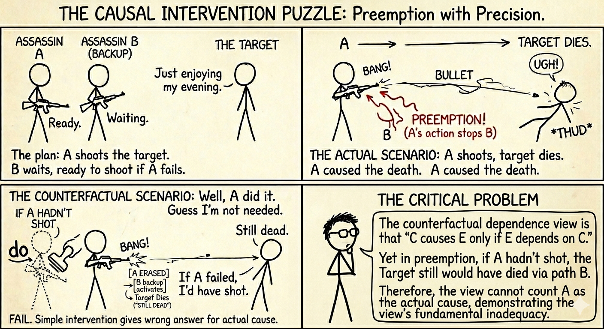
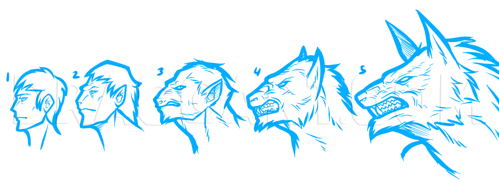
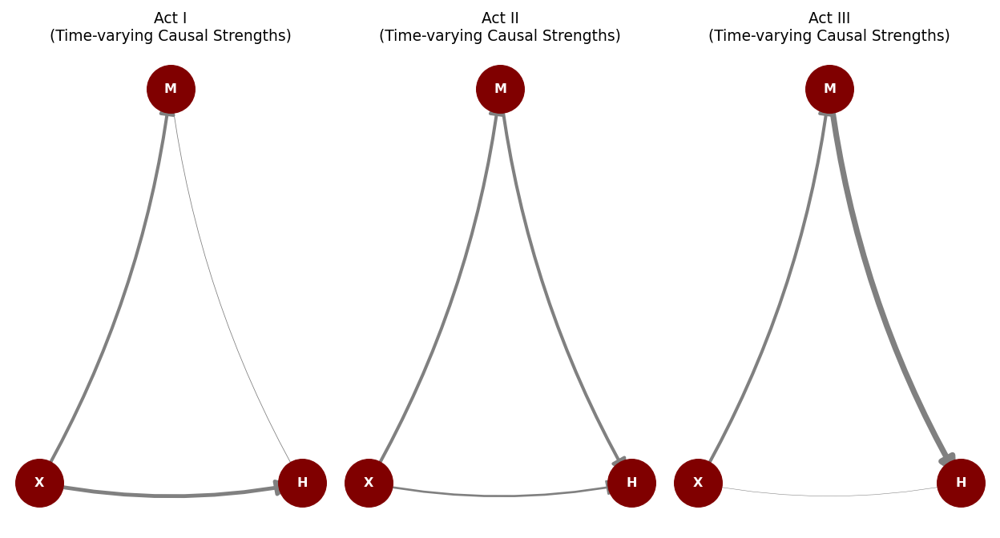
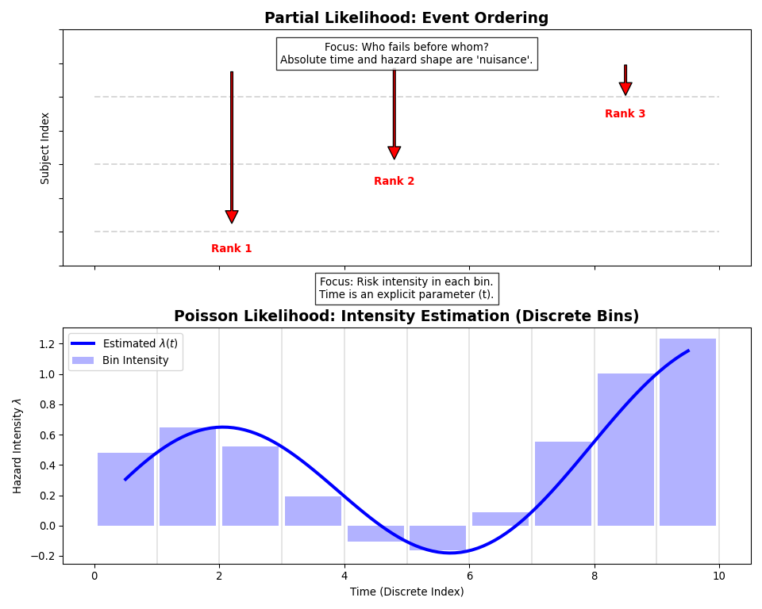
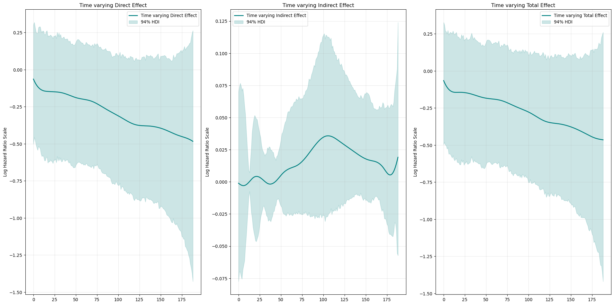
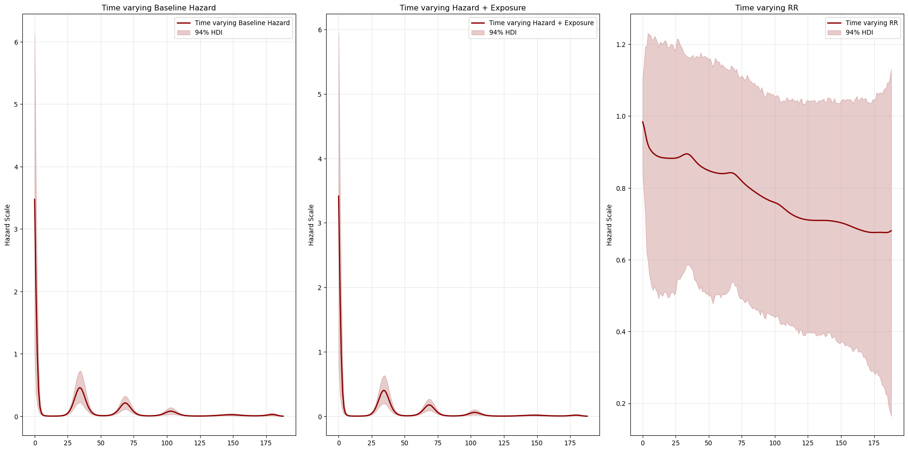
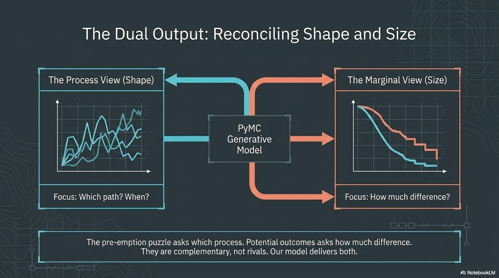
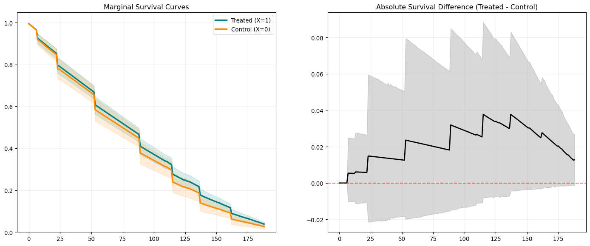
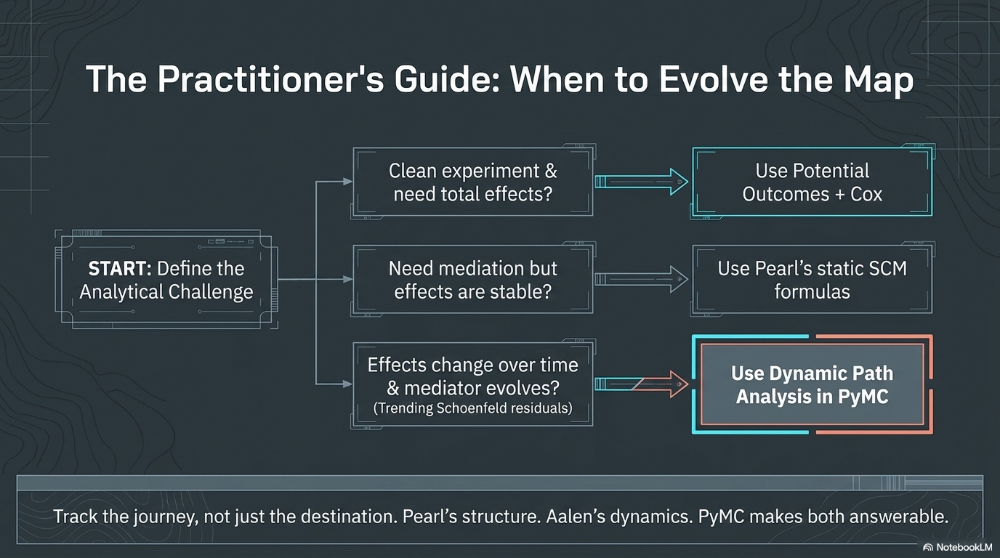

```{python}
#| echo: false
#| output: false
import numpy as np
import matplotlib.pyplot as plt
import matplotlib as mpl
from scipy.interpolate import BSpline

TEAL = "#1a9988"
CORAL = "#e07050"
DARK = "#2a3439"
GREY = "#888888"

mpl.rcParams.update({
    "figure.facecolor": "white",
    "axes.facecolor": "white",
    "axes.edgecolor": DARK,
    "axes.labelcolor": DARK,
    "xtick.color": DARK,
    "ytick.color": DARK,
    "text.color": DARK,
    "font.family": "sans-serif",
    "font.size": 13,
    "axes.grid": False,
    "figure.dpi": 150,
})
```

## Preliminaries

:::{.callout-warning}
## Who am I?
- I'm a __data scientist__ at __[Personio]{.blue}__
    - Bayesian statistician,
    - Reformed philosopher and logician.
- Website: [https://nathanielf.github.io/](https://nathanielf.github.io/)
:::

{fig-align="center" width="150px"}

::: {.callout-tip}
## Code or it didn't Happen
The full worked example can be found on my [blog](https://nathanielf.github.io/posts/post-with-code/AalenDynamicPaths/aalen_dynamic_paths.html)
:::


## The Pitch {.smaller}

Causal claims are contested. There are at least **three schools** of causal inference, and they disagree about mediation.

. . .

This talk: build a generative model, and then ask what it teaches us about the disagreement.


## Agenda {.smaller}

::: {.fragment .fade-in}
- The puzzle: three ways to say "because" — and where they disagree
:::
::: {.fragment .fade-in}
- The model: a generative process model in PyMC
:::
::: {.fragment .fade-in}
- The lesson: what the model teaches us about the puzzle
:::


# Act I: Three Ways to Say "Because" {background-color="#2a3439"}


## The Counterfactual Test {.smaller}

The two dominant frameworks in causal inference — potential outcomes and do-calculus — share a common foundation:

. . .

**"X caused Y"** means **Y would not have occurred without X.**

. . .

- Potential outcomes: $\text{ATE} = E[Y(1)] - E[Y(0)]$ — the difference between what happens and what *would have* happened.
- Do-calculus: $E[Y \mid do(X=1)] - E[Y \mid do(X=0)]$ — same logic, structural implementation.

. . .

Counterfactual difference-making is the **shared engine** of modern causal inference. Enormously powerful for **total effects**.

. . .

But what about **decomposing** effects by pathway? That's where the test starts to strain.

::: {.notes}
The point of this slide is to establish that the counterfactual test is the shared foundation for total effects. Rubin's potential outcomes compare Y(1) to Y(0); Pearl's do-calculus compares do(X=1) to do(X=0). Both define causation as difference-making. This is enormously powerful when you want to know "did X make a difference to Y?" But mediation asks a finer question — how much of that difference flowed through a particular pathway? — and that's where the frameworks diverge. Pearl handles it via structural equations; PO struggles with it. The pre-emption puzzle that follows illustrates why decomposition is harder than total effects.
:::


## The Pre-emption Puzzle {.smaller}

::::{.columns}

:::{.column}

Two assassins are hired. Assassin A poisons the coffee. Assassin B waits with a sniper rifle as backup.

- A's poison works. B never fires. The target dies.

- **Counterfactual test:** "Would the target have survived if A hadn't acted?"

    - No — B would have fired. So A **fails** the counterfactual test.

- But A clearly caused the death. The counterfactual test misses the **process** that did the work.

The process mattered; the endpoint didn't change. In survival analysis, this is exactly where we live.

:::

:::{.column}




:::

::::

::: {.notes}
This is the classic pre-emption case from the philosophy of causation (Lewis 1973), but it maps directly onto survival analysis. Competing risks are the medical version of pre-emption: the drug prevents one cause of death (cardiac arrest) but another cause (kidney failure) pre-empts the benefit. The counterfactual test — "would the patient have died anyway?" — says yes, so it denies the drug any causal credit. But the drug clearly worked on its pathway.
:::


## From Competing Risks to Mediation {.smaller}

::::{.columns}

:::{.column}
- The assassin example is a **competing risks** problem: multiple pathways to the same outcome, and the endpoint alone can't tell you which one operated.


- Mediation is the same structure. A treatment works through **multiple channels** — some beneficial, some harmful — and the total effect is their sum.

    - *"How much of the exercise programme's benefit runs through cardiovascular fitness, and how much is undermined by joint inflammation?"*


- Attributing credit requires **process decomposition**: tracing which pathway transmitted how much influence, not just whether the endpoint moved.

The three schools of causal inference give three different answers to how this decomposition should work.

:::

:::{.column}

```{python}

import matplotlib.pyplot as plt
from matplotlib.patches import (
    Circle,
    FancyArrowPatch,
    FancyBboxPatch,
)
import matplotlib.patheffects as pe


# =========================================================
# STYLE
# =========================================================

BG = "#F5F5F5"
DARK = "#222222"
BLUE = "#3B9DDD"
RED = "#D95C5C"
GRAY = "#B8BEC5"

plt.rcParams.update({
    "font.family": "DejaVu Sans",
    "font.size": 13
})


# =========================================================
# HELPERS
# =========================================================

def rounded_box(ax, x, y, w, h, text,
                fc="white", ec="#BBBBBB",
                fontsize=14, weight="bold"):

    patch = FancyBboxPatch(
        (x, y),
        w,
        h,
        boxstyle="round,pad=0.02,rounding_size=0.08",
        linewidth=2,
        edgecolor=ec,
        facecolor=fc,
        zorder=2
    )

    patch.set_path_effects([
        pe.SimplePatchShadow(offset=(2, -2), alpha=0.12),
        pe.Normal()
    ])

    ax.add_patch(patch)

    ax.text(
        x + w/2,
        y + h/2,
        text,
        ha="center",
        va="center",
        fontsize=fontsize,
        weight=weight,
        color=DARK,
        zorder=3
    )


def node(ax, xy, label, color="#FFFFFF",
         edge=DARK, r=0.22,
         fontsize=12):

    c = Circle(
        xy,
        r,
        facecolor=color,
        edgecolor=edge,
        linewidth=2.2,
        zorder=3
    )

    c.set_path_effects([
        pe.SimplePatchShadow(offset=(2, -2), alpha=0.15),
        pe.Normal()
    ])

    ax.add_patch(c)

    ax.text(
        *xy,
        label,
        ha="center",
        va="center",
        fontsize=fontsize,
        weight="bold",
        color=DARK,
        zorder=4
    )


def arrow(ax, p1, p2,
          color=DARK,
          rad=0,
          lw=3,
          alpha=1,
          linestyle="-"):

    arr = FancyArrowPatch(
        p1,
        p2,
        connectionstyle=f"arc3,rad={rad}",
        arrowstyle="Simple,tail_width=0.7,head_width=10,head_length=12",
        linewidth=lw,
        color=color,
        linestyle=linestyle,
        alpha=alpha,
        shrinkA=18,
        shrinkB=18,
        zorder=1
    )

    ax.add_patch(arr)


# =========================================================
# FIGURE LAYOUT
# =========================================================

fig = plt.figure(figsize=(16, 8), facecolor=BG)

gs = fig.add_gridspec(
    1, 2,
    width_ratios=[1, 1],
    wspace=0.08
)

ax1 = fig.add_subplot(gs[0, 0])
ax2 = fig.add_subplot(gs[0, 1])

for ax in [ax1, ax2]:
    ax.set_facecolor(BG)
    ax.axis("off")


# =========================================================
# LEFT PANEL — COMPETING RISKS
# =========================================================

ax1.set_xlim(0, 10)
ax1.set_ylim(0, 10)

# Title
ax1.text(
    5,
    9.3,
    "COMPETING RISKS",
    ha="center",
    va="center",
    fontsize=28,
    weight="heavy",
    color="#555555"
)

ax1.text(
    5,
    8.7,
    "Multiple pathways, but only one event occurs",
    ha="center",
    fontsize=16,
    color=DARK
)

# Source nodes
node(ax1, (1.2, 6.8), "1")
node(ax1, (1.2, 5.0), "2")
node(ax1, (1.2, 3.2), "3")

# Outcome
target = Circle(
    (7.8, 5),
    1.1,
    facecolor="#F8FAFC",
    edgecolor="#888888",
    linewidth=3
)

target.set_path_effects([
    pe.SimplePatchShadow(offset=(3, -3), alpha=0.15),
    pe.Normal()
])

ax1.add_patch(target)

ax1.text(
    7.8,
    5,
    "EVENT",
    ha="center",
    va="center",
    fontsize=22,
    weight="heavy",
    color=DARK
)

# Arrows
arrow(ax1, (1.6, 6.8), (6.8, 5.4),
      color=BLUE, lw=5)

arrow(ax1, (1.6, 5.0), (6.8, 5.0),
      color=GRAY, lw=4)

arrow(ax1, (1.6, 3.2), (6.8, 4.6),
      color=GRAY, lw=4)

# Hazard labels
ax1.text(4.1, 6.0, "λ₁(t)",
         fontsize=18,
         style="italic",
         color=BLUE)

ax1.text(4.1, 5.25, "λ₂(t)",
         fontsize=18,
         style="italic",
         color="#777777")

ax1.text(4.1, 4.0, "λ₃(t)",
         fontsize=18,
         style="italic",
         color="#777777")

# Blocking X marks
ax1.text(5.7, 5.2, "×",
         fontsize=28,
         weight="bold",
         color="#999999")

ax1.text(5.7, 4.3, "×",
         fontsize=28,
         weight="bold",
         color="#999999")

# Footer
rounded_box(
    ax1,
    0.7,
    0.7,
    8.4,
    1.1,
    "Only one transition becomes realized",
    fc="#FFFFFF"
)


# =========================================================
# RIGHT PANEL — MEDIATION
# =========================================================

ax2.set_xlim(0, 10)
ax2.set_ylim(0, 10)

# Title
ax2.text(
    5,
    9.3,
    "MEDIATION",
    ha="center",
    va="center",
    fontsize=28,
    weight="heavy",
    color="#555555"
)

ax2.text(
    5,
    8.7,
    "A treatment operates through multiple channels",
    ha="center",
    fontsize=16,
    color=DARK
)

# Treatment node
rounded_box(
    ax2,
    0.7,
    4.4,
    1.8,
    1.1,
    "A",
    fontsize=22
)

# Mediators
node(ax2, (4.5, 6.6), "M₁",
     color="#EEF6FD",
     edge=BLUE)

node(ax2, (4.5, 3.4), "M₂",
     color="#FDEEEE",
     edge=RED)

# Outcome
rounded_box(
    ax2,
    7.2,
    4.2,
    2.0,
    1.4,
    "OUTCOME",
    fontsize=18
)

# Arrows
arrow(ax2, (2.3, 5.0), (4.0, 6.3),
      color=BLUE, lw=5)

arrow(ax2, (2.3, 5.0), (4.0, 3.7),
      color=RED, lw=5)

arrow(ax2, (5.0, 6.3), (7.0, 5.5),
      color=BLUE, lw=5)

arrow(ax2, (5.0, 3.7), (7.0, 4.5),
      color=RED, lw=5)

# Direct effect
arrow(ax2, (2.2, 5.0), (7.0, 5.0),
      color="#999999",
      lw=2.5,
      linestyle="--",
      alpha=0.8)

# Labels
ax2.text(
    3.2,
    6.9,
    "beneficial\npath",
    fontsize=12,
    color=BLUE,
    ha="center"
)

ax2.text(
    3.2,
    2.5,
    "harmful\npath",
    fontsize=12,
    color=RED,
    ha="center"
)

ax2.text(
    4.8,
    5.3,
    "parallel mechanisms",
    fontsize=13,
    color="#666666",
    ha="center"
)

# Footer
rounded_box(
    ax2,
    0.7,
    0.7,
    8.4,
    1.1,
    "Total effect = sum of indirect and direct pathways",
    fc="#FFFFFF"
)

plt.show()

```

:::

::::

::: {.notes}
The competing risks framing is the cleaner analogy. Pre-emption in the assassin case involves redundant backup causes, which is not quite the structure of mediation. But competing risks — multiple pathways to the same event, where you need to know which one operated — maps directly onto mediation analysis. In both cases, the counterfactual test on the endpoint is insufficient: the patient dies either way in competing risks; the treatment shows "modest benefit" in mediation. You need to decompose by pathway to understand what actually happened. Whether death occurs due to a mediated harmful effect or an alternative risk pathway, it is the process decomposition that tells you where to intervene. The three schools that follow are three responses to this challenge. Potential outcomes tries to express mediation decomposition as nested counterfactuals and runs into trouble. Pearl embraces structural equations to make the decomposition well-defined. Aalen models the process directly, so the decomposition is algebraic rather than counterfactual.
:::


## School 1: Potential Outcomes {.smaller}

:::: {.columns}
::: {.column width="50%"}

**The Framework**

- Rubin, Holland (1986): "No causation without manipulation"
- Every causal quantity must correspond to a **well-defined intervention**
- $Y(1) - Y(0)$: randomise treatment on or off
- Clean, experiment-centric — the gold standard for total effects

:::
::: {.column width="50%"}

**The Problem with Mediation**

- The NDE requires $Y(1, M(0))$
- This demands **two simultaneous interventions**: set $X = 1$, but also force $M$ to take the value it would have had under $X = 0$
- No single experiment can implement both settings at once
- If "no causation without manipulation" is your rule, this has **no operational meaning**

:::
::::

::: {.notes}
The logic of the objection is clean and principled. The ATE is fine: you randomise treatment on or off, observe Y under each, take the difference. Each potential outcome corresponds to a well-defined intervention. But the NDE requires a nested, staggered intervention: treat the patient (X=1) while simultaneously forcing their mediator to behave as if they were untreated (M(0)). What experiment produces this state? You would need to intervene on X and on M independently — but the whole point of mediation is that M is a consequence of X, not an independent lever. Robins and Richardson have argued this makes the NDE incoherent within the PO framework. It's not that mediation is unimportant — it's that the framework's commitment to intervention semantics rules out the quantity you'd need to define it. If every causal claim must map to an experiment you could run, and this one doesn't, you can't use it.
:::


## School 2: Structural Causal Models {.smaller}

:::: {.columns}
::: {.column width="50%"}

**The Framework**

- Pearl (2001): DAGs + structural equations + do-calculus
- Allows cross-world counterfactuals via structural equations
- $\text{NDE} = E[Y(1, M(0))] - E[Y(0, M(0))]$ is well-defined
- Mediation is a first-class citizen

:::
::: {.column width="50%"}

**The Cost**

- Requires commitment to structural equations as real
- The cross-world counterfactual remains philosophically contentious
- "Your structural equations had better be right"

:::
::::

::: {.notes}
Pearl's framework solves the mediation problem by embracing structural equations. If you believe the equations describe the actual data-generating process, then cross-world counterfactuals are just computations over the model. The NDE formula falls out naturally. But critics (Dawid, Robins in some moods) object that this puts too much weight on untestable structural assumptions. We have a stalemate between two interventionist frameworks.
:::


## School 3: Process / Aalen {.smaller}

:::: {.columns}
::: {.column width="55%"}

Aalen (1987, 1989): Causation as **unfolding temporal process**.


- Effects are **increments to risk** over time, not static comparisons between frozen worlds.

- The causal story is told by the **trajectory**, not the endpoint.

- Time is the medium, not just a container.


This sidesteps the cross-world problem — direct and indirect effects are read off the coefficients as they unfold.

:::
::: {.column width="45%"}



:::
::::

::: {.notes}
Aalen's view is less well-known in the ML/data science community but standard in biostatistics and survival analysis. The key insight: causation is not a comparison between two frozen worlds — it is the accumulation of influence over time. The sidestep works because the decomposition is algebraic, not counterfactual. In an additive hazard model, the total effect on the hazard is literally the sum of the direct path coefficient alpha_1(t) and the indirect path product beta(t) * alpha_2(t). You don't need to imagine a person simultaneously treated and untreated — you just read the path coefficients from the fitted model. The cross-world counterfactual Y(1, M(0)) never arises because the decomposition operates on the hazard scale, not on nested potential outcomes. This handles pre-emption naturally too: the cause is the process that actually transmitted the influence, identified by its coefficient, not by a counterfactual subtraction.
:::


## The Stalemate {.smaller}

|  | Potential Outcomes | Pearl SCM | Process (Aalen) |
|---|---|---|---|
| Cause is... | Difference between worlds | Structural mechanism | Unfolding process |
| Mediation? | Ill-defined (cross-world) | Well-defined (structural eqns) | Naturally decomposable |
| Strength | Clean identification | Full causal calculus | Temporal dynamics |
| Weakness | No mediation | Untestable structural assumptions | No marginal estimand? |

. . .

**What if one model could make the mechanism transparent *and* deliver both kinds of estimand?**

::: {.notes}
The table oversimplifies, but the pattern is real. Each school has a genuine strength and a genuine limitation. The contribution of the generative model is not that it settles the debate. It is that it makes mechanism transparent through the parametric coefficients — you can see which path dominates when — and simultaneously supports both kinds of estimand: the path decomposition that Aalen and Pearl care about, and the marginal survival contrast that even a potential outcomes purist can accept.
:::


## Back to Earth: A Concrete Problem {.smaller}


:::: {.columns}
::: {.column}
- A patient starts an exercise programme.

- It reduces cardiovascular risk directly. Good.


- But it also causes joint inflammation. The inflammation increases risk over time.


- At the six-month endpoint, the treatment looks modestly protective.

- **You have no idea it's being undermined.**


To act on this, you need both answers: **which process** is doing the undermining, and **how much** benefit is being lost.
:::


::: {.column}


:::
::::


::: {.notes}
This is the concrete version of the two-question framing from Act I. An endpoint analysis gives you the total effect — modest benefit — but can't tell you that the direct path is strongly protective while the mediated path is clawing back half the gain. You need the process question to identify the problem and the magnitude question to size it. That is what the model we build next will provide.
:::


## The Structure: A Sequence of DAGs {.smaller}

{fig-align="center" width="90%"}

The arrows don't just exist. They **strengthen and weaken** over time.

::: {.notes}
This is Aalen's insight. The DAG is not static. The causal structure evolves. Treatment X influences mediator M, and both influence the hazard. But the weights on every arrow are functions of time. This is what it means to take the process view seriously.
:::


# Act II: Building the Process Model {background-color="#2a3439"}


## Why a Generative Model? {.smaller}

The process view demands a model that **generates trajectories**, not just estimates coefficients.

. . .

A partial likelihood (Cox) conditions out time. We need time **in**.

. . .

A full Poisson likelihood gives us: explicit baseline hazard, time-varying coefficients, and the ability to **simulate counterfactual worlds**.

. . .

Three technical moves: **discretise, smooth, bridge.**

::: {.notes}
This is the transition from philosophy to engineering. The process view of causation requires a specific technical capability: you must be able to simulate what would have happened under alternative interventions. You cannot simulate from a partial likelihood. This is not about fanciness — it is about what the philosophical commitment demands of the model.
:::


## Discretise + Smooth {.smaller}

:::: {.columns}
::: {.column width="50%"}

**Discretise time into bins**

```{.python code-line-numbers="|1-3"}
# Each row: who was at risk, how long, what happened
df["dt"] = df["stop"] - df["start"]
bin_idx = df["bin_idx"].values
```

**Smooth with B-splines**

```{.python code-line-numbers="|1-3|5-6"}
# Random walk prior on spline coefficients
beta_raw = pm.Normal("beta_raw", 0, 1,
                     dims=('splines', 'tv'))
coef_alpha = pt.cumsum(beta_raw * sigma_smooth,
                       axis=0)
alpha_1_t = pt.dot(basis, coef_alpha[:, 1])
```

:::
::: {.column width="50%"}

```{python}
#| echo: false
#| fig-align: center
n_basis = 8
degree = 3
knots = np.linspace(0, 200, n_basis - degree + 1)
knots_full = np.concatenate([
    np.repeat(knots[0], degree),
    knots,
    np.repeat(knots[-1], degree),
])
t_grid = np.linspace(0, 200, 400)
np.random.seed(42)
weights = np.cumsum(np.random.normal(0, 0.15, n_basis))

fig, ax = plt.subplots(figsize=(4.5, 3.2))
for i in range(n_basis):
    c = np.zeros(n_basis)
    c[i] = 1.0
    spl = BSpline(knots_full, c, degree, extrapolate=False)
    vals = spl(t_grid)
    ax.plot(t_grid, vals, color=TEAL, alpha=0.3, linewidth=1.2)

weighted = np.zeros_like(t_grid)
for i in range(n_basis):
    c = np.zeros(n_basis)
    c[i] = weights[i]
    spl = BSpline(knots_full, c, degree, extrapolate=False)
    vals = spl(t_grid)
    vals = np.nan_to_num(vals)
    weighted += vals

ax.plot(t_grid, weighted, color=TEAL, linewidth=2.8, label="Weighted sum")
ax.set_xlabel("Time →", fontsize=11)
ax.set_ylabel("Coefficient α(t)", fontsize=11)
ax.set_xticks([])
ax.set_yticks([])
ax.spines["top"].set_visible(False)
ax.spines["right"].set_visible(False)
ax.legend(fontsize=9, frameon=False, loc="upper right")
ax.set_title("B-spline basis → smooth trajectory", fontsize=11, color=DARK)
fig.tight_layout()
plt.show()
```

:::
::::

::: {.notes}
Discretisation gives us a time index so coefficients can vary. B-splines with a random walk prior enforce smoothness — adjacent time bins are probably similar. The sigma_smooth parameter controls wiggliness. We test this with LOO cross-validation across different knot counts. Details are in the blog post.
:::


## The Poisson Bridge {.smaller}

$$d_{it} \sim \text{Poisson}(\lambda(t)), \quad \lambda(t) = Y_{it} \cdot \Delta t \cdot f(\text{linear predictor})$$

:::: {.columns}

::: {.column}

The baseline hazard becomes an **explicit parameter**, not a nuisance to be conditioned away.


This is what makes the model **generative**. We can sample from it. We can intervene on it.

:::

::: {.column}



:::
::::

::: {.notes}
The Poisson likelihood cares about intensities — how fast is risk accumulating in each bin. This gives us a full generative model we can simulate from. A partial likelihood cannot do this. The ability to simulate is what converts a process model into a counterfactual reasoning engine.
:::

## The Softplus Link {.smaller}

:::: {.columns}
::: {.column width="55%"}

```{python}
#| echo: false
#| fig-align: center
x = np.linspace(-5, 6, 300)
softplus = np.log1p(np.exp(x))
identity = x

fig, ax = plt.subplots(figsize=(5, 3.5))
ax.fill_between(x, -1.5, 0, where=(x < 1.5),
                color=CORAL, alpha=0.08)
ax.axhline(0, color=GREY, linewidth=0.8, linestyle="--", alpha=0.5)
ax.plot(x, identity, color=CORAL, linewidth=2, linestyle="--",
        label="Identity (Aalen)", alpha=0.8)
ax.plot(x, softplus, color=TEAL, linewidth=2.5,
        label="Softplus  $\\ln(1+e^x)$")
ax.annotate("Negative hazards\n(MCMC failure)",
            xy=(-3, -1.5), fontsize=9, color=CORAL, alpha=0.8,
            ha="center")
ax.set_xlabel("Linear predictor", fontsize=11)
ax.set_ylabel("Hazard intensity", fontsize=11)
ax.set_ylim(-2, 6.5)
ax.legend(fontsize=9, frameon=False, loc="upper left")
ax.spines["top"].set_visible(False)
ax.spines["right"].set_visible(False)
fig.tight_layout()
plt.show()
```

:::
::: {.column width="45%"}

$$f(\eta) = \ln(1 + \exp(\eta))$$

Ensures the hazard is always positive. Smooth. Differentiable. MCMC-friendly.

- Additivity is preserved in the latent structure — $\eta(t) = \alpha_0(t) + \alpha_1(t)X + \alpha_2(t)M$. The softplus is an **observation constraint**, not a structural one.

- The path decomposition is approximate on the **hazard scale**, but the mechanism is intact in $\eta$. For **precise magnitudes**, g-computation pushes the posterior through the nonlinearity.

:::
::::

::: {.notes}
A common objection: "the decomposition doesn't hold exactly under a nonlinear link." The precise answer: additivity is preserved in the latent linear predictor eta(t,x) = alpha_0(t) + alpha_1(t)*X + alpha_2(t)*M. The softplus is an observation constraint — it maps eta to a positive intensity — not part of the structural model. So the path decomposition (direct = alpha_1, indirect = beta * alpha_2) is exact in latent space. What's approximate is the mapping to the hazard scale: softplus(a+b) != softplus(a) + softplus(b). But this doesn't matter for causal estimands, because treatment effects are computed by posterior pushforward simulation (g-computation), which propagates through the nonlinearity correctly. The coefficients give you the structural shape — which path, when, what sign — and g-computation gives you the magnitude. The softplus is invisible to both questions: it's just ensuring the intensity is positive so the Poisson likelihood is well-defined.
:::


## The Joint Model {.smaller}

:::: {.columns}
::: {.column width="50%"}

**Mediator equation:**

$$M_t = \beta(t) \cdot X + \rho \cdot M_{t-1} + \epsilon$$

The mediator has inertia. Its dynamics are modelled, not assumed away.

:::
::: {.column width="50%"}

**Hazard equation:**

$$\lambda(t) = f\big(\alpha_0(t) + \alpha_1(t) X + \alpha_2(t) M_{t-1}\big)$$

Direct and indirect paths, both time-varying.

:::
::::

. . .

These are estimated **simultaneously**. One likelihood, one posterior.

. . .

This is a **hybrid**: structural equations in Pearl's sense, time-varying mechanisms in Aalen's sense. PyMC is the substrate that makes both cohabit — the probabilistic programming framework estimates the structure, tracks the process, and propagates uncertainty through both.

::: {.notes}
The joint estimation is important. Information flows between the mediator model and the hazard model. If the mediator equation fits well, the hazard model gets a cleaner signal about M's causal contribution. You're fitting a system, not two regressions. The hybrid nature is the key engineering insight. Pearl gives you the structural equations — identifiable paths with a causal interpretation. Aalen gives you the temporal dynamics — coefficients that evolve, mechanisms that wax and wane. Neither alone would suffice: Pearl's SCM at a single time point can't show you the mediator turning harmful after day 100; Aalen's additive model alone doesn't give you marginal counterfactual contrasts. Probabilistic programming is what unifies them: it estimates both equations jointly, lets you read the coefficients for mechanism, and lets you simulate counterfactual worlds for magnitude — all within a single model with coherent uncertainty.
:::


## The Model Block {.smaller}

```{.python code-line-numbers="|1-4|6-9|11-14|16-21|23-27"}
# 1. Time-varying coefficients via random-walk splines
beta_raw = pm.Normal("beta_raw", 0, 1,
                     dims=('splines', 'tv'))
coef_alpha = pt.cumsum(beta_raw * sigma_smooth, axis=0)

# 2. Mediator equation  (Pearl's X → M, Aalen's β(t))
mu_m = beta_t[b] * trt + rho * med_lag
pm.Normal("obs_m", mu=mu_m, sigma=sigma_m,
          observed=med)

# 3. Hazard equation  (Pearl's X → Y + M → Y, Aalen's α(t))
eta = (alpha_0_t[b]
       + alpha_1_t[b] * trt        # direct path
       + alpha_2_t[b] * med_lag)   # mediated path

# 4. Softplus link → Poisson likelihood
Lambda = dt * pm.math.log1pexp(eta)
pm.Poisson("obs_event", mu=Lambda,
           observed=events)

# 5. Path decomposition — falls out of the structure
pm.Deterministic("direct",   alpha_1_t)
pm.Deterministic("indirect", beta_t * alpha_2_t)
pm.Deterministic("total",    alpha_1_t + beta_t * alpha_2_t)

# 6. One call estimates everything jointly
idata = pm.sample(draws=2000, tune=2000,
                  nuts_sampler="numpyro")
```

::: {.notes}
Walk through this slide step by step. Step 1: the random-walk splines are the Aalen contribution — they let every coefficient evolve smoothly over time. Step 2: the mediator equation is the first structural equation, Pearl's X→M path, but with a time-varying coefficient β(t). Step 3: the hazard equation is the second structural equation — the direct path α₁(t) and the mediated path α₂(t) are both time-varying. Step 4: the softplus link ensures positive hazards, and the Poisson likelihood makes the model generative — this is the "bridge" from process to simulation. Step 5: the path decomposition is not a post-hoc calculation; it falls directly out of the model's structure, because the equations explicitly separate the paths. Step 6: one pm.sample call estimates the entire system jointly — both equations, all time-varying coefficients, with full posterior uncertainty. This is what the probabilistic programming substrate buys you: Pearl's structure and Aalen's dynamics in a single inference pass.
:::


## Direct and Indirect Effects {.smaller}
### (Latent Additive Scale)



Remember: both the parametric coefficients *and* the g-computation NDE depend on **modularity** — the equations being stable under intervention. 

## Translating to Hazards {.smaller}
### (Observed Scale)




## The Dual Output {.smaller}

:::: {.columns width="30%"}
::: {.column}

- **Shape** (Process View)
    - Which path dominates?
    - When does it change?
    - What sign?

- **Size** (Marginal View)
    - Simulate counterfactual worlds
    - Compare survival curves
    - Propagate uncertainty


:::

::: {.column}



:::

::::

. . .

One model. Two complementary outputs. The process question and the difference-making question, answered together.

::: {.notes}
This is the conceptual architecture slide that bridges Act II and Act III. Everything we built in Act II — the splines, the Poisson bridge, the joint estimation — produces a single fitted model. But that model yields two distinct kinds of output. On the left: read the parametric coefficients to see the shape of the mechanism — which path, when, what sign. This is Aalen's process view. On the right: run g-computation to simulate counterfactual survival curves and compute marginal contrasts — total effect, NDE, NIE. This is the interventionist view that the PO school demands. PyMC is the substrate in the middle that makes both available. Act III will now show each output in turn.
:::


# Act III: What the Model Teaches Us {background-color="#2a3439"}


## The Path Decomposition (Process View) {.smaller}

:::: {.columns}
::: {.column width="50%"}

The parametric coefficients answer the **process** question:

- Direct effect: protective throughout
- Indirect effect: inert, then harmful after day 100
- Total effect: attenuated

:::
::: {.column width="50%"}

Remember pre-emption: the counterfactual test couldn't tell you **which process** did the work.

These coefficients can. They are estimands of the mechanism.

:::
::::

. . .

But the potential outcomes school asks a different question: **how much difference did the treatment make?** That requires a marginal contrast — and the same model provides it.

::: {.notes}
This is where Act III connects back to Act I. The pre-emption puzzle showed that "would the outcome have been different?" misses which process did the work. The parametric path coefficients answer precisely that process question: alpha_1(t) shows the direct channel's contribution over time, beta(t) * alpha_2(t) shows the indirect channel. These are genuine estimands — they tell you which path dominates when. But the potential outcomes school's concern was never unreasonable. They want a well-defined interventional contrast, not regression coefficients. The generative model accommodates both: the coefficients give you mechanism, and g-computation gives you magnitude. Neither view is dispensable.
:::


## G-Computation for the Marginal Contrasts {.smaller}

```{.python code-line-numbers="|1-4|6-9"}
# World 1: everyone treated
pm.set_data({'trt': np.ones(n)})
idata_trt1 = pm.sample_posterior_predictive(
    idata, var_names=['Lambda', 'obs_m', 'obs_event'])

# World 0: nobody treated
pm.set_data({'trt': np.zeros(n)})
idata_trt0 = pm.sample_posterior_predictive(
    idata, var_names=['Lambda', 'obs_m', 'obs_event'])
```

. . .

Two counterfactual worlds. Same population. Same model.

The mediator **evolves naturally** under each intervention.

::: {.notes}
The path coefficients gave us mechanism. Now g-computation gives us magnitude. When you set treatment to 1 for everyone, the mediator equation generates what M would have been under treatment. When you set it to 0, M evolves under control. These counterfactual mediator trajectories feed into the hazard equation. The survival curves reflect the full mediated process. This is the second kind of estimand: simulate, don't derive.
:::


## The Survival Contrast {.smaller}

:::: {.columns}
::: {.column width="55%"}

{fig-align="center" width="100%"}

:::
::: {.column width="45%"}

$$\bar{S}_{\text{treated}}(t) - \bar{S}_{\text{control}}(t)$$

Defined **interventionally**. Estimated **processually**. Full posterior uncertainty.

. . .

1. Individual hazard trajectories per posterior draw
2. Transform to survival: $S_i(t) = \exp(-\Lambda_i(t))$
3. Average across individuals, compare

:::
::::

::: {.notes}
This marginal survival contrast is a perfectly valid causal estimand in the potential outcomes framework — a comparison of two well-defined interventions on the same population. No cross-world counterfactuals required. But note what we already have from the parametric coefficients: the mechanism, the temporal dynamics, which path dominates when. The g-computation adds magnitude and uncertainty to that mechanistic picture.
:::


## Cross World Dynamics{background-color="black" .smaller}

:::: {.columns}
::: {.column width="45%"}

::: {style="color: #aaa; font-size: 1.1em; line-height: 1.8; margin-top: 40px;"}
The NDE requires $Y(X(1), M(0))$.

- This nests two worlds.
    - M(0) where we intervene on M
    - Conditional on the counterfactual M(0) we intervene on the treatment X(1)

::: {.fragment .fade-in}
Potential outcomes: **"Ill-defined."** Logically Impossible intervention

Pearl: **"Well-defined, via structural equations."**. Assumes modular mechanisms defined by the equations
:::
:::

:::
::: {.column width="10%"}
:::
::: {.column width="45%"}

::: {style="color: white; font-size: 1.1em; line-height: 1.8; margin-top: 40px;"}

::: {.fragment .fade-in}
The hybrid model inherits Pearl's key assumption — **modularity**: the equations are stable under intervention.
:::

::: {.fragment .fade-in}
But it makes that assumption **inspectable**.
:::

::: {.fragment .fade-in}
::: {style="color: #4ec9b0; font-size: 1.2em; font-weight: bold; margin-top: 20px;"}
- $\alpha_1(t)$ → process. 

- G-computation → contrast.

Both require modularity — inside a testable generative model.
:::
:::

:::

:::
::::

::: {.notes}
This is where the philosophical lesson lands. The potential outcomes objection to cross-world counterfactuals was never unreasonable — you really can't run an experiment that produces Y(1, M(0)). Pearl's response was to make it a computation over structural equations, justified by modularity: the assumption that each equation is stable under interventions on other variables. The hybrid model does not escape this assumption — it inherits it. But the Bayesian implementation changes its epistemic status. In Pearl's framework, modularity is an untestable structural commitment. In the generative model, it becomes at least partially inspectable: posterior predictive checks test whether the model reproduces the data, LOO cross-validation tests whether the structural choices are predictively adequate, and you can directly examine whether the mediator-hazard relationship varies by treatment status. The commitment is the same in kind — modularity — but the probabilistic programming substrate makes it something you can scrutinize rather than merely assert.
:::


## NDE: The Non-Parametric Route {.smaller}

```{.python code-line-numbers="|1-2|4-6|8-9"}
# Mediator trajectories under control (the "natural" M(0))
m_nat = idata_trt0.posterior_predictive['obs_m']

# Hazard under treatment, but with control mediator
eta_nde = (alpha_0(t) + alpha_1(t) * 1
           + alpha_2(t) * m_nat)

# Transform through the link and simulate
hazard_nde = dt * log1pexp(eta_nde)
```

. . .

Plug one simulation's mediator into another simulation's hazard. ~25% risk reduction via direct path alone.

. . .

This **is** a cross-world comparison. It is justified by assuming the hazard equation is **stable** — that $\alpha_2(t)$ acts on $M$ the same way regardless of which intervention generated $M$.

. . .

Compare with the **parametric** route: $\alpha_1(t)$ tells you the direct effect's trajectory without crossing worlds — but under the same structural assumption.

::: {.notes}
We should be honest: plugging M(0) into the hazard under X=1 is exactly the cross-world counterfactual that the potential outcomes school objects to. The operation only makes sense if you assume the hazard equation is structurally stable — that alpha_2(t) relates the mediator to risk in the same way regardless of whether M was generated under treatment or control. This is not a free assumption. It is the modularity or invariance assumption that Pearl's framework makes explicit. The generative model does not escape this assumption; it makes it transparent and testable. You can inspect whether the hazard equation's fit depends on treatment status, or whether the mediator's relationship to risk changes under intervention. The parametric route — reading alpha_1(t) directly — also depends on the same structural assumption: that the equation correctly separates the direct and mediated paths. Both routes require the model to be right. The difference is what kind of answer you get: the coefficients give you the shape of the mechanism, the g-computation gives you a marginal magnitude.
:::


## Masked Mediation: Sizing the Hidden Harm {.smaller}

:::: {.columns}
::: {.column width="50%"}

```{python}
#| echo: false
#| fig-align: center
labels = ["Direct\nBenefit", "Mediated\nHarm", "Total\nObserved"]
values = [25, -8, 17]
colors = [TEAL, CORAL, GREY]

fig, ax = plt.subplots(figsize=(4.5, 3.5))
bars = ax.bar(labels, values, color=colors, width=0.6, edgecolor="white",
              linewidth=1.5)
ax.axhline(0, color=DARK, linewidth=0.8)

for bar, val in zip(bars, values):
    sign = "+" if val > 0 else ""
    y_pos = val + (1.2 if val > 0 else -1.8)
    ax.text(bar.get_x() + bar.get_width() / 2, y_pos,
            f"{sign}{val}%", ha="center", va="bottom" if val > 0 else "top",
            fontsize=13, fontweight="bold",
            color=bar.get_facecolor())

ax.set_ylabel("Risk reduction (%)", fontsize=11)
ax.set_ylim(-14, 32)
ax.spines["top"].set_visible(False)
ax.spines["right"].set_visible(False)
ax.set_title("An endpoint analysis stops at 17%", fontsize=10,
             color=GREY, style="italic")
fig.tight_layout()
plt.show()
```

:::
::: {.column width="50%"}

**The Implication:**

- **Do not abandon the treatment. Intervene on the mediator after day 100.**

- The coefficients told you **where and when** — shape.

- G-computation told you **how much** — size.

Neither answer alone gets you here.

:::
::::

::: {.notes}
This is the actionable payoff of the two-question framing. The process question — answered by the parametric coefficients — told the practitioner that the mediator becomes harmful after day 100 and that the direct path is consistently protective. That is the "which process" answer. The magnitude question — answered by g-computation — told them the direct effect alone gives 25% risk reduction versus 17% total. That is the "how much difference" answer. Together they produce a concrete clinical recommendation: manage the mediator after day 100 and you could nearly double the benefit. Neither answer alone would have got you there.
:::


## The Lesson {.smaller}

:::: {.columns}
::: {.column width="50%"}

The pre-emption puzzle asked:

> **Which process did the work?**

The potential outcomes school asked:

> **How much difference did it make?**

These were never the same question.

- __One model. Pearl's structure. Aalen's dynamics. Both answers.__
:::


::: {.column width="50%"}


::: {.fragment .fade-in}

:::

:::
::::

::: {.notes}
This is the lesson of the talk. The three schools disagreed because they were asking subtly different questions under the same banner of "causation." The process question — which path transmitted the influence, and when? — is answered by the time-varying coefficients: they show the indirect effect is inert for 100 days, then spikes. That is shape — the temporal signature of the mechanism. The difference-making question — how much benefit does the treatment produce through each path? — is answered by g-computation: 25% risk reduction via the direct path, 17% total, so the mediator claws back roughly 8%. That is size — the integrated magnitude. Shape tells you when to worry and where to intervene. Size tells you how much is at stake. The hybrid model — Pearl's structural equations with Aalen's temporal dynamics, unified in PyMC — is what makes both available from the same assumptions.
:::

## What We Built {.smaller}

::: {.fragment .fade-in}
**1.** A hybrid model: Pearl's structural equations + Aalen's time-varying mechanisms, unified in PyMC with full posterior uncertainty.
:::

::: {.fragment .fade-in}
**2.** Two kinds of estimand from one model: **coefficients** for the shape of the mechanism, **g-computation** for the size of the effect — including NDE/NIE.
:::

::: {.fragment .fade-in}
**3.** A practical lesson from a real philosophical puzzle: the process question and the difference-making question are **complementary**, not rival. Probabilistic programming is the substrate that makes both answerable — and the assumptions inspectable.
:::


## Thank You

:::{.callout-tip}
## Resources
- Blog post: [nathanielf.github.io](https://nathanielf.github.io/posts/post-with-code/AalenDynamicPaths/aalen_dynamic_paths.html)
- PyMC: [pymc.io](https://www.pymc.io)
- Fosen et al. (2006), "Dynamic path analysis," *Lifetime Data Analysis*
- Aalen (1989), "A linear regression model for the analysis of life times," *Statistics in Medicine*
- Holland (1986), "Statistics and Causal Inference," *JASA*
- Pearl (2001), "Direct and Indirect Effects," *UAI*
- Robins & Richardson (2010), "Alternative graphical causal models"
:::

{fig-align="center" width="150px"}
