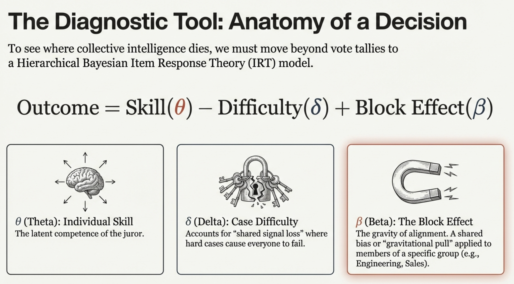
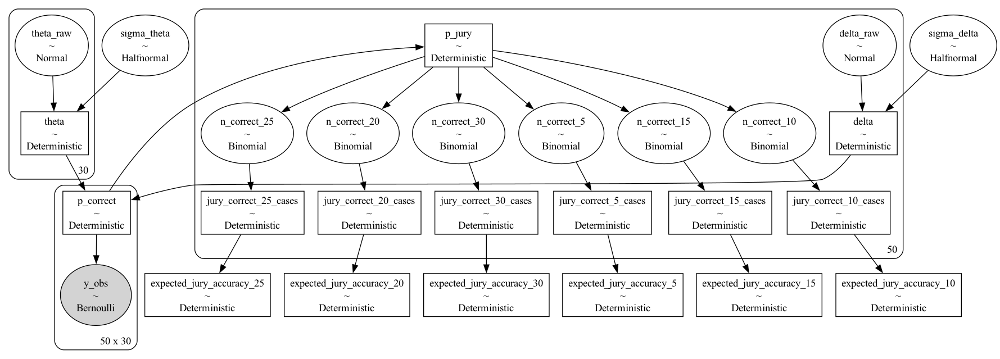
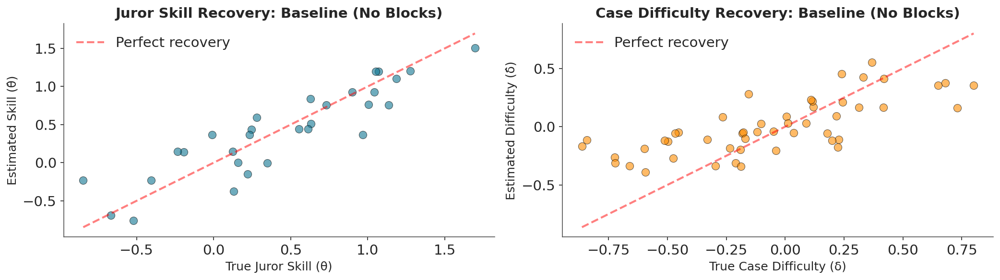
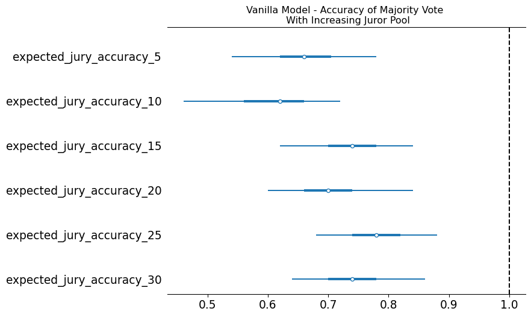
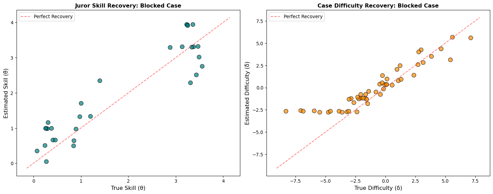
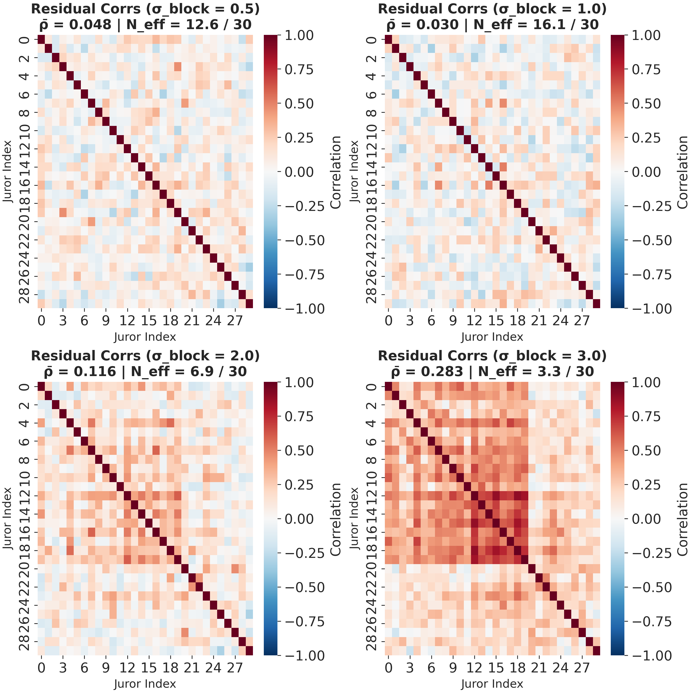
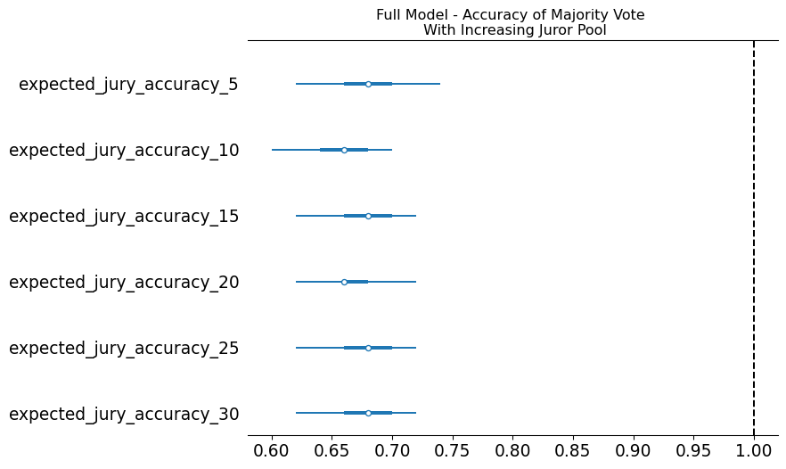

## Preliminaries 

:::{.callout-warning}
## Who am I?
- I'm a __data scientist__ at __[Personio]{.blue}__
    - Bayesian statistician,
    - Reformed philosopher and logician.
- Website: [https://nathanielf.github.io/](https://nathanielf.github.io/)
:::

{fig-align="center" width="150px"}

::: {.callout-tip}
## Code or it didn't Happen
The worked examples used here can be found on my [blog](https://nathanielf.github.io/posts/post-with-code/Condorcet_Jury_Sensitivity/sensitivity_analysis.html)
:::

## {background-color="black" background-image="images/legibility_trees.png" background-size="cover" background-opacity="0.3"}

::: {style="color: white; font-size: 1.6em; font-weight: bold; text-align: center; margin-top: 100px;"}
"You don't have 30 employees.

You have three, rehired ten times."
:::


## The Pitch

How do you know whether your panel of decision-makers is actually **working**?

. . .

Not just "are they accurate?" but:

- Can you **separate** individual skill from problem difficulty?
- Does adding more agents actually **help**?
- Are your agents thinking **independently** — or echoing each other?

. . .

**Item Response Theory** + **PyMC** gives us a framework to answer all three.


## Agenda

::: {.fragment .fade-in}
- The Condorcet Jury Theorem — when crowds are wise
:::
::: {.fragment .fade-in}
- Item Response Theory — decomposing decisions into skill, difficulty, and structure
:::
::: {.fragment .fade-in}
- Building and Fitting the Model — simulation and PyMC
:::
::: {.fragment .fade-in}
- Three Scenarios — what independent, grouped, and expert agents look like
:::
::: {.fragment .fade-in}
- Evaluating Agent Collectives — a vocabulary for ensemble diagnostics
:::


# Part I: The Promise {background-color="#2a3439"}

## The Condorcet Jury Theorem

A group of independent, slightly-better-than-chance decision-makers will converge on the truth as the group grows.

. . .

**Three assumptions:**

1. **Equal competence** — everyone is similarly skilled
2. **Equal difficulty** — all problems are equally hard
3. **Independence** — my errors don't predict yours

. . .

> If $p > 0.5$ and errors are independent, majority accuracy $\to 1$ as $N \to \infty$.

::: {.notes}
This is a theorem — it's mathematically true. The question is whether the assumptions hold in practice. Spoiler: they don't. But the framework for testing them is what makes this useful.
:::

## Independence is the Engine

{fig-align="center" width="85%"}

When errors are uncorrelated, every new voice adds **new evidence**.

::: {.notes}
This heatmap shows voter error correlations under the idealised Condorcet setting. Pure white noise — no structure, no clustering. Each agent you add to the panel is providing genuinely new signal.
:::

## What Breaks Independence?

**Shared training** — everyone learned the same frameworks

**Shared information** — filtered summaries, not raw data

**Shared incentives** — optimising for the same objectives

**Shared tools** — the same pipelines, the same priors, the same scaffolding

. . .

When agents share structure, their errors correlate. The effective ensemble size **collapses**.

::: {.notes}
This is the practical problem. Whether your agents are humans in an organisation, models in an ensemble, or reviewers on a panel — shared structure kills the scaling benefit.
:::


# Part II: From Theorem to Testable Model {background-color="#2a3439"}


## The IRT Extension

To stress-test Condorcet, we need a model that captures what the theorem assumes away.

**Item Response Theory** decomposes each decision into:

$$\text{logit}(p_{ij}) = \underbrace{\theta_j}_{\text{Skill}} - \underbrace{\delta_i}_{\text{Difficulty}} + \underbrace{\beta_{b(j)}}_{\text{Block}} + \underbrace{\tau_j \cdot Z_j}_{\text{Treatment}}$$

. . .

Now we can ask: **when does adding more agents actually help?**

::: {.notes}
This is the one equation of the talk. Theta is individual skill, delta is case difficulty, beta is the block effect — the structural pull of alignment — and tau is the treatment, some intervention to break conformity. Each of these is estimable from observed decision data.
:::

## Anatomy of a Decision 

{fig-align="center" width="90%"}

::: {.notes}
This diagram maps the equation visually. Skill, difficulty, and the block effect. Each of these components is something we can estimate from voting data using PyMC.
:::


# Part III: Building the Simulation {background-color="#2a3439"}


## Generative Modelling

We build a synthetic decision panel from scratch and stress-test its collective judgment.

```{.python code-line-numbers="|2-3|5-8"}
# The Rasch model: probability of being correct
logit_p = theta[j] - delta[i]     # skill minus difficulty
p_correct = 1 / (1 + np.exp(-logit_p))

# Vote follows the truth with probability p_correct
if true_state == 1:
    vote = rng.binomial(1, p_correct)
else:
    vote = rng.binomial(1, 1 - p_correct)
```

::: {.notes}
This is the core of the simulation. Each decision is a noisy signal about the truth, filtered through individual skill and case difficulty. We can generate as much synthetic data as we need to validate the model.
:::


## How Blocks Compress Skill

```{.python code-line-numbers="|2-6|8-9"}
# Block effects override individual variance
theta[idx] = (
    mu_theta                    # population mean
    + u_block[b]               # block-specific shift
    + kappa * (theta_raw[idx] - mu_theta)  # scaled individuality
)

# kappa < 1: groupthink (compresses skill differences)
# kappa > 1: expertise  (amplifies skill differences)
```

. . .

When $\kappa \to 0$, everyone in the block becomes **interchangeable**.

::: {.notes}
This is where we model structural alignment. The block replaces individual signal with group identity. When kappa is small, adding 10 more agents from the same block is like adding the same agent 10 more times.
:::

## Three Scenarios

```{.python code-line-numbers="|1-2|4-10|12-19"}
# 1. Vanilla — independent agents, no blocks
votes_vanilla = simulate_irt_data(N_CASES, N_JURORS, seed=42)

# 2. Groupthink — correlated blocks, compressed skill
votes_blocked = simulate_irt_data(
    N_CASES, N_JURORS,
    block_id=BLOCK_ID,
    block_type="groupthink_corr",
    true_kappa_groupthink=0.2,  # heavy compression
    seed=43
)

# 3. Expertise + Treatment — can intervention break free?
votes_full = simulate_irt_data(
    N_CASES, N_JURORS,
    block_id=BLOCK_ID,
    block_type="expertise_corr",
    treatment=treatment,
    true_tau=1.3,
    seed=44
)
```

::: {.notes}
Three regimes. Vanilla is the Condorcet ideal. Blocked is the groupthink failure mode. Full is the question: can intervention overcome the structural pull?
:::


# Part IV: Fitting with PyMC {background-color="#2a3439"}


## The Bayesian IRT Model

```{.python code-line-numbers="|2-5|7-9"}
with pm.Model() as model:
    # Case difficulty (non-centered)
    sigma_delta = pm.HalfNormal("sigma_delta", sigma=0.5)
    delta_raw = pm.Normal("delta_raw", mu=0, sigma=1, shape=n_cases)
    delta = pm.Deterministic("delta",
        sigma_delta * (delta_raw - delta_raw.mean()))

    # Juror ability (non-centered)
    sigma_theta = pm.HalfNormal("sigma_theta", sigma=1.0)
    theta_raw = pm.Normal("theta_raw", mu=0, sigma=1, shape=n_jurors)
    theta_base = sigma_theta * theta_raw
```

::: {.notes}
Non-centered parameterizations help the MCMC sampler navigate the posterior geometry. This is a standard PyMC pattern for hierarchical models. We separate the scale from the raw deviation.
:::

## Adding Block and Treatment Effects

```{.python code-line-numbers="|2-4|6-10|12-13"}
    # Block effects — the structural pull
    sigma_block = pm.HalfNormal("sigma_block", sigma=1.0)
    block_raw = pm.Normal("block_raw", mu=0, sigma=1, shape=n_blocks)
    block_effect = sigma_block * (block_raw - block_raw.mean())
    theta = theta_base + block_effect[block_id]

    # Treatment — the escape velocity
    tau_mu = pm.Normal("tau_mu", mu=0, sigma=1)
    tau_sigma = pm.HalfNormal("tau_sigma", sigma=1)
    tau_raw = pm.Normal("tau_raw", mu=0, sigma=1, shape=n_jurors)
    tau = tau_mu + tau_raw * tau_sigma
    theta = theta + tau * treatment

    # Correlated shock — shared drift within blocks
    sigma_gamma = pm.HalfNormal("sigma_gamma", sigma=1.0)
    gamma = sigma_gamma * w[:, None] * gamma_raw  # scaled by difficulty
```

::: {.notes}
Block effects create persistent correlated bias. The treatment tries to break it. Gamma captures the shared case-by-block shocks — when the block fails, everyone in it fails together.
:::


## The Likelihood

```{.python code-line-numbers="|2|5|8"}
    # Core logit: skill - difficulty + block shock
    logit_core = theta[None, :] - delta[:, None] + gamma[:, block_id]

    # Probability of correctness
    p_correct = pm.math.sigmoid(logit_core)

    # Observed votes
    vote_prob = (true_states[:, None] * p_correct
                 + (1 - true_states[:, None]) * (1 - p_correct))

    y_obs = pm.Bernoulli("y_obs", p=vote_prob, observed=votes)
```

. . .

Then: `pm.sample(1000, tune=1000, chains=4)`

::: {.notes}
The likelihood ties everything together. Given the true state of each case, the probability of the observed decision pattern is determined by the interaction of skill, difficulty, and block effects.
:::

## The Model Structure



# Part V: What the Model Reveals {background-color="#2a3439"}


## Independent Agents: The Baseline

:::: {.columns}
::: {.column width="50%"}
**Parameter Recovery**

The model cleanly separates skill from difficulty.

Each agent's estimated $\hat{\theta}$ tracks their true $\theta$.
:::
::: {.column width="50%"}
**Error Correlation**

White noise — no structure.

30 agents = 30 independent signals.
:::
::::

::: {.notes}
In the vanilla case, the model works beautifully. Individual skill is recoverable, errors are uncorrelated, and the Condorcet miracle holds. This is the benchmark.
:::

## Independent Agents: Parameter Recovery



## Independent Agents: Accuracy Scaling




## Grouped Agents: The Collapse

:::: {.columns}
::: {.column width="50%"}
**Parameter Recovery**

Individual skill is **crushed** into block identity.

You can't tell who is skilled — only who belongs.
:::
::: {.column width="50%"}
**Error Correlation**

Dark red clusters emerge.

$N_{eff}$ collapses: 30 agents $\neq$ 30 signals.
:::
::::

::: {.notes}
In the blocked case, the model reveals the damage. Block effects overwhelm individual signal. The correlation heatmap shows the clustering — three blocks, three dark squares. The effective ensemble size is far less than 30.
:::


## Grouped Agents: Parameter Recovery




## Grouped Agents: Error Correlation

:::: {.columns}
::: {.column width="50%"}

:::

::: {.column width="50%"}
- Block structure creates persistent correlation.
- The stronger the block effect, the more clustered the errors.
- This is the signature of structural coupling.

:::
::::

## Grouped Agents: Does Accuracy Scale?



::: {.notes}
This is the key diagnostic. The y-axis is the relative log-odds gain — how much "work" each additional agent does for collective intelligence. Independent agents scale beautifully. Blocked agents flatline. Expert agents with treatment also flatline — the expertise trap.
:::


## The Expertise Trap

The expert model has **high baseline accuracy** but **zero scaling**.

. . .

- Experts are right on the easy cases
- They share the same blind spots on the hard cases
- Treatment ($\tau$) can't overcome the structural pull — you'd need a **6 standard deviation** intervention

. . .

> You are 100% accurate on the trivial, which masks the fact that you've lost the ability to solve the complex.

::: {.notes}
This is perhaps the most important result. Even high-competence alignment creates an accuracy ceiling. The system is legible, manageable, and epistemically trapped.
:::


# Part VI: A Vocabulary for Agent Evaluation {background-color="#2a3439"}


## The IRT Diagnostic Toolkit

Our model gives precise language for evaluating any collective decision system:

. . .

| What You Want to Know | What to Measure |
|:---|:---|
| Is this agent skilled or lucky? | Individual $\theta$ vs case difficulty $\delta$ |
| Are my agents genuinely diverse? | Error correlation heatmap, $N_{eff}$ |
| Does my ensemble scale? | Relative log-odds gain by panel size |
| Is alignment helping or hurting? | Block effect $\beta$ vs individual variance |
| Can intervention restore independence? | Treatment sensitivity $\tau$ vs accuracy |

::: {.notes}
This is the practical takeaway. Whether you're evaluating human reviewers, model ensembles, or any panel of agents — IRT gives you a decomposition and PyMC gives you the inference engine.
:::


## The Design Principle

Independence is not a default. It is a **design choice**.

. . .

**For any ensemble:**

- Measure $N_{eff}$, not headcount
- Diagnose shared failure modes — they reveal structural coupling
- Accuracy that doesn't scale with panel size is a warning sign

. . .

**For your own work:**

- Stress-test your priors — if your conclusions are sensitive to your starting assumptions, you haven't learned enough from the data
- Diversity of method matters more than diversity of opinion

::: {.notes}
The lesson applies whether your agents are people, models, or some combination. The mathematics is indifferent to the substrate.
:::


## {background-color="black"}

::: {style="color: white; font-size: 1.4em; text-align: center; margin-top: 150px;"}
"Collective wisdom is not a gift of scale.

It is an achievement of independence."
:::

. . .

::: {style="color: #aaa; font-size: 0.9em; text-align: center; margin-top: 60px;"}
Blog post: [nathanielf.github.io](https://nathanielf.github.io/)

PyMC: [pymc.io](https://www.pymc.io/)

Nathaniel Forde — Python Ireland, March 2026
:::

::: {.notes}
End with the design principle. Leave space for questions. The audience can draw their own conclusions about which agents — human or otherwise — need this diagnostic most.
:::
